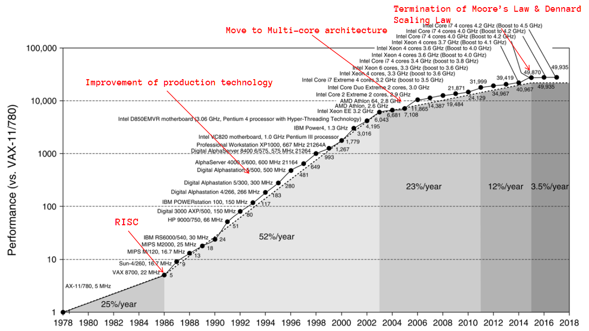

> 计算机体系结构演化是计算机系统发展的**源动力**。

## 1.1 计算机系统的发展

### 1.1.1 历史上的计算机

​		第一台**电子计算机**被认为是爱荷华州立大学在1942年研制的ABC——**阿塔纳索夫-贝里计算机(Atanasoff–Berry computer)**。

​		由美国科学家阿塔纳索夫在1937年开始设计，**不可编程**，仅仅设计用于求解线性方程组，并在1942年成功进行了测试。是**公认的计算机先驱**，为今天大型机和小型机的发展奠定了坚实的基础。如下图所示。

​		**电子延迟存储自动计算器EDSAC(Electronic Delay Storage Auto-matic Calculator)**是英国的早期计算机。

​		1946年,英国剑桥大学数学实验室的莫里斯·威尔克斯教授和他的团队受冯·诺伊曼的**First Draft of a Report on the EDVAC**的启发，以EDVAC为蓝本，设计和建造EDSAC，1949年5月6日正式运行，是世界上**第一台实际运行的存储程序式电子计算机**。如下图所示。

​		**电子数字积分器与计算机ENIAC(Electronic Numerical Integrator and Computer)**是世界上第一台**通用电子计算机**，诞生于1946年2月14日的美国宾夕法尼亚大学。它是**图灵完全**的电子计算机，**能够重新编程**，解决各种计算问题。如下图所示。

​		自第一台通用电子计算机问世以来，计算机技术经过几十年的发展取得了令人难以置信的的发展。这都依赖于**集成电路技术(Integrated Circuit Technology)**和**计算机体系结构(Computer Architecture)**的进步。这使得计算机的在各个领域都有了全新的应用，发展出来各式各样的的计算机。如下图所示。

下图是微软数据中心的计算机集群。

### 1.1.2 计算机分类

​		计算机使用方式的变化推动形成了5种不同的计算市场，每一种都有自己不同的应用、需求和计算技术。

#### 个人移动设备(PMD)

​		**个人移动设备(Personal Mobile Device, PMD)**是指一类**带有多媒体用户界面的无线设备**。例如，手机、平板电脑等。

​		这类设备上的应用程序经常是**基于Web应用**、**面向媒体**的，这就要求设备具有较好的**响应性能**和**可预测性能**；同时由于此类设备需要使用电池，所以特别注重**能耗**。

#### 桌面计算机(Desktop Computer)

​		桌面计算机覆盖了从低端到高端的整个产品范围。一般需要放置在电脑桌或者专门的工作台上。因此命名为台式机，是最常见的计算机。

#### 服务器(Server)

​		服务器(Server)是指一类**提供更大规模、更可靠的文件和计算的服务**的计算机，这些计算机已经成为**大规模企业计算的中枢**。其具有不同于桌面计算机的特性如下：

* **可用性(Availability)**：这是对于服务器来说最为重要的特征，因为服务器必须每天的每时每刻不断的工作，如果发生宕机会带来灾难性的后果。

* **可扩展性(Scalability)**：这是因为服务器系统经常需要扩展，以满足其所支持的服务的增长需求，或者对功能的增长需求。
* **吞吐量(Throughput)**：由于服务器需要出大量的事务，因此其整体性能（每分钟处理的事务数或者每秒提供的网页数）是最重要的。

#### 集群/仓库级计算机(Cluster/Warehouse Scale Computer)

​		**软件即服务SaaS(Software as a Service)**应用（比如搜索、社交网络、视频分享、多人游戏、在线销售等）的发展已经推动了一类被称为集群的计算机的发展。

​		**集群(Cluster)**是指**一组桌面计算机或服务器通过局域网连接在一起，运转方式类似于一个更大型的计算机。**集群中每个节点都**运行自己的操作系统**，节点之间**使用网络协议进行通信**。

​		**最大规模的集群称为仓库级计算机(Warehouse Scale Computer, WSC)**，它们的设计方式使数万个服务器像一个服务器一样运行。

下图展现的Google的一个数据中心就是仓库计算机。

​		WSC是如此之大，因而**性价比和功耗非常关键**，其**成本中有80%与计算机内部的功耗和冷却技术有关**。其与服务器的相通之处在于它们都**非常看重可用性**；WSC与服务器的区别在于，**WSC以很多廉价组件为构建模块**，依靠**软件层**来捕获和隔离在这一级别进行计算时发生的许多故障。注意，**WSC的可扩展性是由连接这些计算机的局域网**实现的，而不是像服务器那样,通过集成计算机硬件来实现。
​		**超级计算机(Supercomputer)**与WSC的相通之处在于它们都非常昂贵，需要花费数千万美元，但超级计算机的不同之处在于它**强调浮点性能**，会运行大型的、通信密集的批程序，这些程序可能会一次运行几个星期。这种紧耦合性决定了**超级计算级要使用非常快速的内部网络**。而WSC则不同，它**重视互动应用程序、大规模存储、可靠性和很高的因特网带宽**。

#### 嵌入式计算机(Embedded Computer)

​		**嵌入式计算机(Embedded Computer)**是指**针对某个特定的应用场景而设计的计算机**，在日用电器中随处可见，微波炉、洗衣机、大多数打印机、大多数网络交换机和所有汽车中都有简单的嵌入式微处理器。
​		嵌入式计算机的**处理能力和成本差别最大**。有可以每秒执行1亿条指令、价格低于5美元的32位微处理器，也有用于网络交换机的高端处理器，它们的售价高达100美元，每秒可以执行数十亿条指令。

​		**价格是此类计算机设计的关键因素**。通常是**以最低价格满足性能需要**，而不是以更高的价格来获得更高的性能。

下图总结了上述主流的计算环境及其重要特征。

### 1.1.3 摩尔定律(Moore's Law)

​		摩尔定律(Moore's Law)是英特尔创始人之一戈登·摩尔的**经验之谈**，其核心内容为：**集成电路上可以容纳的晶体管数目在大约每经过18个月便会增加一倍**。下图展现的这被历史一次次检验的经验之谈。

摩尔定律一般有三种说法：

* 集成电路芯片上所集成的电路的数目，每隔18个月就翻一番。
* 微处理器的性能每隔18个月提高一倍，而价格下降一半。
* 用一美元所能买到的计算机性能，每隔18个月翻两番。

三种说法虽然各有千秋，但在一点上是共同的，即“翻番”的**周期都是18个月**。

### 1.1.3 丹纳德缩放定律(Dennard Scaling)

​		**丹纳德缩放定律(Dennard Scaling)**指出：**随着晶体管变小，它们的功率密度保持不变，因此功耗与面积成正比；电压和电流都随长度缩放(减小)**。即$Power \varpropto Capacitance \varpropto Voltage^2 \varpropto Frequency$ 。简而言之：随**着给定空间内能够容纳的晶体管的数量不断增加，计算机的速度会越来越快，价格会越来越低。**

> 该定律最初是为MOSFET制定的，它基于1974年与Robert H. Dennard合着的一篇论文，并以他的名字命名。

随着处理器生产工艺越来越逼近物理极限，**摩尔定律和丹纳德缩放定律也逐渐失效**。如下图所示。

### 1.1.4 AI与算力

​		AI时代的来临，使得各种AI模型对算力的要求成倍的提高。自2012年以来，在最大规模的人工智能训练中使用的计算量以3.4个月的时间成倍增长，相比之下，摩尔定律的翻倍周期为2年。如下图所示。

​		计算方面的改进一直是人工智能发展的一个关键组成部分，所以只要这种趋势继续下去，我们就得为远远超出今天算力的AI系统的影响做好准备。

​		因此，计算机体系架构技术的发展与进步将有助于应对此挑战，例如，Google推出了专为AI计算所设计的**TPU(Tensor Processing Unit)**，这是一款为机器学习而定制架构的芯片。打败顶级围棋选手李世石的AlphaGo人工智能便是使用TPU进行的训练。

> [AI and Compute](https://openai.com/blog/ai-and-compute/)

------

## 1.2 计算机体系结构概述

### 1.2.1 计算机体系结构定义

#### 经典定义

​		1964年4月，阿姆道尔(C. M. Amdahl)等在IBM Journal of Research and Development杂志上，发表了题为《Architecture of the IBM System/360》的文章，**首次明确提出了“计算机体系结构”的概念**。并且提出了计算机体系结构概念的经典定义。

​		该定义为：**计算机体系结构是程序员所看到的计算机的属性(The term architecture is used here to describe the attributes of a system as seen by the programmer)，即概念性结构与功能特性**。

> [Architecture of the IBM System/360](https://www.ece.ucdavis.edu/~vojin/CLASSES/EEC272/S2005/Papers/IBM360-Amdahl_april64.pdf)

#### CAQA定义

​		在John L. Hennessy和David A. Patterson编写的《Computer Architecture: A Quantitative Approach》一书中将计算机体系结构的定义囊括计算机设计的三个方面：

* **指令集架构(Instruction Set Architecture)**
* 计算机系统**组成(Organization)**或者说**微体系结构(Microarchitecture)**
* 计算机**硬件(Hardware)**

> ​		In this book, the word architecture covers all **three aspects of computer design**—**instruction set architecture**, **organization or microarchitecture**, and **hardware**.

#### 广义定义

​		In its broadest definition, computer architecture is the **design of the abstraction/implementation layers** that allow us **to execute information processing applications efficiently** using manufacturing technologies.

> ​		在其最广泛的定义中，计算机架构是**对抽象层或实现层的设计**，这些设计使我们能够使用现有技术**有效地执行信息处理应用程序**。

如果将计算机抽象成不同的层次，计算机体系结构所关注的内容应该是：

* **指令集架构(Instruction Set Architecture, ISA)**
* **微架构(Microarchitecture)**
* **寄存器传输级(Register-Transfer Level, RTL)**

如下图所示。

​		在计算机体系的发展过程中，**上层应用程序的需求(Pull)同下层技术的约束和推动(Push)一起促进了计算机体系结构的发展，并反过来指导应用和技术的研究方向**。

### 1.2.2 计算机组成与实现

#### 计算机组成(Organization)

​		计算机组成(Computer Organization)指的是**计算机体系结构的逻辑实现**。包含物理机器级中的数据流和控制流的组成以及逻辑设计等。它关注**物理机器级内各事件的排序方式与控制方式、各部件的功能以及各部件之间的联系。**

#### 计算机实现(Implementation)

​		计算机实现(Computer Implementation)指的是**计算机组成的物理实现**。包括处理机和主存等部件的物理结构，器件的集成度和速度，模块、插件、底板的划分与连接，信号传输，电源、冷却及整机装配技术等。它关注**器件技术和微组装技术。**

### 1.2.3 计算机体系结构中的8大思想

在计算机体系结构中有8大思想是其核心的思想。

* Design for **Moore’s Law** 
* Use **Abstraction** to simplify design 
* Make the **Common Case Fast** 
* Performance *via* **Parallelism** 
* Performance *via* **Pipelining** 
* Performance *via* **Prediction** 
* **Hierarchy** of memories 
* **Dependability** *via* redundancy 

### 1.2.4 体系结构分类

​		多种级别的**并行度(Parallelism)现在已经成为计算机设计的推动力量**，而**能耗和成本则是主要约束条件**。

因此可以根据并行度将体系结构进行分类

#### 并行方式

根据实现并行的软硬件层级可将并行方式分为：

*  应用程序并行方式
    * **数据级并行(Data-level parallelism, DLP)**： 可以**同时操作许多数据项**。
    * **任务级并行(Task-level parallelism, TLP)**： 可以创建一些能够**单独处理但大量采用并行方式执行的工作任务**。
* 计算机硬件并行方式
    * **指令级并行(Instruction-level parallelism)**：在编译器的帮助下，利用**流水线**之类的思想适度实现数据级并行，利用**推理执行**之类的思想以中等水平实现数据级并行。
    * **向量体系结构和图形处理器(Vector architectures, GPUs)**：将**单条指令并行应用于一个数据集**，以实现数据级并行。
    * **线程级并行(Thread-level parallelism)**：在一种紧耦合硬件模型中实现数据级并行或任务级并行，这种模型**允许在并行线程之间进行交互**。
    * **请求级并行(Request-level parallelism)**：在程序员或操作系统指定的大量去耦合任务之间实现并行。

> 计算机硬件以上述4种方式实现2种应用并行。

#### Michael J. Flynn分类

- **指令流(Instruction Stream, IS)**：机器执行的指令序列。
- **数据流(Data Stream, DS)**：由指令流调用的数据序列。
- **多倍性(Multiplicity)**：在系统瓶颈部件上**处于同一执行阶段的指令或数据**的最大可能个数。

​		Flynn分类方法根据多处理器最受约束组件中指令流及数据流的并行程度，将所有计算机分为以下4类：

* **单指令流单数据流SISD**(Single Instruction stream, Single Data stream)：**单处理器**，但是可以利用**指令级并行**。
* **单指令流多数据流SIMD**(Single Instruction stream, Multiple Data streams)：**同一指令由多个使用不同数据流的处理器执行**。实现**数据级并行**。
* **多指令流单数据流MISD**(Multiple Instruction streams, Single Data stream)：目前为止还没有此类商业多处理器。
* **多指令流多数据流MIMD**(Multiple instruction streams, Multiple Data streams)：每个处理器都提取自己的指令，对自己的数据进行操作，实现**任务级并行**。

四种类别如下图所示，PU指处理单元(processing unit)：

-----

## 1.3 计算机设计的量化原理

### 1.3.1 并行(Parallelism)

​		**充分利用并行(Parallelism)是在计算机系统设计中提高性能的重要方法之一**。例如数据级并行、任务级并行、指令级并行等等。

### 1.3.2 局部性原理(Principle of Locality)

​		通过对程序运行时特性的观察得到的局部性原理是指：**程序常常重复使用它们最近使用过的数据和指令**。主要分为**时间局部性**和**空间局部性**两类。

* **时间**局部性：指**最近访问过的内容很可能会在短期内被再次访问**。

* **空间**局部性：指**地址相互临近的项目很可能会在很短时间内被使用**。

### 1.3.3 常见情形优先(Common Case First)

​		常见情形优先(Common Case First)是计算机设计中**最重要**、最广泛采用的设计原则。

​		**对于大概率事件，赋予它优先的处理权和资源使用权**，以**获得全局的最优结果**。并且，常见情形往往比较简单，与不常见情形相比更容易优化。

### 1.3.4 Amdahl定律

​		Amdahl定律是指：**加快某部件执行速度所能获得的系统性能的加速比，受限于该部件的执行时间占系统中总执行时间的百分比。**

​		Amdahl定律可以用于**定量计算**对计算机系统中某个部件进行改进后，可获得多少整体性能的提高。常常通过加速比来衡量。

#### 加速比(Speedup)

加速比的定义如下：
$$
Speedup = \frac{old \ time}{new \ time}
$$
​		加速比告诉我们，与原计算机相比，在经过升级后的计算机上运行一个任务可以加快多少。加速比主要取决于**可改进比例**和**部件加速比**两个因素。

##### 可改进比例

​		**可改进部分在原系统计算时间中所占的比例(The fraction of the computation time in the original computer)**，它总是**小于等于1**的，记为：
$$
f = Fraction_{enhanced}
$$
例如，一个程序执行时间为60s，如果有20s的时间可进行升级，那么其可改进比例为$20/60 = 1/3$。

##### 部件加速比

​		**可改进部分改进以后的性能提高(The improvement gained by the enhanced execution mode)**，一般情况下它是**大于1**的，即可改进部分改进后性能提高的**倍数**，记为：
$$
s = Speedup_{enhanced}
$$
例如，原程序某一部分采用升级模式后需要2s，而原始模式中需要5s，则部件加速比为$5/2$。

因此，**升级后新的执行时间**等于**未升级部分所耗用时间**加上**使用升级部分所耗用时间**：
$$
\begin{align}
new \ time 
&= old \ time \times (1-f) + old \ time \times \frac{f}{s} \\ 
&= old \ time \times \left( (1-f) + \frac{f}{s} \right)
\end{align}
$$
总加速比就为：
$$
\begin{align}
Speedup &= \frac{old \ time}{new \ time} \\ 
&= \frac{old \ time} {old \ time \times \left( (1-f) + \frac{f}{s} \right)} \\
&= \frac{1} {(1-f) + \Large \frac{f}{s}}
\end{align}
$$

#### 特性

##### 回报递减规律

​			Amdahl定律阐述了**性能增加的递减规律**：**如果仅改进一部分计算的性能，在增加改进时，所获得的加速比增量会逐渐减小**。即**针对整个任务的一部分进行优化，则总加速比最大不会超过一个数值**，该数值即1减去未升级部分所占比例，再取其倒数：
$$
\begin{align}
Speedup_{max} 
&= \lim\limits_{s \to \infty} \frac{1}{(1-f) + \large \frac{f}{s}} \\
&= \frac{1}{1-f}
\end{align}
$$

##### 性价比

​		Amdahl定律可用来**判断某项升级能使性能提高多少，以及如何分配资源来提高性价比**。即具有高性能价格比的计算机系统是一个**平衡**的系统，而不是看它使用的某些部件的性能。

#### 练习

##### 练习 1

​		假设在某程序的执行过程中，浮点操作时间占整个执行时间的$10\%$，现希望对浮点操作加速。设对浮点操作的加速比为$s$。

* 请推导出程序总的加速比$Speedup$和$s$之间的关系表达式。
    $$
    \begin{align}
    given, \ f &= 0.1 \\
    then, \ Speedup 
    &=  \frac{1}{1-f + \Large \frac{f}{s}} \\
    &=  \frac{1}{1-0.1 + \Large \frac{0.1}{s}} \\
    &=  \frac{1}{0.9 + \Large \frac{0.1}{s}} \\
    
    \end{align}
    $$

* 请问程序的最大加速比$Speedup_{max}$可达多少？
    $$
    \begin{align}
    Speedup_{max}
    &= \lim\limits_{s \to \infty} \frac{1}{0.9 + \Large \frac{0.1}{s}} \\
    &=  \frac{10}{9}
    \end{align}
    $$

##### 练习 2

​		图形处理器中经常需要的一种转换是求平方根。浮点平方根(FPSQR)的实现在性能方面有很大差异，特别是在为图形设计的处理器中，尤为明显。假设，FP平方根(FPSQR)占用一项关键图形基准测试中$20\%$的执行时间。FP指令占用该应用程序$50\%$的执行时间。

* 有一项提议：升级FPSQR硬件，使这一运算速度提高到原来的$10$倍。
* 另一项提议：升级图形处理器中所有FP指令的运行速度，使其提高到原来的$1.6$倍。

设计团队相信，他们使所有FP指令执行速度提高到1.6倍所需要的工作量与加快平方根运算的工作量相同。试比较这两种设计方案。
$$
\begin{align}
given, \ 
& f_{FPSQR} = 0.2, s_{FPSQR} = 10, f_{FP} = 0.5， s_{FP} = 1.6 \\
then, \ Speedup_{FPSQR} 
&=  \frac{1}{1-f + \Large \frac{f}{s}} =  \frac{1}{1-0.2 + \Large \frac{0.2}{10}} \\
&=  \frac{1}{0.82}  \approx  1.22 \\
 \ Speedup_{FP} 
&=  \frac{1}{1-f + \Large \frac{f}{s}} =  \frac{1}{1-0.5 + \Large \frac{0.5}{1.6}} \\
&=  \frac{1}{0.8125}  \approx  1.23 \\

Therefore, \ FP \ is \ chosen & \ because \ it \ is \ used \ frequently.
(Common \ Case \ First)
\end{align}
$$

### 1.3.5 处理器性能公式

​		再利用Amdahl定律计算系统加速比时，需要知道可改进的比例$f$是多少，通常情况**很难直接计算出$f$​比例**，而**处理器性能公式则从另一个角度计算和比较性能**。

* **将程序分解成指令**：**硬件感知到的是机器指令**，而不是程序。

* **指令划分为时钟周期**：在底层，硬件将**指令的处理划分为时钟周期的处理**。

因此，**CPU性能衡量的铁律(Iron Law)便是时间(Time)**，更具体的说是**CPU时间(CPU time)**。

#### CPU时间

​		几乎所有计算机都有一个以**固定频率运行的时钟**。这些离散时间事件称为：时钟周期、**时钟(Cycle)**、脉冲周期等。计算机设计人员用时钟周期的**持续时间(duration)**，例如$1\ ns$；或其$f$**频率(rate)**，例如$1\ GHz$，来描述时钟周期的时间。**计算机时钟周期时间是计算机时钟周期频率的倒数**。因此，程序的CPU时间可以有两种表示方法：
$$
\begin{align}
CPU \ time 
&= CPU \ clock \ cycles \ for \ a \ program \times Clock \ cycle \ time \\
&= 程序的CPU时钟周期数 \times 计算机时钟周期时间 \\
or \ \ & \\
&= \frac{CPU \ clock \ cycles \ for \ a \ program}{Clock \ rate} \\
&= \frac{程序的CPU时钟周期数}{计算机时钟频率}
\end{align}
$$

* **指令数IC(Instruction Count)**：程序执行过程中所处理的指令。

* **每条指令平均时钟周期数CPI(Cycles Per Instruction)**：每条指令执行所需要的计算机时钟周期数。可以通过程序的CPU时钟周期数和指令数求得：
$$
\begin{align}
CPI
&= \frac{CPU \ clock \ cycles \ for \ a \ program}{Instruction \ count(IC)} \\
&= \frac{程序的CPU时钟周期数}{指令数}
\end{align}
$$

>   **每时钟周期指令数IPC(Instruction Per Cycle)是CPI的倒数**。

因此，可将CPU时间的定义改写为：
$$
CPU \ time = IC \times CPI \times cycle
$$
将三部分展开可以看到各个部分是如何组合在一起的：
$$
\frac{Instructions}{Program} \times \frac{Cycles}{Instruction} \times  \frac{Time}{Cycle}  = \frac{Time}{Program} =  CPU \ time 
$$
​		从这个公式可以看出，处理器性能取决于三个特性：

* **时钟周期(Cycle)**或时钟频率：取决于**硬件实现技术**和**计算机组成**。
* 每条指令平均时钟周期数**CPI**(Cycles Per Instruction)：取决于**计算机组成**和**指令集架构**。
* 指令数**IC**(Instruction Count)：取决于**指令集架构**和**编译技术**。

​		此外，CPU时间同时取决于这三个特性只要改进其中一个都将提高CPU的性能。但是，用于改变这三项特性的基本技术都是**相互关联**的，所以很难在不改变其他两个参数的情况下改变其中一个参数。

#### 深入CPU时间

​		在CPU设计中常使用下面计算CPU时间的公式：
$$
\begin{align}
CPU \ time 
&= 程序的CPU时钟周期数 \times 计算机时钟周期时间 \\
&= \sum_{i=1}^n(CPI_i \times IC_i) \times 计算机时钟周期时间 
\end{align}
$$
其中，**$IC_i$为程序执行过程中第$i$种指令出现的次数，$CPI_i$为执行第$i$种指令的指令平均时钟周期数 ，$n$为计算机指令的种类数**。此时的$CPI$可以表示为：
$$
CPI = \frac{CPU时钟周期数}{IC} = \frac{\sum_{i=1}^n (CPI_i \times IC_i)}{IC} = \sum_{i=1}^n(CPI_i \times \frac{IC_i}{IC})
$$
其中，**$IC_i / IC$反映了第$i$种指令在程序执行过程中所占的比例**。

#### 练习

##### 练习1

假设已经进行以下测量:

* FP操作频率=25%
* FP操作的平均CPI=4.0
* 其他指令的平均CPI=1.33
* FPSQR的频率=2%
* FPSQR的CP1=20

假定有两种设计方案，一种方案将FPSQR的CPI降至2，一种是把所有FP操作的平均CPI降至2.5。请使用处理器性能公式对比这两种设计方案。

**解**：

首先，观察到**仅有CPI发生变化**，**时钟频率和指令数保持不变**。我们首先求出没有任何改进时的原CPI：
$$
\begin{align}
CPI_{original} 
&= \sum_{i=1}^n(CPI_i \times \frac{IC_i}{IC}) \\
&=(4 \times 25\%) + (1.33 \times 75\%) = 2.0 

\end{align}
$$
从**原$CPI$中减去节省的周期数就可以求出改进FPSQR后的$CPI$**:
$$
\begin{align}
CPI_{use \ FPSQR} &= CPI_{original} - 2\% \times (CPI_{old \ FPSQR} - CPI_{new \ FPSQR}) \\
&= 2.0 - 2\% \times (20-2) = 1.64 \\

\end{align}
$$
同理，可计算出采用提升所有FP方案的$CPI$：
$$
\begin{align}
CPI_{use \ FP} &= CPI_{original} - 25\% \times (CPI_{old \ FP} - CPI_{new \ FP}) \\
&= 2.0 - 25\% \times (4-2.5) = 1.625 \\
or \\
&= \sum_{i=1}^n(CPI_i \times \frac{IC_i}{IC}) \\
&= (2.5 \times 25\%) + (1.33 \times 75\%) = 1.625
\end{align}
$$
由于改进所有FP的$CPI$稍低一些，所以采用该方案提升的性能也稍好一点。可以验证，总FP改进的加速比为：
$$
Speedup_{new \ FP} = \frac{CPU \ time_{original}}{CPU \ time_{new \ FP}} = \frac{CPI_{original}}{CPI_{new \ FP}} = \frac{2.0}{1.625} \approx 1.23
$$

##### 练习2

假设我们考虑条件**分支指令**的两种不同设计方法如下：

* $CPU_A$：通过**比较指令**设置条件码，然后**测试条件码**进行分支。

* $CPU_B$：在**分支指令中包括比较过程**。

在这两种$CPU$中，条件**分支指令都占用$2$个时钟周期**，而所有**其他指令占用$1$个时钟周期**。

* 对于$CPU_A$，执行的指令中**分支指令占$20\%$** ；由于每条分支指令之前都需要有比较指令，因此**比较指令也占$20\%$** 。
* 由于$CPU_A$在分支时不需要比较。因此，**假设$CPU_B$的时钟周期时间是$CPU_A$的$1.25$倍**。

问：

* 哪一个$CPU$更快？

    根据题意可知：
    $$
    \begin{align}
    CPI_A 
    &= \sum_{i=1}^n(CPI_i \times \frac{IC_i}{IC}) \\
    &= (2 \times 20\%) + (1 \times 80\%) = 1.2
    \end{align}
    $$
    根据CPU性能公式有：
    $$
    \begin{align}
    CPU_A \ time 
    &= IC_A \times CPI_A \times CLK_A \\
    &= IC_A \times 1.2 \times CLK_A
    \end{align}
    $$
    由于$CPU_B$中没有独立的比较指令，所以$CPU_B$的程序量为$CPU_A$的$80\%$，则$CPU_B$中分支指令比例为$20\% / 80\% = 25\%$，且根据假设有$CLK_B = 1.25 \times CLK_A$ 。其中分支指令占用$2$个时钟周期，剩下$75\%$指令占用$1$个时钟周期，因此有：
    $$
    \begin{align}
    CPI_B 
    &= \sum_{i=1}^n(CPI_i \times \frac{IC_i}{IC}) \\
    &= (2 \times 25\%) + (1 \times 75\%) = 1.25
    \end{align}
    $$
    根据CPU性能公式有：
    $$
    \begin{align}
    CPU_B \ time 
    &= IC_B \times CPI_B \times CLK_B \\
    &= (IC_A \times 80\%) \times 1.25 \times (1.25  \times CLK_A) \\
    &=  IC_A \times 1.25 \times CLK_A \\
    
    \end{align}
    $$
    因此，尽管$CPU_B$执行指令的数目较少，但**$CPU_A$具有更短的时钟周期**，所以$CPU_A$比$CPU_B$快。

* 如果$CPU_B$的时钟周期时间只是$CPU_A$的$1.1$倍，哪一个$CPU$更快？

    由上一问可知，当$CLK_B = 1.1 \times CLK_A$时有：
    $$
    \begin{align}
    CPU_B \ time 
    &= IC_B \times CPI_B \times CLK_B \\
    &= (IC_A \times 80\%) \times 1.25 \times (1.1  \times CLK_A) \\
    &=  IC_A \times 1.1 \times CLK_A \\
    \end{align}
    $$
    因此，**$CPU_B$由于具有更少的指令数目，比$CPU_A$快。**

----

## 1.4 计算机系统性能评测

​		为了更好的设计和使用计算机，经常需要对计算机系统的性能进行评估。如何评估一台计算机的性能与测试者看问题的角度有关。

​	例如，对于桌面级用户希望计算机执行单个程序所耗费时间越少越好；对于数据中心的管理员来说更关注计算机单位时间内能够完成的任务越多越好。即前者关注计算机的**执行时间(Execution Time)**，后者关注计算机的**吞吐率(Throughput)** 。

* **执行时间(Execution Time)**：也称**响应时间(Response Time)**，是指一个事件从启动到完成的时间，即$T_{resp} = T_{end} - T_{start}$ 。
* **吞吐率(Throughput)**：单位时间内完成事件的总量。即$ Throughput = \Large \frac{job \ count}{second}$ 。

### 1.4.1 性能比较

​		在比较不同的设计方案时，经常需要对两台计算机的性能进行比较。假设这两台计算机为$X$和$Y$， $X$比$Y$快的意思是：**对于给定任务，$X$的执行时间比$Y$的执行时间少**。通常$X$的性能是$Y$的$n$倍是指：
$$
n = \large  \frac{T_{respY}}{T_{respX}} =  \frac{\frac{1}{PerformanceY}}{\frac{1}{PerformanceX}} = \frac{PerformanceX}{PerformanceY}
$$
例如：
$$
time(A) = 10s, time(B) = 15s \\

\Rightarrow n =  \frac{time(B)}{time(A)} = \frac{15}{10} = 1.5 
\Rightarrow A的速度是B的1.5倍  \Rightarrow A比B快50\%
$$

### 1.4.2 基准测试程序(Benchmark)

​		目前广泛采用的一致和可靠的性能评价方法是**使用真实程序的执行时间来衡量**。实际上，如果不以执行时间为衡量标准或没有使用真实程序，则可能导致错误的性能评价结论。

​		为了能比较全面地反映计算机在各个方面的处理性能，通常采用**整套测试程序**。这组程序称为**基准测试程序套件(benchmark suites)**，其**由各种不同的真实应用程序构成**。

​		采用测试套件的一个主要优点是**不同的测试程序之间可以互相弥补**，一个测试程序的弱点通常可以因其他测试程序的存在而变得不太明显。基准测试程序套件的目标是**尽可能全面地反映两台计算机的相对性能**。

#### SPEC系列

​		目前，**最成功和最常见的测试程序套件是SPEC系列**，它是由美国的**标准性能测试公司(Standard Performance Evaluation Corporation, SPEC)**创建的。

> ​		SPEC起源于20世纪80年代末，当时的目的是为工作站提供更好的基准测试程序。此后，随着计算机技术及其应用的发展，陆续设计出了适合于各种类型应用的基准测试程序套件。

SPEC基准测试系列的各个版本以及发展如下图所示。

​		其中，**粗线上方为整数程序，下方为浮点程序**。SPEC2017的10个整数应用程序中，有5个用C编写，4个用C++编写，还有1个用Fortran编写。在浮点程序中，3个用Fortran编写，2个为C++编写，2个为C编写，还有6个为C、C++和Fortran混合编写。图中给出了在1989年、1992年、1995年、2006年和2017年版本中的所有82个程序。

##### 分类

SPEC的基准测试分为两类：

* **桌面级基准测试(Desktop Benchmark)**：
    * **处理器**密集型基准测试(Processor-intensive Benchmark)
    * **图形**密集型基准测试(Graphics-intensive Benchmark)
* **服务器级基准测试(Server Benchmark)**：
    * **事务**处理基准测试(Transaction-processing Benchmark)

##### 性能总和

​		当使用某一种基准测试套件来测量性能后，我们希望能够**用一个数值来汇总基准测试套件的性能结果**。

###### 平均值

​		一种简单方法是对比套件中各个程序执行时间的**算术平均值(Arithmetic Mean)**：
$$
\frac{1}{n} \times \sum_{i=1}^n time(i)
$$
但一些SPEC程序花费的时间要比其他程序长4倍，所以如果使用算术均值作为总结性能的唯一数值，那这些程序就占有太大的权重了。

​		另一种方法是为每个基准测试增加一个**加权因子(weight factor)**，以**加权算术平均(Weighted Arithmetic Mean)**作为总结性能的唯一数值。
$$
\frac{1}{n} \times \sum_{i=1}^n( time(i) \times weight(i))
$$
但由于SPEC是由一些相互存在竞争的公司组成的联盟，每家公司可能都有自己中意的权重集，这就很难达成一致意见。

###### SPECRation

​		SPEC不选择权重，而是**以基准计算机为依据，对执行时间进行归一化(Normalization)**。

​		SPEC**将基准计算机上的执行时间除以待评价计算机上的执行时间**，得到一个**与性能成正比的比值**，SPEC将这个比值称为**SPECRatio**。
$$
SPECRation = \frac{time_{reference}}{time_{test}}
$$
​		这是一个特别有用的特性。例如，假定在进行基准测试时，计算机A的SPECRation是计算机B的1.25倍，于是可以计算：
$$
1.25 = \frac{SPECRation_A}{SPECRation_B} 
= \large \frac{\frac{time_{reference}}{time_A}}{\frac{time_{reference}}{time_B}}
= \frac{time_B}{time_A} = \frac{performance_A}{performance_B}
$$
下图展示了一个示例。

​		最后两列给出执行时间和SPECRatio的比值。这一数字说明**基准计算机的选取与相对性能无关**。**执行时间之比与SPECRatio之比相同**，且**几何均值之比$31.91/63.72=2.00$与比值的几何均值$2.00$相等。**

> SPEC2006将执行时间的比值乘以100，以清除结果中的小数点，所以97.7在报告中显示为9770。

​		因为SPECRatio是一个比值，而不是绝对执行时间，所以必须用**几何平均值(Geometric Mean)**来计算它的均值。(由于SPECRatio没有单位，所以以算术方式比较SPECRatio是没有意义的）几何平均的公式如下：
$$
\sqrt[n]{\prod_{i=1}^nSEPCRation(i)}
$$
使用几何均值可以保证SPECRation具有以下两个重要特性：

* **这些比值的几何均值与几何均值之比相等。**
* **几何均值之比等于性能比值的几何均值**，这意味着**与基准计算机的选择无关**。

