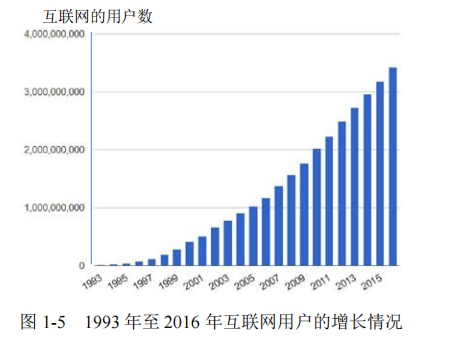

> **计算机网络**是**计算机技术**与**通信技术**结合的产物。

---------------

##  1.1互联网概述

​		现如今的计算机网络最早是由美国国防部高级计划研究署研制的**ARPANET**发展而来，其于1969年开通，经过不断的发展形成了世界上最大的覆盖全球的计算机网络。

### 1.1.1 基本概念

​		计算机网络一般由若干个**结点(node)**和连接这些结点的**链路(link)**组成。

* 结点(node)：计算机、集线器、交换机或路由器等。
* 链路(link)：网线、电磁波等。

​		网络之间还可以通过路由器连接起来，形成**网络的网络(network of networks)**，这样的网络被称为**互联网(internetwork, internet)**，如图1-1所示。

​		也就是说网络将许多计算机连接在一起，而互联网则把许多的网络通过路由器连接在一起。与网络相连的计算机通常被称为**主机(host)**。

* 主机(host)：与网络相连接的计算机。

### 1.1.2 互联网的发展阶段

互联网发展一般分为三个阶段：

#### 第一阶段：从单个网络ARPANET向互联网发展

​		期间，在1983年**TCP/IP协议簇**成为ARPANET上的标准协议，使得使用该协议的计算机都可通过互联网进行通信，因此，**1983年被称为互联网元年**。

#### 第二阶段：建成三级结构的互联网

​		以美国国家科学基金会NSF(National Science Foundation)为引导建成的NSFNET为代表，它是一个三级的计算机网络，分为**主干网**、**地区网**和**校园网**（或**企业网**）。

#### 第三阶段：形成多层次ISP结构的互联网

* 互联网服务提供者ISP(Internet, Service Provider)：如中国移动、中国联通和中国电信等

​		用户上网即通过ISP提供的服务接入互联网的过程。根据ISP的大小以及拥有IP地址数目的不同可以将ISP划分为为不同层次：**主干ISP**、**地区ISP**和**本地ISP**，如图1-3所示。

​		其中，**互联网交换点 IXP** 的主要作用是：**允许两个网络直接相连并交换分组，而不需要再通过第三个网络来转发分组。**

​		互联网的迅猛发展始于20世纪90年代，由欧洲原子核研究组织CERN开发的**万维网(World Wide Web)**在互联网上的广泛使用，极大方便了非网络专业人员对网络的使用，使得互联网成指数级增长。图1-5给出了互联网用户数的增长情况。

> 互联网之父——伯纳斯·李
>
> **蒂姆·伯纳斯·李(Tim Berners-Lee)**爵士，万维网的发明者，互联网之父，英国皇家学会会员，英国皇家工程师学会会员，美国国家科学院院士。
>
> 他在1989年3月提出万维网（即World Wide Web）的设想。并于1990年12月25日，在日内瓦的欧洲粒子物理实验室里开发出了世界上第一个网页浏览器。
> 最重要的是**他放弃万维网版权，极大的推动了互联网及应用的普及和深入发展，深刻的改变了人类的生活面貌。**

### 1.1.3 互联网的标准化工作

​		1992 年由于互联网不再归美国政府管辖，因此成立了一个国际性组织叫做**互联网协会ISOC(Internet Society)**。ISOC 其下有一个**技术组织**叫做**互联网体系结构委员会 IAB(Internet Architecture Board)**，IAB 下面又设有两个**工程部**：**互联网工程部IETF(Internet Engineering Task Force)**和**互联网研究部IRTF(Internet Research Task Force)**。

* 互联网协会ISOC(Internet Society)：**对互联网进行全面管理以及在世界范围内促进其发展和使用**。
    * 互联网体系结构委员会IAB (Internet Architecture Board)：**管理互联网有关协议的开发**。
        * 互联网工程部IETF(Internet Engineering Task Force)：IETF 是由许多**工作组WG(Working Group)**组成的论坛，**主要是针对不同领域的协议的开发和标准化**。
        * 互联网研究部IRTF(Internet Research Task Force)：IRTF 是由一些**研究组RG(Research Group)**组成的论坛，**主要是研究一些需要长期考虑的问题，包括互联网的一些协议、应用、体系结构等**。

下图展示了他们之间的组织结构：

----------

## 1.2 计算机网络组成

​		计算机网络在**逻辑**上可以划分为**通信子网(Communication Subnet)**与**资源子网(Resources Subnet)**。

* 通信子网(Communication Subnet)：**由路由器和通信链路组成，负责计算机之间的数据通信，即网络通信任务。**
* 资源子网(Resources Subnet)：**由连接到通信子网上的服务器和主机系统组成，向用户提供各种共享的软件、硬件、信息资源和数据处理能力，即信息应用服务。**

某些教材上也将其分为**核心部分**和**边缘部分**，如图1-6所示。

-----

## 1.3 计算机网络的定义及分类

### 1.3.1 定义

​		计算机网络的精确定义并未统一，一般来说可以这样定义计算机网络：

​		将若干台具有**独立功能**的计算机系统，用某种或多种通信介质连接起来，通过完善的**网络协议**。在**数据交换**的基础上，实现网络**资源共享**的系统称为计算机网络。

* 独立：网络中每台计算机都可运行各自独立的操作系统，各计算机系统间低位平等。
* 数据交换：**数据交换是网络的基本功能**。
* 资源共享：**资源共享是网络的最终目的**。

### 1.3.2 分类

#### 按地理范围分类

* **局域网LAN(Local Area Network)**：覆盖范围一般不超过几公里，一般安装在一栋大楼或一个大学校园内。
* **城域网MAN(Metropolitan Area Network)**：覆盖范围一般为一个大城市，从几十公里到上百公里不等。
* **广域网WAN(Wide Area Network)**：覆盖范围一般在几百公里以上，**Internet**就是目前最大的广域网。

下图展示了他们之间的层次关系。

#### 按拓扑结构分类

​		计算机网络拓扑是指**通信子网结点**间连接结构的**拓扑形式**，通过结点与线段间的几何关系表示网络结构，反映网络中各实体的结构关系。

* **星型网**：转输介质从一个中央结点向外辐射连接其他结点。
    * **特点**：任何两个结点之间的信息交换必须经过中央结点转发。
    * **可靠性**：终于结点可靠性非常重要，中央结点发生故障，会导致整个网络瘫痪。
* **环型网**：网络上所有的结点通过传输介质连接成一个闭环。
    * **特点**：任何两个结点的数据交换必须沿环进行。
    * **可靠性**：一旦结点或链路发生故障，环路断开，大致网络瘫痪。
* **总线型网**：一条总线连接所有的结点，任何一个结点发送数据，其他节点都能收到。
    * **特点**：共享信道。
    * **可靠性**：任何结点故障都不会影响整个网络正常运行。
* **不规则型网**：每个结点至少要和其他两个结点连接。
    * **特点**：布线灵活，几乎不受任何拓扑结构的约束。 
    * **可靠性**：任何一个结点或一条链路发生故障都不会影响网络的连通性。

下图展示展示了上述四种网络拓扑结构：

然而，互联网(Internet)的拓扑结构比这更加的复杂，下图展示了Internet的拓扑结构：

> 图源自 https://www.opte.org/the-internet

------

## 1.4 计算机网络的运行过程

​		在计算机网络的运行过程中，网络**边缘**的主机系统（资源子网）和网络**核心**的路由器（通信子网）各自发挥着完全不同的作用。

* 主机系统：关心与其他计算机的**通信方式**以及**通信内容**。
* 路由器：关心如何把接收到的**数据包转发**到目的主机。

#### 1.4.1 网络边缘的主机系统

​		两个计算机系统进行通信实际上是指：两个分别位于不同计算机系统中的**程序之间进行通信**，又称为计算机之间的通信。程序之间通信方式可分为两大类：**客户-服务器方式(Client-Server, C/S)**和**对等方式(Peer-to-Peer, P2P)**。

##### 客户-服务器方式(Client-Server, C/S)

**客户(client)**和**服务器(server)**都是指通信中所涉及的两个**应用进程**。客户-服务器方式所描述的是进程之间服务和被服务的关系。**客户是服务请求方，服务器是服务提供方。**

如下图所示，客户和服务器之间的通信模式。

在实际应用中，客户程序和服务器程序通常还具有以下一些主要特点：

* **客户程序**：
    * **主动**发起服务请求，且必须事先知晓服务器程序地址。
    * 不需要特殊硬件与复杂的操作系统。
* **服务器程序**：
    * 专用的提供某种服务的程序，可**同时处理**多个客户请求。
    * 启动后一直运行，**被动**接收请求，因此不必知晓客户程序地址。
    * 一般需要强大的硬件和高级操作系统支持。

##### 对等方式(Peer-to-Peer, P2P)

两台主机在通信时并不区分哪一个是服务请求方哪一个是服务提供方。只要两台主机都运行了**对等连接软件（P2P 软件）**，它们就可以进行平等的、对等连接通信。对等连接工作方式**可支持大量对等用户（如上百万个）同时工作**。其运行方式如下图所示：

​		**P2P方式严格来说也是C/S方式，只不过其不再区分客户和服务器，一个主机既是客户同时也是服务器。** 两种方式的区别如下图所示：

> 图源自https://www.resilio.com/blog/whats-the-difference-between-peer-to-peer-and-client-server

#### 1.4.2 网络核心中的路由器

​		网络核心是计算机网络（特别是因特网）中最复杂的部分。因为**网络核心要向网络边缘中的大量主机提供连通性，使边缘部分中的任何一个主机都能够与其他主机通信。**在网络核心部分起特殊作用的是**路由器(Router)**，是实现**分组交换(Packet Switching)**的关键构件。且在路由器中输入端口和输出端口之间没有直接的连线。

* **路由器(Router)**：它是一种**专用计算机**，是网络核心中最主要的设备，其主要功能是**数据交换**，即接收来自源主机系统的数据，并向目的主机系统转发。

路由器的**工作过程**：

1. 将接收到的的分组先存入**缓存（暂时存储）**。
2. 按照分组头中的目的地址，**查找路由表**，找到目的地址的发送端口。
3. 将分组从正确的端口**转发出去**。

#### 小结

主机和路由器的作用：

* 主机：一般工作在网络边缘，**为用户进行信息处理**，并向网络发送分组和从网络接收分组。
* 路由器：一般工作在网络核心，**对分组进行存储转发**，最后将分组交付目的主机。

---

## 1.5 交换技术

​		在网络中通过转接来实现一个通信连接，这个转接过程被称为**交换(Switching)**。交换就是按照某种方式**动态的分配传输线路的资源**。交换技术主要有两种：**电路交换(Circuit Switching)**和**分组交换(Packet Switching)**。

### 1.5.1 电路交换(Circuit Switching)

​		电路交换主要应用于传统的模拟语音电话，其基本交换单位为**电路(Circuit)**因此，且**电路交换必定是面向连接的**。

​		例如，一部电话与另一部电话之间的连接需要建立一条物理链路。随着电话用户增多，交换机就承担了电话之间的连接。如下图所示。

#### 工作过程

1. 建立连接
2. 通信
3. 释放连接

#### 特点

* 通信期间，通话的两个用户**始终占用端到端的通信资源。**
* 通信**线路利用率很低**，通常不到10%。
* 实时性好。

### 1.5.2 分组交换(Packet Switching) 

​		分组交换采用**存储转发技术(Store-and-Forward)**，其基本交换单位为**分组(Packet)** ，且其**不必面向连接**。

​		通常我们把要发送的整块数据称为一个**报文(Message)**。在发送报文之前，先把较长的报文划分成为一个个更小的**等长**数据段，在这个等长的数据段前加上由一些必要的控制信息组成的**首部(Header)**后，就组成了一个**分组**。如图1-11所示，把一个报文划分为几个分组后再进行传送。

#### 分组组成部分

* **首部(Header)**：网络传输过程中所需的控制信息。
* **数据段(Data Segment)**：报文数据的等长分割段。

#### 工作过程

1. 发送端将报文分割成分组
2. 网络（通信子网）中的结点交换机（路由器）根据接收到的分组的首部中地址信息，将分组转发往下一结点交换机，直至交付目标主机。
3. 接收端将接收到分组剥去分组首部，将恢复成原报文。

​		分组转发在工作过程中采用了**存储转发技术**，其依赖于路由器的工作机制。如下图所示，其中结点交换机一般为路由器。

#### 优缺点

* 优点
    * 高效：动态分配传输带宽，对通信链路逐段占用。
    * 灵活：以分组为交换单位并为其独立的选择路由。
    * 迅速：不必建立连接就可向其他主机发送数据。
    * 可靠：采用保证可靠性的网络协议，使得网络具有很好的生存性。

* 缺点
    * 时延：分组在各结点存储转发是需要排队，会造成一定时延。
    * 空间开销：分组增加了首部，造成了一定的空间开销。

### 1.5.3 报文交换(Message Switching)

​		早在20世纪40年代的电报通信中的**报文交换(Message Switching**)就开始使用**存储转发技术**。

​		在报文交换中，整个报文被完整的传输到相邻结点，全部存储下来后再查找转发表，转发到下一个结点。因此，报文交换时延较长，一般有几分钟到几个小时不等。现如今报文交换已经很少使用。

### 小结

* **电路交换(Circuit Switching)**：整个报文的比特流连续地从源点直达终点，好像在一个管道中传送。
* **分组交换(Packet Switching)**：单个分组（整个报文的一部分）传送到相邻结点，存储下来后查找转发表，转发到下一个结点。
* **报文交换(Message Switching)**：整个报文先传送到相邻结点，全部存储下来后查找转发表，转发到下一个结点。

**计算机网络中的负载往往是大量的突发小数据，所以基本上都选择分组交换作为数据传输方式。**

在线路利用率和头部开销上，分组交换 > 报文交换 > 电路交换。三种交换之间的比较如下图所示。

------

## 1.6 计算机网络的性能指标

### 速率(Rate)

​		计算机网络的速率是指主机在通信线路中**传输数据的速率**，传输数据的基本单位是**比特(bit)**，单位是**bps(bit per second)**。速率是计算机网络中最重要的一个性能指标。

###带宽(Bandwidth)

​		带宽原指信号具有的频带宽度，即该信号所包含的各种不同**频率的范围**，单位是**赫兹(Hz)**。带宽用于衡量网络通信线路所能传送数据的能力。一般来说，**速率 = 2 × 带宽**，即频带越宽，传输速率越快。

### 吞吐量(Throughput)

​		**吞吐量表示在单位时间内通过某个网络**（或信道，设备，端口）的数据量。其受网络带宽和网络速率的限制。

### 延迟(Delay)

​		延迟指数据从网络（或链路）一端传送到另一端所需的时间。延迟主要包括**传输延迟(Transmission Delay)**和**传播延迟(Propagation Delay)**两种。

* 传输延迟(Transmission Delay)：因**网络数据传输速率限制**而耗费的时间。
    $$
    发送(传输)时延 = \frac{数据量(bit)}{网络传输速率(bps)}
    $$
    
* 传播延迟(Propagation Delay)：因**信号在传输信道中传播一定距离**需耗费的时间。
    $$
    传播时延 = \frac{信道长度(m)}{信号传播速率(m/s)}
    $$
    
* 处理时延(Processing Delay)：是指交换结点为存储转发而进行的一些**必要处理**所花费的时间。

* 排队时延(Queueing Delay)：是指结点缓存队列中**分组排队**所经历的时间。

数据所经历的**总时延等于述四者之和**：
$$
总时延 = 发送时延 + 传播时延 + 处理时延 + 排队时延
$$
下图展示了四种时延发生的位置。

### 利用率

​		利用率分为信道利用率和网络利用率两种。

* 信道利用率：指一段时间内**信道被利用（有数据通过）的时间的百分比**，但信道利用率**并非越高越好**，一般不应超过50%，下图展示了信道利用率和延迟之间的关系。

​	

* 网络利用率：指全网络**信道利用率的加权平均值**。

    
