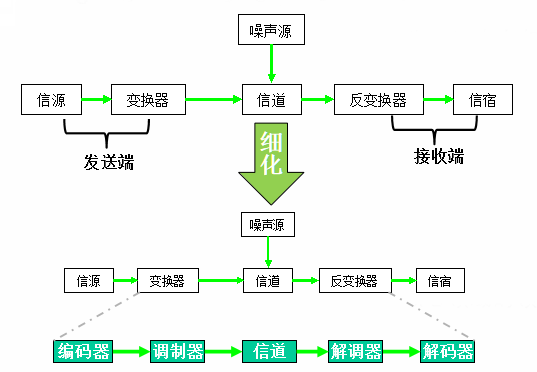
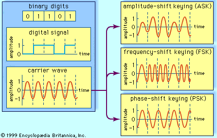

## 3.1 物理层的基本概念

​		物理层(Physical Layer)考虑的是如何才能在连接各种计算机的**传输媒体**上传输**数据比特流**，并向上层屏蔽掉**传输媒体**和**通信方式**的具体细节。

### 3.1.1 概念与术语

#### 数据(Data)

​		事件的某些属性**规范化**后的表现形式，它能被识别，也可被描述。在通信上一般将其分为两类：**模拟数据(Analog Data)**和**数字数据(Digital Data)**。

* 模拟数据(Analog Data)：可在某一区间内**连续取值**的数据。
* 数字数据(Digital Data)：可在某一区间内取**有限个离散值**的数据。

> 数字数据比较容易存储、处理和传输，且模拟数据经过处理很容易转换成数字数据。

#### 信号(Signal)

​		数据的**具体表现形式**，具有确定的**物理描述**。在通信上也可分为两类：**模拟信号(Analog Signal)**和**数字信号(Digital Signal)**。

* 模拟信号(Analog Signal)：指**幅度**随时间作**连续变化**的信号。

* 数字信号(Digital Signal)：指**幅度**随时间作**不连续且离散变化**的信号。

    

#### 信息(Information)

​		信息是用来**消除随机不确定性**的东西，即事件中包含**有意义**的内容。

> **克劳德·艾尔伍德·香农(Claude Elwood Shannon)**，美国数学家、电子工程师和密码学家，被誉为**信息论**的创始人。
>
> 香农在1948年发表的论文**《通信的数学原理》**中首次给出了信息的定义。

##### 信息的度量

信息量与事件出现的**概率**有关，信息量与事件之间的关系如下：
$$
I = log_a \frac{1}{P(x)} = -log_aP(x) 
\left \{
\begin{aligned}
& P(x) \rightarrow 0, I \rightarrow \infty \\
& P(x) \rightarrow 1, I \rightarrow 0 \\
\end{aligned}
\right.
$$
其中，$I$表示信息量，$P(x)$表示事件$x$出现的概率。信息量的单位与对数底数$a$有关。

* $a = 2$：单位比特(bit, b)
* $a = e$：单位纳特(nats, n)

#### 带宽(Bandwidth)

​		带宽是指**物理信道的频带宽度**，单位为**赫兹(Hz)**。

#### 信道容量(Channel Capacity)

​		信道容量一般是指**物理信道上能够进行无差错传输数据的最大能力**，用$C$表示。香农在信息论给出信息传输容量公式为：
$$
C = B \ log_2 \left( 1+\frac{S}{N} \right) = B \ log_2 \left( 1+\frac{S}{N_0 \times B} \right)
$$
其中$B$为信道带宽(Bandwidth, Hz)，$S$为信号功率(Signal, W)，$N$为信道的加性白噪声(Noise, W)；设$N_0$为频谱密度,则有$N=N_0 \times B$。通过该公式可以得到以下结论。

* **提高信噪比$\frac{S}{N}$可以提高信道容量**：若$N \rightarrow 0$，则无干扰信道容量$C$为无穷大。
* **增大信道带宽$B$可以增加信道容量**，但**存在极限值**：$\lim \limits_{B\rightarrow \infty} C = \lim \limits_{B\rightarrow \infty} B\ log_2(1 + \frac{S}{N_0 B}) \approx 1.44\frac{S}{N_0}$

* 调整系统带宽和信噪比可以**维持信道容量不变**。

### 3.1.2 数据通信系统模型

​		根据信号种类的不同可以将通信系统分为**数字通信系统**和**模拟通信系统**，数字通信系统可以细分为**数字电话通信系统**和**数字数据通信系统**，其具有如下优点：

* 抗干扰能力强
* 时候远距离传输（信号中继）
* 安全保密性好
* 适合多媒体信息的传输

#### 数据通信系统组成

​		下图是一个简化的数据通信系统模型。

​		其中信源和变换器（发送器）组成发送端，也称源系统；信道和噪声源组成传输系统；反变换器（接收器）和信宿组成接收端，也称目的系统。其各自的含义如下：

##### 源系统(Source System)

* 信源(Source)：将各种信息**转换**成原始物理信号。
* 发送器(Transmitter)：将原始物理信号**转换成适合在信道上传输的信号**，此过程会进行信号的**编码(Encoding)**与**调制(Modulation)**。

##### 传输系统(Transmission System)

* 信道(Channel)：传输信号的一条通道。
* 噪声源(Noise)：信道**自身的噪声**以及周围**环境**对信道的干扰。

##### 目的系统(Destination System)

* 接收器(Receiver)：将从信道传输来的信号转换成**目的设备可以处理的信息**。此过程会进行信号的**解调(Demodulation)**和**解码(Decoding)**。
* 信宿(Destination)：处理信息。

#### 通信系统指标

​		一般来说，通信系统的性能指标可以归纳为：**有效性**、**可靠性**、适应性、经济性、保密性、标准性和工艺性等等指标。

>  **码元(Code Cell)：信号的二进制编码单位**，编码所需的时间长度称为码元宽度（T）。

##### 有效性

* 码元传输速率：单位时间内传送的码元数，单位为波特每秒(Baud, Bd)。$R_B = \frac{1}{T_b}$
* 信息传输速率：单位时间内传送的信息量，单位为比特每秒(bit/s, bps)。

两者之间的关系为$R_{bN} = R_{BN} \cdot log_2N$，即信息传输速率会通常会的大于码元传输速率，在二进制条件下，二者相等。

##### 可靠性

​		可靠性的指标是利用**差错率**来衡量。差错率通常有两种表示方法。

* 码元差错率（误码率）：发生差错的码元数在传输总码元数中所占的**比例**。$P_e = \frac{接收的错误码元数}{系统传输的总码元数}$
* 信息差错率（误信率）：发生差错的信息量在信息传输总量中所占的**比例**。$P_{eb} = \frac{系统传输中出错的比特数}{系统传输的总比特数}$

### 3.1.3 传输媒体

​		**现代通信技术的基础是电磁理论**，所有的通信方式都采用目前已知的电磁频率作为传输通道。下图展示了不同频率电磁波在通信系统中的应用。

传输媒体可粗略分为三类：

* 金属导体
* 光导纤维
* 电磁波

#### 金属导体

​		金属导体是最古老的一种传输媒体，在所有金属导体中，铜导线因为其优良导电性和抗腐蚀性，最常用来作为传输媒体。

##### 双绞线(Twisted Pair)

​		双绞线由**相互缠绕在一起的两根绝缘铜线组成**。

​		双绞线通常用于**传输平衡信号**。即两根导线分别带有信号**相位相差180度的电流**，因此外界电磁干扰给两个电流带来的影响将**相互抵销**，从而使信号不至于迅速衰退。其螺旋状结构 有助于抵消电路经过导线工程中可能增大的电容。下图展示了其大致结构。

下表展示了不同种类的双绞线将其主要用途。

​		双绞线直接通过水晶头进行连接。水晶头有568A和568B两种连接标准。下图展示了两种标准下图水晶头的连接方式：

在制作跳线时的一般性原则为：

* **同类设备交叉**：即一端568A标准，另一端568B标准。
* **异类设备平行**：两端都采用568A标准或568B标准。

##### 同轴线缆(Coaxial  Cable)

​		一个导体套在另一个导体外面，两个导体间用绝缘材料隔离。**外层导体与内部导体的圆心在同一根轴上**，所以称为同轴电缆。之所以这样设计，是为了**防止外部电磁波干扰电信号的传输**。其结构如下图所示。

同轴电缆可分为两类：**细电缆**和**粗电缆**两种。

* 细电缆：直径0.26cm，最大传输距离185m。
* 粗电缆：直径1.27cm，最大传输距离500m。网络连接主干，用于连接数个由细电缆结成的网络。

#### 光导纤维(Optical Fiber)

​		**光纤通信就是利用光导纤维（光纤）传递光脉冲来进行通信。有光脉冲相当于1，而没有光脉冲相当于0。**

​		光纤是光纤通信的传输媒体，通常由非常透明的石英玻璃拉成细丝，主要由**不同折射率**的**纤芯**和**包层**构成**双层通信圆柱体**。其传输过程如下图所示。

​		按照光纤中**可以同时存在的光线数量**可将光纤分为**多模光纤**和**单模光纤**两种，单模光纤传输速率和距离都远大于多模光纤，常用于长途骨干网。它们的工作方式区别如下。

​		为满足实际使用，一般将光纤做成很结实的光缆。一根光缆少则只有一根光纤，多则可包括数十至数百根光纤，再加上加强芯和填充物就可以大大提高其机械强度。必要时还可放入远供电源线，最后加上包带层和外护套。

#### 电磁波

​		**无线通信是利用电磁波能够在自由空间中传播的特性进行的通信方式。**

##### 微波传输

​		微波(Microwave)是一种射频为300MHz～300GHz的电磁波，也称为厘米波，是全部电磁波频谱的一个有限频段。其具有抗干扰能力强、容量大和成本低的特点。

##### 卫星传输

​		卫星传输是利用通信卫星和卫星地面站构成的一种特殊的**微波通信**。工作频段在1GHz～30GHz的范围内。具有的特点包括：覆盖范围大、可靠性高、开通简便和成本低。

### 3.1.4 数据传输方式

​		在**数字通信系统**中，数据的传输方式也决定了通信系统的效率。一般有：串行与并行方式；同步与异步方式；单工、半双工与双工方式。在实际应用中，这些不同的方式会根据需要**混合使用**。

#### 串行(Serial)和并行(Parallel)

* 串行传输方式：将待发送数据的各个比特位，按一定**顺序依次发送**。
* 并行传输方式：将待发送数据的各个比特位使用**多个信道同时发送**。

#### 同步(Synchronous)和异步(Asynchronous)

​		数据通信的一个基本要求是**接收方必须知道接收的每一个比特位的开始时间和持续时间**，这样才能正确的接收发送方发送来的数据。

* 异步传输方式：每个字节作为**一个单元独立传输**，字节之间的传输**间隔任意**。但是为了标志这一字节的开始和结尾，在这一字节之前加上1个**起始位**，在结尾处加上1至2位**停止位**。

* 同步传输方式：同步传输方式不是对每个字符单独进行同步，而是**对一组字符组成的数据块进行同步。**同步的方法不是加起始位和停止位，而是**在数据块前加特殊模式的位组合**，并通过**位填充**或**字符填充**技术，保证数据块中的数据不会与同步字符混淆。

    

#### 单工(Simplex)、半双工(Half Duplex)和全双工(Full Duplex)

* 单工传输方式：只允许数据在信道上的**单向传输**。
* 半双工传输方式：数据信号可以在信道上**双向传输**，但**同一时刻只允许单向传输**。
* 全双工传输方式：允许数据**同时双向传输**。

## 3.2 信源编码

​		信源编码是将诸如文字、声音、图像、视频等**复杂的信源信息用数字信号表示**的过程。这是一个**信息压缩**过程，在保证不失真的前提下，把信源符合序列变换为最短的码字序列。

​		根据编码对象的特征，信源编码可分为**离散信源编码**、连续信源编码和**相关信源编码**。此节的连续信源编码本质上是**模拟信号的数字化**。

### 3.2.1 模拟信号数字化

​		模拟信号数字化，也称为模拟数据编码，其目的是为了**将模拟信号转变为适合在数字信道上传输的数字信号**。实际上就是要给模数（A/D）转换的过程。可分为三个步骤：

#### 抽样(Sampling)：模拟信号离散化

​		抽样是**对模拟信号进行时间上的离散化处理**，即每个固定间隔的时间对模拟信号抽取一个样值。

##### 抽样定理

​		抽样定理可简述为：**如果媒体传输的最大频率为$f$，那么接收方只要以$2f$的频率进行采样，就可完整地重现原信号。**在实际的应用中，抽样频率为信号最高频率的**2.56至4倍**。

> ​		抽样定理是通信理论中的一个重要定理，是模拟信号数字化的理论依据，包括**时域抽样定理**和**频域抽样定理**两部分。此处的定理是时域抽样定理。
>
> ​		1928年美国电信工程师**H.奈奎斯特（Harry Nyquist）**最先提出信号抽样定理，因此也称之为奈奎斯特抽样定理。奈奎斯特定理也说明了为什么数字化以后对**带宽频率**的需求大大扩大了！
>

​		

​		抽样以后，得到**时间上离散**，**幅度上连续**的**模拟信号**。

#### 量化(Quantification)：无限幅值有限化

​		量化是**用有限位数的0、1数字序列表示被抽取的样值**。目的是将**连续的无限**多种可能的样值变为**有限的取值**，并相应的数字序列表示。

​		设模拟信号抽样后的模拟数据的样值序列的集合为$\{X(kT_s)\}$，取值范围为$[a, b]$，量化后的数字序列为$\{Y_q(kT_s)\}$ 。

1. 将样值序列的范围$[a, b]$**分割**为$m$个区间。即$(x_1, x_2),(x_3, x_4),\cdot \cdot \cdot,(x_m, x_{m+1});x_1=a, x_{m+1}=b$的形式。

2. 若$x_i \leqq X(kT_s) \leqq x_{i+1}$则$Y_q(kT_S) = y_i$。$y_i$是这个间隔所对应的**输出量化电平值**。

> $m$ 个间隔就对应着$m$个可能的量化电平，$m$就是量化电平数，也称作**量化级数**。

​		由于**量化输出电平是原来抽样值的近似**，因此，量化输出电平与其原抽样样值之间存在误差$e_q(k) = Y_q(kT_s) - X(kT_s)$，这被称为**量化误差**，也叫**量化噪声**。下面是不同量化级数时误差的对比图。

​		根据**划分的间隔是否相等**，有两种量化方式。

##### 均匀量化(Uniform Quantification)

​		均匀量化的**量化级差$m$是均匀**，即相邻两个样值的差（级差，一般用$\delta$表示）也是相等的。均匀量化的实质是**不管信号的大小，量化级差都相同。**它具有如下特点：

* 码位越多，信噪比越大。
* 相同码位情况下，大信号信噪比大，小信号信噪比小。

##### 非均匀量化(Nonuniform Quantification)

​		非均匀量化是**对大小信号采用不同的量化级差**，即在量化时对大信号采用大量化级差，对小信号采用小量化级差。

​		这样可以保证在量化级数（编码位数）不变的条件下，提高小信号的量化信噪比，扩大了输入信号的动态范围。我国和欧洲使用的方法非均匀量化方法是**A律13折线**，北美和日本使用的方法是**μ律15折线**。

​		两种不同量化方式之间的对比图如下。

> 本节部分内容源自[Digital Signals: Quantization]: https://www.audiolabs-erlangen.de/resources/MIR/FMP/C2/C2S2_DigitalSignalQuantization.html
>

#### 编码(Encoding)：量化结果码组化

​		编码的任务是**将量化的结果按一定的码型转换成相应的二进制码组**，获得能够在数字信道上传输的**数字信号**。

* 码字位数：一般来说，$m$种不同的量化电平的编码系统，可以选择$k$位二进制比特作为一个码字的长度，两者的关系为：$m = 2^k$。

* 码型选择：常用的码型有自然二进制码、折叠二进制码、循环（格雷）码。

​		数字数据编码也称为**信道编码**。在数字信号在传输中由于各种原因，使得在传送的数据流中产生**误码**。信道编码就是码流进行相应的处理，使系统具有一定的**纠错能力**和**抗干扰能力**。常用的编码有：**非归零编码(Non-Return to Zero, NRZ)**、**曼彻斯特编码(Manchester Encoding)**和**差分曼彻斯特编码(Differential Manchester Encoding)**。

##### 非归零编码(Non-Return to Zero, NRZ)

​		高电平表示“0”，低电平表示“1”，反之亦然。

* 优点
    * 编/译码简单
* 缺点
    * 内部不含时钟信号，收/发端同步困难。
* 用途
    * 计算机内部，低数据通信场合

##### 曼彻斯特编码(Manchester Encoding)

​		每一位中间有一次**跳变**，**既表示数据，又作为同步信号**。从高电平跳变到低电平表示“0”，从低电平跳变到高电平表示“1”，反之亦然。

* 优点
    * **内部含时钟信号**，收/发端同步容易。
    * 抗干扰能力强。
* 缺点
    * 编/译码复杂
    * **占用更多信道带宽**，比NRZ编码多占用一倍带宽，及编码效率只有50%。
* 用途
    * 802.3局域网（以太网）

##### 差分曼彻斯特编码(Differential Manchester Encoding)

​		每一位中间也有一次跳变，但这种**跳变仅作为同步信号，不表示数据**。**数据值通过每位开始时无跳变来表示**；有跳变表示“0”，无跳变表示“1”，反之亦然。

* 优点
    * **内部含时钟信号**，收/发端同步容易。
    * 比曼彻斯特编码抗干扰能力更强。
* 缺点
    * 编/译码更复杂
    * **同样占用更多信道带宽**，比NRZ编码多占用一倍带宽，及编码效率只有50%。
* 用途
    * 802.5局域网（令牌环网）

下图是三种编码方式的对比。

​		

​		将模拟信号的抽样量化值编码成数字代码的过程称为**脉冲编码调制 (Pulse Code Modulation，PCM)**，采样、量化、编码就是一个PCM编码器的工作流程。

​		传输PCM信号的系统，称为PCM系统，其系统组成如下图所示。

### 3.2.2 数字调制技术

​		**将信源产生的信号变换成适合于信道传输的信号的过程就称为调制(Modulation)**。

* **基带信号(Baseband Signal)**：也称基本频带信号，**信源产生的原始电信号**。
* **载波(Carrier Wave)**：**频率较高的连续波**，一般为正弦波。

​		模拟信号经数字化以后就形成PCM信号，也可称作**数字基带信号**。数字基带信号可以直接在短距离内进行传输，如要进行长距离传输，必须**将PCM信号进行数字调制（Digital Modulation）**，然后再将经调制后的信号送到信道上去传输。一般调制技术有以下几类。

#### 调幅(Amplitude-Shift Keying, ASK)

​		用载波信号**不同振幅表示数据**,，振幅大表示“1”，振幅小表示“0”。此种调制技术**易受突发干扰**，适合**低速数据传输**，典型为1200bps。

#### 调频(Frequency-Shift Keying, FSK)

​		用载波信号**不同频率表示数据**，频率高表示“1”，频率低表示“0”。此种调制技术抗干扰优于调幅方式，但**频带利用率不高**。

#### 调相(Phase-Shift Keying, PSK)

​		用载波信号**不同相位表示数据**，此种调制技术**占用频带宽，抗干扰能力强，数据率高**，可达9600bps。

​	下图是上述三种调制方式的举例和对比。

​		为了达到**更高的信息传输速率**，必须采用技术上更为复杂的**多元制的振幅、相位混合调制方法**。例如，**正交振幅调制(Quadrature Amplitude Modulation, QAM)**。

#### 正交振幅调制(Quadrature Amplitude Modulation, QAM)

​		以16-QAM为例，若采用**3个幅度**和**12个相位**，总共有**16种幅度和相位的组合**。

​		一般为了更好的描述调相方式，可以采用**星座图**表示，星座图中**点表示某种幅度和相位的组合**，其中**点和原点的连线与正X轴夹角就是该点对应相位**，而**点与原点的距离表示幅度**。

​		在下图中采用30度相位偏移，可供选择的相位有 12 种，而对于每一种相位有3种振幅可供选择。 

​		由于有**16个信号取值**，因此一个信号可以携带**4bit**的数据，因此若信号的波特率为2400Bps，则数据传输速率可高达9600bps。因此，QAM编码具有能**充分利用带宽**、**抗噪声能力强**等优点。

> 若每一个码元可表示的比特数越多，则在接收端进行**解调**时要正确识别每一种状态就越困难。 

---

## 3.3 多路复用技术

​		实际应用中，一路信号独占一个信道对于充分发挥信道利用率、扩大通信的普及范围是极为不利的，也是不可想象。因此，为了**有效利用信道的容量**。在物理层可以采用**多路复用技术**，其示意图如下。

​		**多路复用(Multiplexing)**是指**将两路或多路信号组合起来在一个物理信道上进行传输**。可以将复用技术分为四类：**频分复用(Frequency Division Multiplexing, FDM)**
、**时分复用(Time Division Multiplexing, TDM)**、**波分复用(Wavelength Division Multiplexing, WDM)**和**码分复用(Code Division Multiplexing, CDM)**。

### 频分复用(Frequency Division Multiplexing, FDM)

​		在频分多路复用中，**信道的带宽被分成若干个互不重叠的频段**，每路信号占用其中一个频段（在调制时采用不同频率载波），因而在接收端可采用适当的**带通滤波器**将多路信号分开，从而恢复出所需要的原始信号。

在频分复用中，每一路信号都要调制到各自的子载波频率上。相邻的两个子载波频率间要有足够的**保护频带**。

* 特点
    * 所有参与频分复用的**信号带宽之和必须小于信道总带宽**，并且给相邻子信道间要有隔离信道。
    * 所有参与频分复用的各路信号在分配的频率范围内**并行传输**，无需考虑时延。
    * 参与复用的每个信号在**全部时间内占用部分频率谱**。

### 时分复用(Time Division Multiplexing, TDM)

​		单路抽样信号在**时间上离散的相邻脉冲间有很大空隙**，而时分复用则利用这一特点，**在空隙中插入若干路其他抽样信号，使各路抽样信号在时间上不重叠并能区分开**。

> 时分复用的所有用户是在**不同的时间占用同样的频带宽度。**

​		时分复用将时间划分为一段段**等长的时分复用帧(TDM Frame)**。每一个TDM帧由若干的**时槽(Time Slot)**组成。这样一个信道就有可能同时传输多路信号，达到多路复用的目的。根据TMD帧**时槽的分配方式**可以将TDM分为：**同步时分复用(Synchronous TDM)**和**统计时分复用(Statistical TDM)**。

> 模拟信号的数字传输或数字信号的多路传输**一般都采用时分多路复用方式来提高系统的传输效率**。这是因为**时分复用只适合传输数字数据**，而频分复用可以传输数字数据和模拟数据。

#### 同步时分复用(Synchronous TDM)

​		每一个时分复用的用户在每一个TDM帧中**占用固定序号的时槽**。每一个用户所占用的时隙是**周期性**地出现（其周期就是TDM帧的长度）。因此，这种TDM称之为同步时分复用。

#### 统计时分复用(Statistical TDM)

​		使用同步时分复用系统传送计算机数据时，由于计算机数据的**突发**性质，用户对分配到的子信道的利用率一般是不高的。

​		而在统计时分复用中，每一个时分复用的用户在每一个STDM帧不是固定分配时槽，而是**按需动态地分配时槽**。因此，统计时分复用可以**提高线路的利用率**。还可看出，在输出线路上，某一个用户所占用的时槽并不是周期性地出现。因此，统计时分复用又称为**异步时分复用(Asynchronous TDM)**或**智能时分复用(Intelligent TDM)**。其时槽分配方式如下图所示。

​		无论是同步时分复用还是统计时分复用都需要**解决发送方和接收方的时钟同步问题**，即此种传输方式必须是同步的。如下图所示。

目前主流解决时钟同步问题的方法有：

* TDM帧前加**同步位**。
* 借鉴频分复用，在时槽间加**保护时隙**。

* 使用**原子钟**保证收发双方时钟精确同步。

### 波分复用(Wavelength Division Multiplexing, WDM)

​		波分复用将两种或多种**不同波长的光信号**经复用器汇合在一起，并耦合到同一根光纤中进行传输；在接收端经分波器将各种波长的光进行分离，然后由光接收机相应的进一步处理恢复信号。

> **波分复用本质上是光域的频分复用。**

### 码分复用(Code Division Multiplexing, CDM)

​		码分复用**将每个比特时间都划分为m个短时间片**，称为**码片(chip)**。每个参与复用的用户都被分配一个m（128或64）位的码型，**各码型之间成正交关系**。

> 比特时间是指发送1bit数据需要的时间。

​		某用户S若要发“1”，则直接发出自己的码型；若要发“0”，则发自己码型的**反码**。每个用户可以在同样的时间使用同样的频带进行通信，**各用户的码型相互正交**，因此各用户之间不会造成干扰。在公共信道上这些不同的码型**叠加**在一起与信道白噪声相似，**破译困难，安全性高**。

​		若用户X要接收用户S发送的数据，用户X就**必须知道用户S所特有的码片序列**。用户X使用它得到的码片向量 $S$与接收到的未知信号进行求**规格化内积的运算**。运算结果是：**所有其他站的信号都被过滤掉（其内积的相关项都是0），而只剩下用户S发送的信号。**

* 特点
    * 参与复用的每路信号都能够在**全部的时间内使用全部的带宽资源**。
    * 安全性高，只要码片足够长，除非拥有相应的码型，否则无法从“白噪声”中获得有价值的信息。

---

## 3.3 宽度接入技术

​		用户要连接到互联网，必须先连接到某个ISP，以便获得上网所需的IP地址，用户一般通过接入网接入到互联网中。

​		接入网是传统电信网络重要的组成部分，由用户终端和末端通信设备组成，通常称为**最后一公里(The Last Mile)**。在早期计算机网络接入方式中，电话拨号和ISDN等技术接入曾占据重要位置。而宽带接入技术是相对于早期的接入方式，主要包括：**数字用户线技术(Digital Subscriber Line, DSL)**、**光纤同轴混合技术(Hybrid Fiber Coax, HFC)**、**FTTx技术(Fiber To The x)**和**无线接入技术(Radio Interface Technology, RIT)**。

### 数字用户线技术(Digital Subscriber Line, DSL)

​		数字用户线(Digital Subscriber Line，DSL)是**基于普通电话线的宽带接入技术**。其**利用数字技术对现有的模拟电话用户线进行改造**，从而解决接入计算机网络的“最后一公里”问题。
​		除了300-3400Hz的语音信号低段频带外，普通铜质电话线还有大量高段频带空闲。DSL技术则是同时使用**高段频带**和**低段频带**，实现了**传统语音服务与网络接入的并行**。
​		**xDSL技术是特指一系列使用DSL思想的具体技术**。例如，ADSL（Asymmetric DSL，非对称用户数字线）、HDSL (High Speed DSL，高速数字用户线）、VDSL (Very high speed DSL，甚高速数字用户线）等。

​		xDSL系统由**端局系统(Central Office)**和**用户端设备(Customer Premises Equipment, CPE)**组成。

* 端局系统
    *  DSL接入复用器(Digital Subscriber Line Access Multiplexer, DSLAM)
    * 局端收发器ATU-C(ATU-Central Office)
    * 语音分离器(Splitter)
* 用户端设备
    * 语音分离器(Splitter)
    * 远端收发器ATU-R(ATU-Remote)

>**接入端单元(Access  Termination Unit，ATU)：分为ATU-C和ATU-R两种。**
>
>在ADSL技术中也称**ADSL调制解调器(ADSL Modem)**。在端局系统中即为ATU-C，在用户端即为ATU-R，两者须成对使用。

下图展示了以ADSL技术为例的DSL系统结构图。

#### ADSL技术

​		ADSL（Asymmetric Digital Subscriber Line，非对称数字用户线路）是xDSL系列技术中最流行的一种。由贝尔实验室于1989年推出。
​		ADSL有三个信道，分别为:一个**高速下行信道**，一个**上行信道**和一个**POTS信道**。
上下行最高速率分别可达1Mbps和8Mbps。数据信号和电话音频信号以**频分复用**方式调制于各自频段互不干扰。

##### 离散多音频调制技术(Discrete Multi-Tone, DMT)

​		离散多音频调制技术是ADSL采用的**频分复用调制技术**。

​		理论上，按照4kHz一个子信道，从0-1.1MHz的范围可以划分出281个子信道。其中**0-4kHz为电话音频信道**，其余分为上下行子信道，相邻子信道间约有0.096kHz的**隔离频带**。
​		实际中，DMT将整个信道划分为**256个4kHz的子信道**（实际是4.3125kHz），并在**每个子信道使用不同的载波进行数字调制**。除了0-4KHz为音频子信道外，其余皆为数据子信道。其中，**上行为低频部分的25个子信道**，最高速率为1.5Mbps；**下行为高频部分的230个子信道**，最高速率为13.8Mbps。子信道间隔离频带隔离频率为0.3125kHz。其频谱分布如下图所示。

### 光纤同轴混合技术(Hybrid Fiber Coax, HFC)

​		光纤同轴混合网(Hybrid Fiber Coax，HFC)是**在覆盖面广泛的有线电视网CATV的基础上开发的一种面向居民的宽带接入网**。
​		CATV网是树形拓扑结构的同轴电缆网络，采用模拟技术的**频分复用**对电视节目进行**单向传输**。同轴电缆的频率带宽可达1GHz，传统CATV的单向信号仅用了其中50-750MHz，其余空闲。

​		HFC网则需对CATV网进行改造，因为HFC网除可传送CATV外，还会提供电话、数据和其他宽带**交互型**业务。

##### HFC对CATV网的改造

* 将原有的450MHz的单向模拟CATV改造成双向的0-860MHz的双向数字网络。
    * 0-50MHz用于上行数字信道
    * 50-550MHz用于传统的CATV
    * 550-750MHz用于数字电视下行
    * 750-860MHz用于下行数字信道
* HFC的主干采用光纤，接入网采样同轴电缆。
    * 光纤到达光结点后将**光信号变换为电信号**，并经同轴电缆传输进入**接入点**。
    * 接入点**分离**出电信号中的音频信号、CATV信号和数字信号，分别送入不同的接收端。

下图是一个简要的HFC网络结构图

> [图源自]:https://forum.huawei.com/carrier/zh/forum.php?mod=viewthread&tid=143073

### FTTx技术(Fiber To The x)

​		FTTx（光纤到x）技术是一种实现**宽带居民接入网**的方案。这里字母x可代表不同意思。

* 光纤到家FTTH(Fiber To The Home)：把光纤一直铺设到用户家庭。只有在光纤进入用户的家门后，才把光信号转换为电信号。这样做就可以使用户获得最高的上网速率。
* 光纤到大楼FTTB(Fiber To The Building)：光纤进入大楼后就转换为电信号，再用电缆或双绞线分配到各用户。
* 光纤到路边FTTC(Fiber To The Curb)：从路边到各用户可使用星形结构双绞线作为传输媒体。 

### 无线接入技术(Radio Interface Technology，RIT)

​		无线接入技术(Radio Interface Technologies, RIT)是指通过**无线介质**将用户终端与网络结点连接起来，以实现用户与网络之间的信息交换。一般利用：卫星、微波、超短波等向用户提供通信业务的接入服务。

​		无线接入技术一般可分为：**固定无线接入**和**移动无线接入**两种。

#### 固定无线接入

​		从业务结点到用户终端全部或部分采用无线传输方式，一般**终端不能移动**。

​		这种接入方式适合**小型无线接入系统**，如农村或山区等用户密度低的场合；无线市话系统，如1990年代早期的PHS系统；点到多点的微波固定接入。

#### 移动无线接入

​		从业务结点到用户终端全部或部分采样无线传输方式，**终端移动速度可从10km/h到500km/h**。

​		这种接入方式适合**卫星通信**，包括同步轨道卫星和低轨道卫星，如铱星系统、星链等；**集群通信**，从简单的对讲机到复杂的集团调度指挥；**移动通信**，2G、3G、4G、5G；**WLAN**；无线市话等。

无线接入系统的构成一般为：

* **用户站**：包括无线设备和用户终端（整合或分离）。有固定、移动和便携三类，负责**数据处理、无线传输和连接控制**。如手机、笔记本电脑、无绳电话等。
* **无线传输机**：由一路或多路无线收发机构成，主要完成**无线信道收发、基带信号处理、网络接口**等。如基站、NodeB、eNB和给NB等。
* **传输网**：**有线或无线传输/交换设备构成**，如光纤、微波、双绞线，ADM、MSTP、网络交换机等。
* **接入网控制器**：控制整个无线接入网络的运行，包括**连接控制、用户定位、用户信息传送、网络资源管理、与外部网络互通**等。如2G的BSC(BS Controller)、3G的RNC(Radio Network Controller)、4G的EPC(Evolved Packet Controller)、5G的MEC(Mobile Edge Computting)等。

---

## 3.4 物理层协议

​		用于物理层的协议也常称为物理层**规程(procedure)**。因此，物理层协议实际上就是指**通信接口标准**。

### 3.4.1 传输媒体接口的特性

​		可以将物理层的主要任务描述为**确定与传输媒体的接口有关的一些特性**，分别有以下的一些特性：

#### 机械特性

​		**指明接口所用接线器的形状和尺寸、引脚数目和排列、固定和锁定装置，等**。平时常见的各种规格的接插件都有严格的标准化的规定，如RS-232C使用25脚扦头（座）。

#### 电气特性

​		**指明在接口电缆的各条线上信号的传输速率，电平关系，负载要求和电缆长度等**。

#### 功能特性

​		**指明对接口的各信号线作用的定义和说明**。

#### 规程特性

​		**指明对于不同功能的各种可能事件的出现顺序**。

### 3.4.2 四类物理层协议

#### EIA标准

​		美国电子工业协会**EIA**(Electronic Industries Alliance)制定的协议标准。
* **RS-232C**
* RS-422A
* RS-423A
* RS-449
* RS-485
* RS-530等**串行接口标准**。

#### ITU标准

​		国际电信联盟**ITU**(International Telecommunication Union)（原为CCITT）制定的**X系列**和**V系列**接口标准。

* **V系列**：规定了**数字设备与模拟信道**的接口标准，适用于**电话信道**的数据传输。
* **X系列**：规定了**数据设备与数据信道**的接口标准，适用于**公用数据网**的数据通信。

#### ISO标准

​		国际标准化组织**ISO**(International Organization for Standardization)制定的标准。

* ISO2110
* ISO4902
* ISO4903
* ISO1177等接口标准

> ISO制定的的这些标准实际工程中很少用到。

#### IEEE标准

​		电气电子工程师学会**IEEE**(Institute of Electrical and Electronics Engineers)指定的标准。

* **802物理层规范**

### RS-232C标准

​		RS-232C标准（协议）的全称是EIA-RS-232C标准，其与1969年制定，是目前为止使用最广泛的物理层协议。

​		其协议的定义是：**数据终端设备DTE(Data Terminal Equipment)**和**数据通讯设备DCE(Data Communication Equipment)**之间**串行二进制数据交换接口**技术标准。

#### 机械特性和功能特性

​		采用DB-25（25针脚）标准连接口。接口标准以及各引脚功能定义如下图所示。

#### 电气特性

* 电压

    * 低电压（小于-3V）：1
    * 高电压（大于+3V）：0

    > 最高电压可达到正负12V。

* 电缆

    * 长度：不超过15m

* 速率

    * 通信速率：**小于20Kbps**
    * 标准速率：19.2kbps、9600bps、4800bps、2400bps、1200bps等

#### 规程特性

* 本地计算机网络准备就绪时，将脚20置成高电平，通知本地MODEM：计算机就绪状态。
    * 若本地MODEM也准备就绪，则将脚6置高电平，以示响应。
    * 计算机将脚4置高电平请求发送数据。
    * 本地MODEM检测到脚4高电平后，向远程MODEM发一载波信号，让远程MODEM做好接收数据准备，然后通过延迟电路将脚5置成高电平，以示允许本地计算机发送数据。
* 远程MODEM检测到载波信号后，将脚8置高电平，通知远程计算机做好接收数据准备。

* 本地计算机测的脚5为高电平后，即可通过脚2发送数据，并由脚3接受数据。数据发送完毕，将脚4置成低电平，通知本地MODEM发送完毕。
    * 本地MODEM收到该电平后，停止向电话线发送载波信号，并将脚5置成低电平作为对计算机的响应。
* 远程MODEM测不到载波信号后，则将脚8置成低电平，恢复初始状态。
* 本地计算机置脚20位低电平，通知本地MODEM拆线。
    * 本地MODEM收到该低电平信号后，将脚6置成低电平同意拆线。
