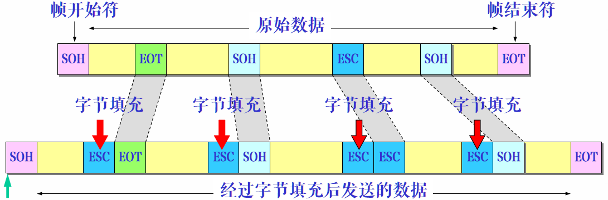
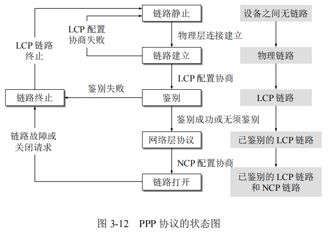
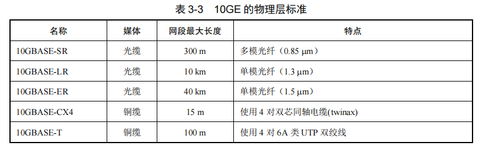

## 4.1 数据链路层概述

​		在传输信号时，物理线路可能会有差错。数据链路层需要在可能出错的物理线的基础上，构造一个**无差错的逻辑数据链路**，从而为网络层提供高质量服务。

> 数据链路层是整个模型中提供高质量数据通信服务最重要的一层。

### 4.1.1 专业术语与名词

* **结点(Node)**：计算机或网络设备（如路由器、交换机或集线器等）。
* **帧(Frame)**：数据链路层的协议数据单元(PDU)，用于**封装网络层数据报**，由三部分组成。
    * 帧首部
    * 数据，即网络层的PDU
    * 帧尾部
* **最大传输单元(Maximum Transmission Unit, MTU)**：**结点可以接受报文的最大尺寸**。
    * 发送方若要发送一个超过MTU的报文，则**分片**发送。
    * 接收方收到一个超过MTU的报文，则直接**丢弃**。
    * **同一链路上两个方向的MTU未必相同**。
* **路径最大数据单元(Path MTU, PMTU)**：通信的结点间需要**跨越网络**时，PMTU是**两个结点路径上的最小MTU**。
* **链路(Link)**：也称**物理**链路，是连接两个**相邻结点的物理信道**，如双绞线、光纤等。**一条链路只是一条通路的一个组成部分**。
* **数据链路(Data Link)**：也称**逻辑**链路，是两个**结点间的逻辑通道**，把实现控制数据传输协议的硬件和软件加到链路上即构成数据链路。
    * 通常使用**适配器**（即网卡）实现这些协议的**硬件**和**软件**。一般的适配器都包括了数据链路层和物理层的功能。 
* 数据链路层的**范围**：只与**本地结点之间的数据交付(Local Delivery of Frames)有关**。即在数据链路层，**帧的传输不会超出本地网络**。

​		数据链路层传送的是**帧(Frame)**，发送节点将网络层的PTU封装成帧并交由物理层进行传输，接收方从物理层收取数据帧并进行差错检验，无差错则将网络层PTU取出交由网络层处理，有差错则直接丢弃。

​		由于数据链路层不必考虑物理层如何实现比特传输的细节。可以更简单地设想 数据帧是是沿着两个数据链路层之间的水平方向把帧直接发送到对方，如下图所示。

### 4.1.2 向网络层提供的服务

​		数据链路层为了向网络层提供**可靠的且无差错的节点间数据传输链路**。实际提供的服务随系统的不同而不同，通常有：**无确认的无连接服务**、**有确认的无连接服务**和**有确认的面向连接的服务**三种形式。

##### 无确认的无连接服务

​		此种服务具有以下特点：

* 发送数据帧之前源结点与目标结点**无需建立连接**，事后也**无需释放连接**。
* 源结点只**发送数据帧**，其余一概不关心。
* 目标结点只**接收数据帧**，并不进行确认。接收的数据若有错则丢弃，不通知源结点。
* **传输可靠性由高层完成**。

这种服务一般用于有**较可靠**的网络中，是以太网(Ethernet)的主要方式。

##### 有确认的无连接服务

​		此种服务具有以下特点：

* 源结点按照顺序对每个数据帧进行**编号再发送**。
* 目的结点**收到数据帧**，然后向源结点**发出确认帧**。
* 如果在规定的时间内源结点未收到相应数据帧的确认帧，则认为已经丢失，重新发送数据帧，即**超时重传**。

这种服务主要用于**不可靠**信道，如无线通信系统。

##### 有确认的面向连接的服务

​		此种服务具有以下特点：

* 源结点和目标结点在传输数据前需要**先建立一个连接**，只有连接建立后才能传输数据帧，且传输完成后**要释放连接**。
* 源结点对每一个数据帧均进行编号，并**按照编号顺序发送**。若在规定时间内未收到确认帧，则重新发送，即**超时重传**。
* 目标结点**收到数据帧**，则向源结点**发送确认帧**。

这种服务有明显的：数据链路**建立**、数据**传输**、数据链路**释放**等三个阶段。通常用于**广域网的通信子网**。

### 4.1.3 主要功能

​		数据链路层会将网络层的报文拆分成**数据帧**，并按顺序发送。根据协议的不同，一个数据帧可能会有几百到几千字节的长度。
​		同时，数据链路层为了保证**可靠传输**，还需要具有以下功能：

* 一种合适的**帧结构**，以便拆分上层数据。

* 一种合适的**数据识别机制**，确保所有数据得到传输。

* 一种**检错或纠错机制**，以发现并解决传输中的错误。

* 一种合适的**流量控制机制**，以维持有序通信。

* 一种获得发送数据权的**判断和决策机制**。

### 4.1.4 数据链路层简单模型

​		当一个端系统向另一个端系统发送数据时，从协议的层次上看，端系统之间都有完整的五层协议栈，但**路由器在转发分组时使用的协议栈一般只有下面的三层** 。数据进入路由器后要先**从物理层上到网络层**，在转发表中找到下一**跳(Hop)**的地址后，再下到物理层转发出去。

​		因此，数据从一个端系统流向另一个端系统时，会在路径中的各结点的**协议栈中向上和向下流动多次**，如下图中的红色箭头所示。

### 4.1.5 两种传输方式

​		数据链路层使用的信道主要有**点对点信道(Point-to-Point)**和**广播(Broadcast)信道**两种类型，这两种数据传输方式分别代表了**两种不同的网络应用场景**。

##### 点对点(Point-to-Point)信道数据传输

​		点对点信道数据传输是在一个数据链路上**有且仅有两个结点**。两个结点间**以双工的方式进行传输数据**，即双向都可以发送/接收数据。

​		主要用于**通信子网的结点（路由器）间数据传输**。

##### 广播(Broadcast)信道数据传输

​		广播信道数据传输是**多个结点共享一个信道**，每个结点都可以通过这个信道向其他结点发送数据，**每个结点只接收发送给自己的数据**。
​		主要用于**资源子网的同一局域网结点间数据传输**。

----

## 4.2 基本问题

​		面对物理链路的恶劣环境，为实现**可靠数据传输**，数据链路层有许多问题需要解决，其中以下三个是最基本的共性问题：

**封装成帧(Framing)**：发送结点的数据链路层将网络层的数据报文添加**首部(Header)**和**尾部(Trailer)**后封装成帧。
**透明传输(Transparent Transmission)**：据报文中的任意数据都可以得到传输，高层应用无需担心**特殊字符的传输问题**。
**差错控制(Error Control)**：接收方只接收**无差错的数据帧**。

### 封装成帧(Framing)

​		为方便接收方数据链路层能够**以帧为单位处理接收的数据**，发送方必须正确标识出帧的**起始**和**终止**，也就是进行**帧定界(Frame Definition)**。

​		封装成帧(Framing)是**在网络层报文的前后分别添加首部(Header)和尾部(Trailer)**，构成一个帧。首部和尾部的重要作用之一就是进行**帧定界**。此外，首部和尾部还包括许多必要的**控制信息**。下图简要展示了这一过程。

#### 帧界定符

​		当数据是由**可打印的ASCII码**组成的文本文件时，帧定界可以使用**控制字符**作为帧定界符。

* 控制字符**SOH(Start Of Header)**：放在帧的最前面，表示帧**开始**。
* 控制字符**EOT(End Of Transmission)**：放在帧的最后面，表示帧**结束**。

> SOH和EOT只是控制字符的名字，分别十六进制编码`0x01`和`0x04`。

下图展示了这一封装形式。

​		若发送端在发送一个帧时出现故障，发送中断，随后又恢复正常，重新发送。接收端通过**判断SOH与EOT之间的匹配情况**就可以判断前面收到的是个不完整的帧，丢弃即可。例如，只有首部开始符SOH而没有传输结束符EOT。

### 透明传输(Transparent Transmission)

* **透明(Transparent)**：表示对于某个对象来说一个**实际存在的事物看起来却好像不存在**一样。

​		由于帧的开始和结束的标记使用专门指明的控制字符，因此，所传输的数据中一定**不允许出现同帧界定符的比特编码一样字符**，否则就会出现帧定界的错误。

​		如果数据中的某个字节的二进制代码恰好和SOH或EOT这种控制字符一样，数据链路层就会错误地“找到帧的边界”，接收部分帧（误认为是个完整的帧），而把剩下的那部分数据丢弃。如下图所示。

​		在数据链路层的透明传输是指**无论被传数据是什么样的比特组合，都能够在链路上传送**。

​		为了解决透明传输问题，就必须设法使数据中可能出现的控制字符“SOH”和“EOT”**在接收端不被解释为控制字符**。具体的方法有：**字节填充(Byte Stuffing)**和**比特填充(Bit Stuffing)**两种。

#### 字节填充(Byte Stuffing)

字节填充(Byte Stuffing)也称**字符填充(Character Stuffing)**，其具体方法如下：

* 发送端的数据链路层在数据中出现控制字符“SOH”或“EOT”的前面插入一个**转义字符ESC**(十六进制编码为`0x1B`)。如果转义字符也出现在数据当中，则在转义字符的前面插入一个转义字符。
* 接收端的数据链路层在把数据送往网络层之前**删除插入的转义字符**。

下图展示了字符填充方法的例子。

#### 比特填充(Bit Stuffing)

​		比特填充(Bit Stuffing)是当**连续的多个“1”或多个“0”作为帧定界符中的一部分**时，可采用的一种比较简单的透明传输方法。其具体方法如下：

* 设帧定界符中有**连续n个“1”**，如HDLC协议中 ，帧定界符为`01111110`
    * **发送端**：当在帧的数据字段发现有**n-1个连续“1”**时，则在其后立即**填入一个“0”**。
    * **接收端**：对帧的数据字段比特流进行扫描。每当发现**n-1个连续“1”**时，就**删除其后的“0”**。

下图展示了比特填充方法的例子。

### 差错控制(Error Control)

​		现实的通信链路都不会是理想的，在数据通信过程中，由于自然环境等因素，**数据比特流在传输过程中可能会产生差错**。最常见的就是**比特差错(Bit Error)**。

> **比特差错(Bit Error)**：1可能会变成 0，而0也可能变成1。

​		产生差错的自然原因一般有：

* **热噪声(Thermal Noise)**：**传输介质内的分子热运动**，它存在于所有电子器件和传输介质中。是温度变化的结果，但不受频率变化的影响。
    * 特点：**干扰幅度小，持续性，对模拟通信影响大。**
* **冲击噪声(Impulse Noise)**：外界干扰，是传输中的主要差错。
    * 特点：**干扰幅度大，突发性，对数字通信影响大**。

​		在计算机网络通信中，**差错控制主要针对冲击噪声**。例如，数据率为9600bps，一次闪电持续时间为10ms，则会连续破坏96个比特位。

#### 差错控制方法

​		通过特殊的编码，即**差错控制码(Error Control Coding)**，使**接收端能够发现甚至自动纠正错误**。常用的差错控制编码有：**检错码(Error Detection Code)**和**纠错码(Error Correction Code)**两类 。

* **检错码(Error Detection Code)**：能够**发现差错**，但**无法自动纠正差错**，通过发送方重传获得正确数据。
* **纠错码(Error Correction Code)**：不但能过**发现差错**，而且能够知道哪里出错，从而**自动纠正差错**。

#### 基本概念

* **码字(Code Word)**：由**信息位**和**校验位**（冗余位）组成。设信息位为$m$位，校验位为$r$位，则码字长度为$n=m+r$。

* **码距(Code Distance)**：指两个码字的**不同位数**。如`1000_1001`和`1011_0001`的距离为3。

* **海明距离(Hamming Distance)：**指对于给定某种编码算法，其给出的包含全部合法码字的码字表（编码系统）中的**两个码字之间的最小距离**。

    * 若**检测**$d$位出错，则海明距离至少为$d + 1$。
    * 若**纠正**$d$位出错，则海明距离至少为$2d+1$。

    > **海明距离决定了编码系统的检错和纠错能力。**
    >
    > 例：设有一编码系统的码字表有**4个码字**组成：
    > `00_0000_0000`          `00_0001_1111`
    > `11_1110_0000`          `11_1111_1111`
    > 海明距离为5，则可检测出4位出错，纠正2位出错。
    > 若收到一个码字：00_0000_0111，判断出错。
    >
    > * 若出错位不超过2位，则可以断定其正确码字为`00_0001_1111`
    > * 若出错为超过两位（如3位），则无法断定其正确码字是`00_0001_1111`还是`00_0000_0000`。

* **编码效率**：指$R=\frac{m}{n}=\frac{m}{m+r}$ 。其中信息位为$m$位，校验位为$r$位，码字长度为$n$ 。

#### 海明码(Hamming Code)

​		**理查德·卫斯里·汉明(Richard Wesley Hamming)**在1950年发明**海明码(Hamming Code)**。海明码是一种能够纠正1位错误或检测两位错误并纠正一位错误的线性编码系统。主要用于**存储器校验**。

##### 基本思想

* 在数据位组中加入几个校验位，增加数据代码间的码距。
* **将有效信息按照某种规律分为若干组，每组安排一个校验位进行奇偶校验。**
* 当某一位发生变化时会引起校验结果变化，不同码位上的错误会得出**不同的校验结果**。

> **奇偶校验位(Parity Bit)**
>
> 又称**校验比特(Check Bit)**是一个**表示给定位数的二进制数中1的个数是奇数还是偶数的二进制数**。奇偶校验位是最简单的错误检测码。 
>
> 奇偶校验位有两种类型：偶校验位与奇校验位。 
>
> **偶校验位**：若一组给定数据位中1的个数是奇数，补一个bit为1，反之补一个bit为0，使得总的1的个数是**偶数**。
>
> 例：`000_0001`，补一个bit为1，`0000_0011`。 
>
> **奇校验位**：若一组给定数据位中1的个数是奇数，补一个bit为0，反之补一个bit为1，使得总的1的个数是**奇数**。
>
> 例：`000_0001`，补一个bit为0，`0000_0010`。

##### 通用算法

​		下列通用算法可以为任意位数字产生一个可以**纠错一位(Single Error Correcting, SEC)**的汉明码。

1. **确定校验位位数**：根据$2^r \geq  d + r + 1$公式求出校验位位数$r$，其中$d$为数据位位数。

2. **标号**：从1开始给编码系统中的bit位（从左向右）标上序号： 1，2，3，4，5...

3. **确定校验位位置**：编码系统的位置序号中**所有为2的幂次方的位**（编号1，2，4，8等）是校验位。

4. **确定数据位位置**：除校验位外，其它位置是数据位，按数据中bit位的次序填入即可。

5. **确定分组**：每一数据位包含在特定的两个及以上的校验位中，这取决于**数据位位置序号**的**二进制表示**形式。

    * **校验位1**：管理所有数据位位置序号的二进制表示形式**第1位有1**的数据：000**1**，001**1**，010**1**，011**1**，100**1**等。

    * **校验位2**：管理所有数据位位置序号的二进制表示形式**第2位有1**的数据：00**1**0，00**1**1，01**1**0，01**1**1，10**1**0，10**1**1等。

    * **校验位4**：管理所有数据位位置序号的二进制表示形式**第3位有1**的数据：0**1**00，0101，0**1**10，0**1**11，1**1**00，1**1**01，1**1**10，1**1**11等。

    * **校验位8**：管理所有数据位位置序号的二进制表示形式**第4位有1**的数据：**1**000，**1**001，**1**010，**1**011，**1**100，**1**101，**1**110，**1**111等。

6. **确定校验位数据**：根据分组计算对应校验位应该置“1”还是置“0”。**采用奇校验还是偶校验都是可行的**。偶校验从数学的角度看更简单一些，但在实践中并没有区别。

下图展示了这一过程：

##### 特性

* 海明码效率最高时海明距离为3，只能纠正一位出错，而实际通信过程中经常发生的是突发性错误（一连串位出错）。
* 要纠正突发性出错，则必须加大海明距离；但加大海明距离会增加校验位长度，从而降低了编码效率。同时也会使编码系统过于复杂。

#### 循环冗余码(Cyclic Redundancy Code, CRC)

​		**循环冗余码(Cyclic Redundancy Code, CRC)**，又称为多项式码，是指在发送端产生一个冗余码，附加在信息位后面一起发送到接收端，接收端收到的信息按发送端形成循冗余码同样的算法进行校验，如果发现错误，则通知发送端**重发**。循环冗余码是目前计算机网络中使用最广泛的一种检错码

##### 编码原理

* 设信息位串为$a_1a_2a_3 ... a_m$ ，则信息编码多项式为$M(x)=a_1x^{m-1} + a_2x^{m-2} + a_3x^{m-3} +  ... +a_mx^0$ 。
* 选择一个$r$次多项式$G(x)$作为生成多项式，按下面步骤**生成校验串**：
    1. 在信息位串后补$r$个0，对应的多项式为$x^rM(x)$。 
    2. 用**模2不借位除法**，计算余数$R(x)$，$R(x)= \mod \Large{(\frac{x^rM(x)}{G(x)})}$
    3. 要发送的码字多项式$T(x)=x^rM(x)+ R(x)$
* 接收方使用同样生成多项式$G(x)$通过模2不借位除法得到余数$R(x)$。
    * **余数为0**：则认为数据在传输过程中**没有出错**。
    * **余数不为0**：则认为数据在传输过程中**出错**，且出错位为余数对应bit位置。

> 模2不借位除法：即二进制模2除法，相当于**按位异或运算**。

**例**：信息位串为$101\_0001$，若$G(x) = x^4+x^2+x+1$，求CRC码。 
**解**：
$$
\begin{align} 

& M(x)= x^6+x^4+1;  r=4 \\
& x^rM(x)= x^{10}+x^8+x^4 \rightarrow 101\_0001\_0000 \\
& G(x) = x^4+x^2+x+1 \rightarrow 1\_0111 \\
Compute: R(x) &= \mod \Large{(\frac{x^rM(x)}{G(x)})} \\

\Downarrow \\ 
& \underline{\qquad 1001111} \rightarrow quotient : almost \ no \ use \ in \ here \\
G(x) \leftarrow 10111 \bold{)} & 10100010000 \rightarrow x^rM(x)\\
& \underline{10111 \qquad \qquad} \\

& \ \ \quad 11010 \\
& \underline{\ \ \quad 10111 \qquad \quad } \\

& \qquad 11010 \\
& \underline{ \qquad 10111 \qquad \quad } \\

& \ \ \qquad 11010 \\
& \ \ \underline{ \qquad 10111 \qquad \quad } \\

& \quad \qquad 11010 \\
& \ \ \ \ \underline{\qquad 10111 \qquad \quad } \\

& \ \ \quad \qquad 1101 \leftrightarrow R(x) = x^3 + x^2 + 1  \\

\\

T(x) &= x^rM(x) + R(x) \\
     &= x^{10} + x^8 + x^4 + x^3 + x^2 + 1 \\
     & \Rightarrow  101\_0001\_1101 \\
     
\end{align}
$$

##### 检错能力

* 若$\\mod {(\frac{T'(x)}{G(x)})} = 0 $，**不一定正确！**
* 若$\\mod {(\frac{T'(x)}{G(x)})} \neq 0 $，**一定出错！**

**CRC码不能100%的发现错误，因为，当余数为`0`时可能发生错误**。**CRC检错率取决于生成多项式**$G(x)$ 。

##### 生成多项式性质

* 若$G(x)$中含有$x+1$因子：则能检测出所有的**奇数位错**。
* 若$G(x)$中不含有$x$因子，或者说，$G(x)$含有常数项1：那么能检测出所有**突发长度小于等于$r$的突发错**。
* 若$G(x)$中不含有$x$因子，且对任何$0<e≤n-1$的$e$，除不尽$x^e+1$：则能检测出所有的**双位错**。
* 若$G(x)$中不含有$x$因子：则对于突发长度$b = r+1$的突发错误的**漏校率为$2-(r-1)$** 。
* 若$G(x)$中不含有$x$因子：则对突发长度$b ≥ r+1$的突发错误的**漏校率为$2-r$** 。

下面是三个标准CRC生成多项式：
$$
\begin{align}
CRC-12 &= x^{12}+x^{11}+x^3+x^2+x+1 \\
CRC-16 &= x^{16}+x^{15}+x^2+1 \\
CRC-CCITT &= x^{16}+x^{12}+x^5+1 \\
\end{align}
$$

----------

## 4.3 点到点信道数据链路层协议

​		点到点信道数据链路层协议是指：在信道两端各有一个端点（结点），采用**一对一通信方式**，双方协调完成通信。通常用于广域网中两个路由器串口之间互联，或者使用调制解调器通过电话线拨号连接ISP。

### 4.3.1 HDLC协议

**HDLC(High-level Data Link Control)协议**是一种**面向比特**的链路层协议。是ISO在IBM的**SDLC(Synchronous Data Link Control)协议**的基础上制定的数据链路层协议。HDLC协议曾经是数据链路层协议的典型代表，得到过广泛的应用。现如今，HDLC协议已经退出历史舞台。

> **面向比特**：是指**以二进制位作为数据帧**的基本数据单位。

#### HDLC基本配置

HDLC协议定义了3种类型的**站**、2种**链路配置** 和3种**数据传输方式**。

##### 站

* **主站**：主站发出的帧叫**命令帧**，负责对链路进行**控制**。

* **从站**：从站发出的帧叫**响应帧**，在主站的控制下进行**操作**。

* **复合站**：兼具主站和从站的功能，既可以发送**命令帧**，也可以发送**响应帧**。

##### 链路配置

* **非平衡配置**：既可用于**点对点链路**，也可用于**多点链路**。这种链路由**一个主站和多个从站**组成，可以支持全双工或半双工传输。

    

* **平衡配置**：只能用于**点对点链路**。这种配置由**两个复合站**组成，同样支持全双工或半双工传输。 

    

##### 数据传输方式

* **正常响应方式(Normal Response Mode, NRM)**：这种方式适合不平衡配置，**主站启动数据传输过程，从站只有收到命令时才能发送数据。**
* **异步平衡方式(Asynchronous Balanced Mode, ABM)**：这种方式适合**两端都是复合站的平衡配置，任何一方都可以启动数据传输。**
* **异步响应方式(Asynchronous Response Mode, ARM)**：这种方式适合不平衡配置，**从站在没有收到主站命令时，就可以启动数据传输服务。** 

#### HDLC帧格式

下图是HDLC协议标准的帧格式。

##### 标志(Flag)

​		固定为`0111110`，标志着一个帧的**开始和结束**。具有帧之间的**同步作用**。在连续发送多帧时，可用一个标志字段，既表示帧的开始，又表示帧的结束。

> 为保证透明传输，HDLC协议采用**比特填充法(Bit Stuffing)**实现。

##### 地址(Address)

全`1`为广播地址，全`0`为无效地址。

* **非平衡方式**：总是填入从站地址。
* 平衡方式：总是填入应答站地址，用来区分命令和响应。

##### 控制(Control)

​		控制字段的第1位或第1、2位用于表示**帧类型**，共有三种不同类型的帧：**信息帧(I-Frame)**、**监控帧(S-Frame)**和**无编号帧(U-Frame)**。其余比特位用于表示**帧编号**及其他**控制信息**。其中：

* **N(S)**：表示信息帧的帧序号0-7，以便**标识信息帧的发送顺序**。
* **N(R)**：**接收端期望接收的下一帧的序号**。
* **P/F**：轮询(Poll)/结束(Final)位，用于**多点轮询访问方式。**

控制字段格式如下所示。

具体的解释如下：

* **信息帧**：含有需要传输的数据。

* **监控帧**：**管理**和**控制**链路操作。
    * **RR（接收准备好）**：`00`，确认以前各帧，准备接受后继帧。
    * **REJ（拒绝）**：`10`，确认以前各帧，但暂停接收后继帧，用来进行**流量控制**。
    * **RNR（接收未就绪）**：`01`，**否认N(R)起的各帧**，请求**重发从N(R)开始的各帧**。
    * **SREJ（选择拒绝）**：`11`，**仅否认N(R)帧**，请求**重发N(R)那一帧**。

* **无编号帧**：不带编号和数据， 用于提供各种**附加的链路控制命令和响应功能。共有$2^5=32$种控制功能，常用的有：**
    * SNRM（置正常响应模式）
    * UA（无编号帧确认）
    * FRMR（帧拒绝）
    * DISC（拆除连线）
    * RESET(复位)

##### 数据(Information)

要传输的数据，可以是任意二进制位的组合，即**高层的报文分组**。

##### 帧校验(Frame Checksum, FCS)

**16位CRC码**，生成多项式采用：$G(X)=CRC-CCITT= x^{16}+x^{12}+x^5+1$

#### HDLC工作原理

HDLC的工作过程分：**建立数据链路连接**、**传输数据帧**和**拆除链路连线**三个阶段。

##### 建立数据链路连接

* 请求建立物理连接。
* 请求建立链路连接，即发送方发送SNRM（置正常响应模式）。
* 接收方同意建立链路连接，即发送UA（无编号帧确认）。

##### 传输数据帧

当数据链路建立完毕，发送/接收方按照某种流量控制策略发送和接收数据帧，并允许**捎带应答**。 

##### 拆除链路连线

* 全部数据发送完毕，发送方发出DISC（拆除连接）无编号帧。
* 接收方返回UA（无编号帧确认）作为响应，此时释放链路层实体占用的资源。

### 4.3.2 PPP协议

​		根据OSI/RM模型，数据链路层应该向网络层提供**可靠的传输服务**，因此在数据链路层的传输协议中要求有**帧编号**、**确认帧**、**重传机制**等（如HDLC）。

​		随着通信线路通信质量的提升，特别是光纤媒介的大规模普及的前提下，**数据链路层协议取消了可靠传输服务，使数据链路层协议变得更加简单。可靠传输和流量控制等任务均交予上层协议（如运输层TCP协议）完成。**

​		**点对点(Point-to-Point Protocol, PPP)**协议就是一个比HDLC协议**简单的数据链路层协议。**是一个得到广泛应用的广域网及接入网中主流的数据链路层传输协议 。

​		PPP协议是**面向字符**、**全双工**、**按照顺序传递数据包**的协议。其主要目的是：通过**拨号**或**专线**方式建立点对点的连接和通信，为各种主机、网桥和路由器之间简单连接提供一种共通的标准解决方案。

#### PPP组成

* 一个**将IP数据报封装到串行链路的方法**
    * PPP在点对点链路上使用与HDLC极为类似的格式封装数据，仅做了很少的改动。
    * PPP既支持异步链路也支持面向比特的同步链路。
    * IP数据报被作为数据封装在PPP帧中。
    * PPP的数据长度受最大传送单元MTU的限制。        

* 一个用来建立、配置和测试数据链路连接的**链路控制协议(Link Control Protocol, LCP)**
    * 通信的双方可协商一些选项。
    * 在RFC1661中定义了11种类型的LCP分组。        
* 一套**网络控制协议(Network Control protocol, NCP)**
    * 协商链路上传输的数据包格式与类型，建立、配置不同的网络层协议，从而可以支持不同的网络层协议,如IP、Decnet、Appletalk等。
    * 针对上层不同的协议，使用不同的NCP组件。
        * 如果是IP，则提供ipcp接口。
        * 如果是IPX，则提供ipxcp接口。
        * 如果是Appletalk，则提供atcp接口。

#### PPP分层结构

​		PPP协体系结构分为**LCP子层**和**NCP子层**，**LCP主要作用于数据链路层中**，**NCP介于网络层和数据链路层之间起作用**。具体地位如下图所示。

* **LCP子层**：主要负责数据链路的建立、配置和测试。
* **NCP子层**：根据网络层的**不同协议**互相交换特定的控制报文 、**配置不同上层协议**。

#### PPP帧格式

​		PPP的帧格式与HDLC的帧格式几乎相同，仅做了很少的改动。具体帧格式如下图所示。

* **F(Flag)**：1Byte，取值固定为`0x7E`。标志一个帧的开始或结束。连续2个帧之间只需一个标志字段，如果出现连续两个标志字段，表示这是一个空帧。

* **A(Address)**：1Byte，取值固定为`0xFF`。无实际意义。

* **C(Control)**：1Byte，取值固定为`0x03`。无实际意义。

* **P(Protocol)**：2Byte，根据取值的不同有不同意义。

    * `0x0021`：信息字段是IP数据报
    * `0xC021`：信息字段是链路控制数据LCP
    * `0x8021`：信息字段是网络控制数据NCP
    * `0xC023`：信息字段是安全性认证PAP
    * `0xC025`：信息字段是链路质量报告LQR
    * `0xC223`：信息字段是安全性认证CHAP

    

* **I(Information)**：**1500Byte**，传输的信息，不超过1500字节，不足1500字节时填充。

* **FCS(Frame Checksum)**：2Byte，CRC码，使用CRC的帧校验序列。

#### PPP透明传输

​		PPP根据**同步**和**异步**的传输方式制定了不同的透明传输方法。

##### 同步传输

​		在同步传输链路中，PPP规定采用硬件实现**零比特填充**方法完成透明传输，同HDLC的方法一样。

##### 异步传输

​		在异步传输时，PPP使用一种特殊的**字符填充**法。 

* 将信息字段中出现的每个`0x7E`字节转变成为2字节序列`(0x7D, 0x5E)`。 
* 若信息字段中出现一个`0x7D`的字节, 则将其转变成为2字节序列`(0x7D, 0x5D)`。
* 若信息字段中出现ASCII码的**控制字符（即数值小于 0x20 的字符）**，则在该字符前面要加入一个`0x7D`字节，同时将该字符改为与`0x20`**异或**后的编码。 如`0x04`，改为`0x24`。

#### PPP运行阶段

PPP协议运行过程的几个工作阶段如下。

##### 链路静止(Link Dead)阶段

​		初始阶段。这时在用户端和ISP的路由器间**不存在物理层的连接**。

##### 链路建立(Link Establish)阶段

​		完成LCP协商，包括协商认证方式等，其目的是**建立链路层的LCP连接**。

* 发送LCP的**配置请求帧(Configure-Request Frame)**。
* 回应LCP的**配置确认帧(Configure-Ack Frame)**，所有选项都接受。
* 回应LCP的**配置否认帧(Configure-Nak Frame)**，所有选项都理解但不能接受。
* 回应LCP的**配置拒绝帧(Configure-Reject Frame)**，选项有的无法识别或不能接受，需要协商。

##### 验证(Authenticate)阶段（可选）

​		完成PAP/CHAP验证，在这一状态，**只允许传送LCP协议的分组、鉴别协议的分组以及监测链路质量的分组**。

​		PPP协议有：**口令认证协议(Password Authentication Protocol, PAP)**和**挑战握手认证协议(Challenge Handshake Authentication Protocol,  CHAP)**两种认证方式。

* 鉴别成功：进入**网络层协议(Network-Layer Protocol)状态**。
* 鉴别失败：进入**链路终止(Link Terminate)状态**。

###### 口令认证协议(Password Authentication Protocol, PAP)

​		PAP是PPP中最**基本认证**协议。由链路的一端向另一端发送用户名和密码，另一端以收到的用户名和密码判断是否建立连接。是一种简单的用户名/口令认证方式。以**明文方式**传输用户名和口令，安全性差。

###### 挑战握手认证协议(Challenge Handshake Authentication Protocol,  CHAP)

​		CHAP是PPP协议中**安全性较高**的认证协议。由认证端向被认证端发出**挑战challenge信息**，通常是要求用户名和密码，被认证端将**挑战应答的hash函数值**发送给认证端。认证端根据收到的响应决定是否建立连接。

##### 网络层协议(Network-Layer Protocol)阶段

​		完成NCP协商，PPP链路的两端的网络控制协议NCP**根据网络层的不同协议互相交换网络层特定的网络控制分组**。

> PPP协议两端的**网络层可以运行不同的网络层协议**，但仍可**使用同一个PPP协议进行通信**。

##### 链路打开(Link Open)阶段

​		维持PPP会话，传输数据、定时测试链路。

##### 链路终止(Link Terminate)阶段

​		终止PPP会话，回到链路不可用阶段。

* 一端发出**终止请求LCP分组(Terminate-Request)**请求终止链路连接。
* 接收另一端发送的**终止确认LCP分组(Terminate-Ack)**后，转到**链路终止**状态。

具体的运行阶段变化情况如下图所示。

#### LCP子协议

​		**链路控制协议(Link Control Protocol, LCP)**是PPP协议的一个子集，用于**点对点通信时发送端和接收端协商确定一系列必要的信息**。

##### LCP协议帧格式

​		LCP是PPP的子协议，**嵌入在PPP的信息部分**。当PPP的协议字段的值为`0xC021`时，表示其信息部分为LCP协议。

​		LCP帧有四个字段，分别为：**Code**、**Ident**、**Length**和**LCP Data**，具体的LCP帧格式如下图所示。

* **Code**：**标识LCP数据报文(Request or Reply)类型**。值如下图所示：

* **Ident(ID)**：LCP报文**序列号**，用于**匹配Request和Reply报文**。
    * 由Request报文的发送端生成，保持**递增**。
    * Replay报文的Ident值就是接收的Request报文的Ident的值，以帮助对端识别匹配。
* **Length**：即**LCP报文长度**，单位为**字节**。$Length \ value =Code+Ident+Length+LCP \ Data$
* **LCP Data**： **LCP数据报文**。

​		针对不同的工作，LCP协议有**链路配置报文帧**、**链路维护报文帧**和**链路终止报文帧**三种不同类型的帧。

* 链路**配置**报文帧：建立和配置一条链路。
* 链路**维护**报文帧：维护和调试链路。
* 链路**终止**报文帧：终止一条链路。

###### 链路配置报文帧

​		建立和配置一条链路。

* Code：
    * **Config-Request**：代码为`0x01`，启用链路以及配置请求报文。链路两端结点均可根据需要主动发出。
    * **Config-Ack**：代码`0x02`，所有选项都接受。
    * **Config-Nak**：代码`0x03`，所有选项都理解但不能接受。
    * **Config-Reject**：代码`0x04`，选项有的无法识别或不能接受，需要协商。

* LCP Data：

    * **最大接收单元(Maximum-Receive-Unit, MRU）**：通知对方可以接收的最大数据包长度。
    * **异步控制字符映射(Asynchronous-Control-Character-Map, ACCM)**：通知对方**哪些控制字符需要转义（映射**）。用32位整数，相应的位数表示ASCII表中第几个字符需要转义。0表示不需要转义，1表示需要转义。第0位对应的是ASCII 码NUL。
    * **认证协议（Authentication-Protocol）**：协商认证协议，**默认不认证**。
    * **魔术数(Magic-Number）**：**测试链路是否存在环的检测方法**。若接收方发现本次请求报中的魔术数与上次的相同，则认为可能存在环，并发送一个携带不同魔术数的Nak报文，以进一步检测。
    * **协议域压缩(Protocol-Field-Compression)**：标准的PPP中，协议编号为两个字节，经过协商后，可以把编号小于256的协议压缩为一个字节传输，但是编号大于256的协议无法压缩。默认不使用协议压缩。
    * **地址和控制域压缩(Address-and-Control-Field-Compression）**：标准PPP中须发送地址和控制域。但在点对点中，这些是固定值。在接收过程中，如果没有接收 FF则认为进行了地址和控制域压缩。

    >**LCP的配置选项都是一些TLV(Type、Length、Value)组**。只要不超过MTU，一个LCP报文可以携带多个TLV组。
    >
    >LCP 配置选项包括：最大接收单元，异步控制字符映射、链路鉴权协议等。如果一个配置选项没有在配置请求数据包中出现，那么该配置选项将使用**默认值**。

###### 链路维护报文帧

​		维护和调试链路。

* Code
    * **Terminate-Request**报文：**关闭一个点对点的连接**，PPP的任意一个端点都可以发出此报文。主动终止链路的一端持续发送Terminate-Request报文，直到收到一个Terminate-Reply。
    * **Terminate-Reply**报文：**应答链路终止请求**。当收到一个Terminate-Request报文后，接收方必须回应一个Terminate-Reply报文，同时等待对端先将链路断开后，再完成本端的所有断开的操作。

###### 链路终止报文帧

​		终止一条链路。

​		链路维护报文内容比较杂。如，定时进行PPP保活的报文，链路两端分别发送Echo Request报文，如果对方回复了Echo Reply报文，则表示链路仍在活跃状态。

##### LCP协商过程

​		**LCP两端通过发送请求和应答帧的方式进行交互协商各种配置选项**。 

* 发送LCP Config-Request报文的一端向另一方提出自己需要的选项。
* 接收Config-Request报文的一端根据自身情况选择下列三种报文之一进行应答：
    * Config-Ack
    * Config-Nak
    * Config-Reject

#### NCP子协议

​		**网络控制协议(Network Control Protocol, NCP)**实际上是**一套协议**。每个子协议都是为处理相应网络层协议所需的错综复杂的配置而存在。

​		当链路建立后，LCP将控制权交给适当的NCP。NCP与LCP**相同的协议格式**。IP、IPX、AppleTalk等都**拥有各自的NCP**。

​		在NCP成功配置网络层协议之后，在已建立的LCP链路上，网络层协议处于**开启状态**。此时，PPP可以**传输相应的网络层协议数据包**。

##### IPCP(IP Control Protocol)

​		IP控制协议(IPCP)是PPP协议中负责**配置和激活网络层IP协议**传输的NCP子协议，
其使用和链路控制协议(LCP)同样的机制。

* **Protocol**：`0x8021`

* **Code**：取值范围是`1-7`

    * Configure-Request
    * Configure-Ack
    * Configure-Nak
    * Configure-Reject
    * Terminate-Request
    * Terminate-Ack
    * Code-Reject

    > 其他取值会导致Code-Rejects

* **NCP Data**：
    * **IP-Compression-Protocol**：协商使用指定的压缩协议，默认不使用压缩选项。
        Van Jacobson TCP/IP 报头压缩技术可以将 TCP/IP 报头的大小降低至3字节。
    * **IP-Address**：协商本地使用的IP地址。一个合法的IP地址。若为全0的IP地址，则要求**对方分配**一个IP地址。
    * **Primary DNS Server Address/Secondary DNS Server Address**：协商**远端的主、次DNS(Domain Name System)，域名服务器地址**。全0表示要求**对方提供**DNS地址。

----

## 4.4 广播信道数据链路层协议

​		**广播信道(Broadcasting Information Channel)**是一种可以通过广播方式传输信息的信息通道。通过广播信道，可以实现**一对多的通信**。

### 4.4.1 概述

#### 局域网数据链路层分层结构

​		**局域网使用的就是广播信道**，其在20世纪 70年代末发展起来。**局域网技术**（以太网技术，令牌环网技术等）在计算机网络中占有非常重要的地位，广播信道的数据链路层协议一般也指代局域网中的数据链路层协议。下图展示了在局域网中关于数据链路层的分层结构。

#### MAC技术

​		使用广播信道是一个**公共**信道，必须制定某种机制保证通信**有序**进行。这种机制被称为媒介共享技术，也称为**多址接入控制(Multiple Access Control, MAC)**或**媒介访问控制(Medium Access Control, MAC)**技术。

​		MAC技术用于**解决公共信道使用产生竞争时，如何分配信道使用权的问题。**

​		在`IEEE 802`标准中，**媒介访问控制(Medium Access Control, MAC)层**是数据链路层的一个**子层**，处于**逻辑链路控制层(Logical Link Control, LLC）**与物理层之间。

* **LLC层**：负责**提供本结点到其他相邻结点的“链路”**。
* **MAC层**：负责**实现本结点与其他结点有序、高效的共享信道**。MAC层在分享**有限的信道资源**时，需要满足：
    * **公平**地在多个用户间分配信道资源。
    * **高效**的使用信道资源。
    * 各用户之间具有**良好的连通性**。
    * 尽可能高的系统**吞吐量**、尽可能低的系统**时延**。

​		按照信道访问权限的控制方式，媒介访问控制协议通常分为下图的几类。

### 4.4.2 动态接入分配协议

​		动态接入分配方式有两种分别是：

* **随机接入分配**：**目前最流行的MAC技术，在有线网络和无线网络中应用十分广泛**。有以下几种常见的协议：
    * ALOHA
    * CSMA
    * CSMA/CD
    * CSMA/CA
* **受控分配方式**：在一些特定的场合使用。主要有以下两种协议：
    * 令牌协议：持有令牌的结点才能访问媒介。
    * 轮询协议：由主结点**轮询**各从属结点，并分配媒介访问权限。

#### ALOHA协议

​		ALOHA协议，也称ALOHA技术、ALOHA网，是**世界上最早的无线电计算机网**，由美国夏威夷大学的**Norman Abramson**等人于1968年设计。其目的是在夏威夷各岛屿之间通过**利用低成本的商业无线电设备实现部署在各岛上的计算机系统能够互连**。
​		ALOHAnet最重要的贡献在于**利用共享介质来进行终端的传输**，而不是像ARPANET那样只能结点间只能通过一对一的方式通信。

​		ALOHA协议分为**纯ALOHA(Pure ALOHA)协议**和**时隙ALOHA(Slotted ALOHA)协议**两种。

##### 纯ALOHA(Pure ALOHA)协议

###### 基本思想

**不监听信道，想发就发，随机重发。**

###### 传输机制

* 发送端发起传输请求后可**立即发送数据**，无需等待授权，也不需要检测信道否空闲。
* 接收端在成功接收数据后返回一个**ACK帧**，通知发送端传输成功。
* 接收端收到的数据校验有错，则**不发ACK帧**。
* 发送端在**预定的时间内未收到ACK帧**，则认为发生**碰撞**，并在一个**随机时间后重发**。若重发再次碰撞，则再等待一个时间后重发，**直到接收到ACK帧**。

具体的传输过程如下图所示。

* $T_0$：指这个帧的**发送时延**（传输时延+传播时延），一个帧从刚开始发送到发送成功的时间。
* 站1：第一时间发送1号帧，经过$T_0$之后并没有别的数据帧与它发生冲突，这个时间段只有它一个数据帧发送数据，它是发送成功的。
* 站2：过了一段时间发送2号帧，前半段时间顺利，后半段时间，站N-1也开始发送数据帧；此时信道上有**两个站点在同时发送数据**，就一定会**造成冲突**。
    * 冲突解决办法：**超时后等一个随机时间再重传**。

​		在纯ALOHA中，当网络中**结点数量较多**，且在单位时间内，结点发送帧的数量符合**泊松分布**时，**信道利用率的理论值仅为18%**。可见纯ALOHA的信道利用率很低。

##### 时隙ALOHA(Slotted ALOHA)协议

时隙ALOHA协议是针对纯ALOHA协议中大量存在的碰撞而提出的一种改进型ALOHA协议。

###### 基本思想

**不监听信道，规定发送时间。**

###### 传输机制

* 将时间划分为**等长的时隙(slot)**，**每个时隙可以传输1个帧**。
* **结点间严格时钟同步，且只能在时隙开始时发送帧。**
* 如果2个及以上结点在同一时隙发送帧，结点即**检测到冲突**。

当某个结点发送一个帧后：

* 无碰撞：可以在下一个时隙继续发送新的帧。
* 有碰撞：在下一个时隙**以概率p重传该帧**，直至成功。

具体的传输过程如下图所示。

在时隙ALOHA中，其信道利用率的理论值比纯ALOHA高出一倍有余，**约为37%** 。

###### 优缺点

* 优点

    * 单个结点活动时，可以连续以信道全部速率传输数据。
    * 高度**分散化**，只需同步时隙。
    * 简单

* 缺点:

    * **冲突会浪费时隙**
    * 空闲时隙
    * 结点也许能以远小于分组传输时间检测到冲突
    * **时钟同步**

#### CSMA协议

​		无论是纯ALOHA还是时隙ALOHA，在广播信道中都存在严重的碰撞现象，造成信道利用率极低。**载波侦听多路访问 (Carrier Sense Multiple Access, CSMA)**就是针对ALOHA的弱点提出的一种改进机制。

​		CSMA认为：ALOHA的信道利用率低主要在于**发送前没有查看信道是否被占用。**于是，CSMA提出了**载波侦听(Carrier Sense)**的基本思想。即：**发送数据前先检测信道**，若信道**空闲**，则立即发送数据；若信道**忙**，则等待，并继续检测信道。

**根据检测到信道忙后所采取的策略**，CSMA可分为下面三种：

* **1-Persistent CSMA（1-坚持CSMA）**
    * 信道**空闲**：立即发送数据。
    * 信道**忙**：持续检测，发现空闲立即发送。
* **Non-persistent CSMA（非坚持CSMA）**
    * 信道**空闲**：立即发送数据。
    * 信道**忙**：**等待随机时间后再检测。**
* **P-persistent CSMA（P-坚持CSMA）**：适用于**分槽**的信道
    * **信道**空闲**：按$p$概率发送数据**，或**按$1-p$概率等到下个时间槽**再试。
    * 信道**忙**：等待下一个时间槽再试。

下面是几种协议之间吞吐量的对比。

​		由于只是在**发送前检测信道是否被占用**，当有两个或两个以上结点同时发送数据时，发送方只有**在数据发送完成后才会获悉发生碰撞**，数据无法使用，必须重发，从而浪费信道资源。

#### CSMA/CD协议

​		**CSMA/CD(Carrier Sense Multiple Access with Collision Detection)载波侦听多址接入/碰撞检测**是一种**具有碰撞检测能力**的广播信道多点接入技术，CSMA/CD是针对纯CSMA**在发送数据时无法检测到是否与其他结点发生碰撞问题**而提出的一种**改进协议**。 

​		**CSMA/CD是以太网的基础**。其主要贡献是**解决了多个结点同时传输，由于距离等原因，无法立刻检测到冲突的问题**。

##### 碰撞检测(Collision Detection)

###### 碰撞发生过程

* **原因**：电磁波在信道上**传播速度有限性**，体现为发送的数据信号在信道上传输时有一定的**传输时延**。使得同时或相差时间不大的多个结点**发送数据前无法检测到别的结点也在或已经发送了数据**，导致发生碰撞。
* **后果**：发生碰撞后，信道上传输的**信号严重失真**，无法从中得到出有价值的信息。

​		例如，假设，在一个广播信道的两端各有一个结点，分别为结点A和结点B。从A到B的距离为1km，信号传输时间为$\tau$，则碰撞发生的过程如下：

###### 碰撞检测基本思想

​		CSMA/CD中的碰撞检测是指：**结点边发送数据边检测信道上的信号电压大小**。
​		原理是：若**多个结点同时发送数据**，由于各结点**信号电压的叠加**，信道上的信号电压会发生较大变化。当结点检测到**信号电压变化值超过阈值**时，就认为至少有两个结点同时在发送数据，即发生了碰撞。
​		每个正在发送数据的结点，一旦发现碰撞，会**立即停止发送**，免得继续浪费网络资源，并在**等待一段随机时间后重新发送**。

###### 碰撞避退算法

​		当判断发生了碰撞，CSMA/CD采用了一种称为**截断二进制指数退避(Truncated Binary Exponential Back-off)**的算法。其体现在**随机等待时间的确定**，具体随机等待时间的确定如下：

* 每个站点确定一个基本**推迟时间(Propagation Time)**$T_p$，例如$T_p ＝ \ 2 \tau $ 。
* 从整数集合$\{0,1,2,3,...,2^{K-1}\}$中随机抽取一个整数$r$，其中$k＝\min(重发次数，10)$；则随机等待时间$T_W＝r×T_p$；
* 若**连续16次发送不能成功，则放弃发送并向高层报告**。

> 算法要点：**重发次数越多，等待时间越长。**

具体的算法流程如下图所示：

##### 特性

* **半双工**：CSMA/CD**只支持半双工**

* **争用期(Contention Period)**：也称**碰撞窗口(Collision Window)**，发送数据帧后最多经过$2 \tau$的时间，发送端就可知道是否遭受了碰撞。只要超过这个时间就不会发生碰撞。

* **最小帧长度**：为了**确保发送端能够在发送完成前检测到碰撞**，采用CSMA/CD的网络必须确定其最小的帧长度。凡是收到长度小于最小帧长度的帧都是**无效帧**。

* **比特干扰信号(Jamming Signal)**：检测到碰撞后，发送端立即停止发送数据，并**发送若干比特干扰信号通知其他结点**。

    

* **低通信量**：由于存在发送成功与否的**不确定性**，因此采用CSMA/CD协议的网络的平均**通信量远低于其最高数据速率**。

#### CSMA/CA协议

​		**CSMA/CA(Carrier Sense Multiple Access with Collision Avoidance)载波监听多路访问/冲突避免**，一般工作在无线网中。因为在无线网中会有许多同有线网不同的问题（如发生碰撞的信号能量通常较小，很难被检测），使得CSMA/CD不再适用，**只能设法避免碰撞**。

##### 隐蔽结点问题(Hidden Node Problem)

​		**发送结点无法检测到隐蔽结点，从而存在碰撞的可能性。**具体情况如下图所示。

##### 暴露结点问题(Exposed Node Problem)

​		**发送结点检测到有冲突的结点其实并不影响其发送数据**。具体情况如下图所示。

##### 碰撞避免(Collision Avoidance)

​		CSMA/CA协议主要使用如下两种方法来避免碰撞：

* **发送数据前，监听信道**。

    * 若存在**冲突**：则进行**二进制指数避退**。
    * 若信道**空闲**：则在**维持一段时间后**，**再等待一段随机的时间后**，信道依然没有别的结点使用，即发送数据。由于每个结点采用的随机时间不同，这样可以**减少碰撞的机会**。

* **RTS-CTS三向握手**

    * 发送数据前，先发送一段很小的**请求传送报文RTS(Request to Send)**给目标端。
    * **等待目标端回应报文CTS(Clear to Send)**后，才开始传送数据。
    * 在RTS、CTS和后面发送的数据帧中都有一个称为**网络分配向量(Network Allocation Vector, NAV)**的数据结构，**指明本次发送数据所需要的时间**，凡是能收到报文的其他结点将不会在这段时间里发送数据，**确保接下来传送资料时，不会被碰撞**。

    

    

两种碰撞避免方式的工作流程图如下所示。

-------

## 4.5 以太网技术

### 4.5.1 经典以太网

#### 局域网(LAN)

​		一般认为，**局域网(Local Area Network, LAN)**是在一个**局部的地理范围内**（如一个学校、工厂和机关内），将各种计算机，外部设备和数据库等互相联接起来组成的计算机通信网。

​		局域网可以实现文件管理、应用软件共享、打印机共享、扫描仪共享、工作组内的日程安排、电子邮件和传真通信服务等功能。

##### 特点

* **共享性**：具有**广播**功能，从一个站点可很方便地访问全网。局域网上的主机可**共享**连接在局域网上的各种硬件和软件资源。 
* **灵活性**：便于系统的扩展和逐渐地演变，各设备的位置可灵活调整和改变。多种媒体、全/半双工、共享/交换。
* **扩展性**：速率从10 Mbit/s到100 Gbit/s。
* **可靠性**、**可用性**和**残存性**等

##### 拓扑形式

局域网一般具有如下的拓扑连接形式。

#### 基本概念

​		**以太网(IEEE 802.3)是最常用的局域网组网方式。**特别是在与ATM技术的竞争中获胜后。

​		在局域网里建设网络，就需要使用多种**标准技术**，有以太网技术、令牌环网技术、ATM网技术、帧中继技术等，而以太网技术凭借其，使用方便、网络建造简洁，逐渐的流行开来。

* **协议**：采用CSMA/CD协议作为基本工作机制。
* **传输媒介**：以**粗电缆**为传输媒介，单段传输距离可达500m，最多可连接4台**中继器**，最长可达2500m。
* **连接方式**：采用较为灵活的**无连接**的工作方式，即不必先建立连接就可以直接发送数据。且不对发送的数据帧编号，也不要求对方发回确认。这是因为**局域网信道质量好**，因其而**产生差错的概率很小**。
* **编码**：采用**曼彻斯特编码**。
* **争用期**：争用期为**2倍的端到端往返时延**，并被规定为51.2us。争用期内可发送512bit(64byte)。如发送了64byte均未遇到碰撞即不会再遇到碰撞。
* **帧大小**：**最短有效帧长为64byte**，小于64byte的帧都是**无效帧**。

##### 以太网技术标准

​		常用的以太网标准有两个，分别是：

* **DIX Ethernet V2标准** 
* **IEEE 802.3标准**

> **DIX Ethernet V2标准**是世界上**第一个局域网产品（以太网）的标准**。
>
> **DIX Ethernet V2**与**IEEE 802.3**只有很小的差别，因此也可以将802.3局域网称为“以太网”。

​		严格说来，**以太网应当是指符合DIX Ethernet V2标准的局域网**。由于**TCP/IP使用的局域网标准是DIX Ethernet V2标准**而不是802.3标准中的几种局域网标准，因此逻辑链路控制子层LLC（即 802.2 标准）的作用已经不大了。很多厂商生产的适配器上就**仅装有MAC协议而没有LLC协议**。在路由器的互连中依然能看到LLC协议。

##### 原始连接方式

​		最初的以太网是将许多计算机都连接到一根**总线**上。当初认为这样的连接方法既简单又可靠，因为总线上没有**有源器件**。 具体情况如下图所示。

​		信道上的每一个工作的结点都能检测到B发送的数据信号。 由于只有结点D的地址与数据帧首部写入的地址一致，因此**只有D才接收这个数据帧**。 
​		其他所有的结点（A、C和E）都检测到数据帧首部的地址与自身的地址不同，因而将数据帧丢弃。**在具有广播特性的总线上实现了一对一的通信**。 

##### 以太网信道利用率

假设:

* $L,(bit)$为帧长
* 据发送速率为$C,(bit/s)$
* 的发送时间为$T_0 = L/C \ , (s)$
* 端到端传输时延$\tau$

* **占用期**：定义为成功发送一个帧所需要的时间，即$a = \frac{\tau}{T_0}$
    * $a \rightarrow 0$表明一发生碰撞就立即可以检测出来，并立即停止发送，因而信道利用率很高。
    * $a \rightarrow \infty$表明争用期所占的比例增大，每发生一次碰撞就浪费许多信道资源，使得信道利用率明显降低。
    * 当数据率一定时，以太网的媒介过长， $\tau$值会很大。
    * 帧的长度不能太短，否则$T_0$的值会太小，使$a$值太大。 

具体的形式如下图所示。

在理想状态下：

* 各结点发送数据时都**不会产生碰撞**。
* 媒介一旦空闲就有结点**立即发送数据**。

因此，发送一帧占用媒介的时间是：$T_0 + \tau$，则**极限信道利用率为$ S_{max} = \frac{T_0}{T_0 + \tau} = \frac{1}{1 + a}$** 。

##### 以太网帧结构

以太网的帧结构一般由

* **头部(Header)**

    * **目的地址** ，长度6字节，用于标记数据由哪台机器**接收**。
    * **源地址** ，长度6字节，用于标记数据由哪台机器**发送**。
    * **类型** ，长度2字节，指**承载的上层协议**，即在数据字段里封装着什么样的上层协议报文。例如IP、ARP、RPAR协议等。`0x0800`表示该帧数据是一个IP包。

    > 目的/源地址：即**MAC地址**，也称为物理地址、硬件地址等。由**IEEE管理和颁发**，其中**前24位由IEEE确定**，**后24位由硬件厂商确定**。在以太网中，每个适配器只接受与自身MAC相匹配的数据帧（广播帧、多播帧和发给自己的单播帧）。

* **数据(Data)**：任何需要发送的信息，长度可变，46至1500字节。

* **校验和(Checksum)**：一般采用**循环冗余校验(CRC)**。实际中采用CRC-32的生成多项式：$G(x)= x^{32}+x^{26}+x^{23}+x^{22}+x^{16}+x^{12}+x^{11}+x^{10}+x^8+x^5+x^4+x^2+x+1$

三部分构成，具体形式参考下图。

​		因为**历史**和**利益诉求**的不同，形成了大致相同略有区别的多种以太网协议，在封装格式上也有明显体现：

* **DIX Ethernet V2**：也有称为Ethernet V2(ARPA)，以示其来源的正宗性。**由DEC、Intel和Xerox三家企业开发的经典以太网，目前的主流**。
* **IEEE 802.3/802.2 LLC**：以Ethernet V2为基础，除了将原协议类型字段替换为长度字段外，还加入802.2LLC头用以标志上层协议。
* **IEEE 802.3/802.2 SNAP**：IEEE为支持更多的上层协议而发布，在保留LLC头的同时，新增加了一个2Bytes的协议类型域。
* **RAW 802.3**：也称为NOVELL Ethernet 802.3。仅支持IPX/SPX网络。		

具体的格式可以参考下图。

#### 10BASE-T以太网

​		传统以太网最初是使用**粗同轴电缆**，后来演进到使用比较便宜的**细同轴电缆**，最后发展为使用更便宜和更灵活的**双绞线**。
​		以双绞线为物理传输介质的以太网，其物理拓扑结构为**星形**，中心结点为一种有**很高可靠性的设备**——**集线器(Hub)**。网络拓扑结构如下图所示。

* **集线器(Hub)**：集线器工作在**物理层**，形状类似多接口转发器。
    * 一个集线器有许多接口，例如8至16个，每个接口通过**RJ-45插头**用两对双绞线与一台计算机上的适配器相连。
    * 每个接口仅简单地转发比特。收到1就转发1，收到0就转发0，不进行碰撞检测。

​		10BASE-T以太网中，10代表10Mbit/s的**数据率**，BASE表示连接线上的信号是**基带信号**，T代表**双绞线**。

​		由Hub构成的星形网络在逻辑上依然是**总线结构**。 依然使用**CSMA/CD协议**，并共享逻辑上的总线。 **半双工**方式传输数据。10BASE-T的通信距离稍短，每个站到集线器的距离不超过100 m。但这种10 Mb/s速率的无屏蔽双绞线星形网，既降低了成本，又提高了可靠性。 

> ​		**10BASE-T双绞线以太网的出现，是局域网发展史上的一个非常重要的里程碑，为以太网在局域网中的统治地位奠定了牢固的基础。**  

### 4.5.2 扩展以太网

#### 物理层扩展

##### 利用光纤作为传输介质

更换金属铜导体媒介为光导纤维媒介。具体形式参考下图。

##### 利用集线器的级联

此种方式**碰撞的可能性会变得更大**。具体形式参考下图。

* 优点
    * **跨域访问**：使原来属于不同碰撞域的局域网上的计算机能够进行跨碰撞域的通信。扩大了局域网覆盖的地理范围。
* 缺点
    * **碰撞域**：碰撞域增大了，但总的吞吐量并未提高。
    * **硬件**：只能级联相同速率的集线器。

#### 数据链路层扩展

​		**扩展以太网更常用的方法是在数据链路层进行**。最初人们使用的是**网桥(Bridge)**进行扩展，随后出现**交换式集线器(Switching Hub)**很快就取代了网桥。

##### 网桥(Bridge)扩展

###### 网桥(Bridge)

​		网桥(Bridge)是一种工作在**数据链路层**，**根据MAC帧的目的地址对收到的帧进行转发和过滤**的网络设备。

* 网桥具有**过滤帧**的功能。当网桥收到一个帧时，并不是向所有的接口转发此帧，而是先**检查此帧的目的MAC地址**，然后**查找网桥中的地址表**，然后确定将该帧转发到哪一个接口，或者是把它丢弃（过滤）。
* 利用网桥可以将两个**不同的局域网互连**。

> 透明网桥：透明是指**局域网上的结点并不知晓也不关心所发送的帧将经过哪几个网桥**。这种网桥是一种**即插即用设备**，其标准是IEEE 802.1D。 

网桥的工作原理如下图所示。

###### 基于自学习算法的帧转发

​		**基本思想**：从A发出的帧从接口x进入了某网桥，那么从这个**接口出发沿相反方向**一定可把一个帧传送到A。每个网桥都一个**转发表**，表中记录目的MAC地址和对应的网桥接口。

​		为了适应网络拓扑的变化，除了地址和接口外，转发表还有一个**老化时间**。每发送或接受一个帧，就更新转发表中的相应条目的时间戳，使网桥时刻反应最新的拓扑。

* **自学习**：网桥收到一帧后，查找转发表中与收到帧的**源MAC地址**有无相匹配的项目。
    * 没有：就在**转发表中增加一个项目**。
        * 源MAC**地址**
        * 进入的**接口号**
        * 进入的**时间**
    * 有：**更新原有项目**。
* **转发帧**：查找转发表中与收到帧的**目的MAC地址**有无相匹配的项目。
    * 没有：向除进入网桥的接口的其他所有接口进行**广播**。
    * 有：按转发表中给出的接口进行**转发**。
* **过滤帧**：若转发表中接口就是该帧进入网桥的接口，则应**丢弃该帧**，因为这时不需要经过网桥进行转发。

###### 避免网络成环

​		在实际的局域网连接中，有时为了增加网络的可靠性，组网时往往会增加一些冗余的链路。这样就可能出现网桥将不同局域网连接成一个个的环型拓扑结构，这样的拓扑结构会对网络造成不利的影响，因此应当**从逻辑上避免环型拓扑结构**。具体情况如下图所示。

> **广播风暴(Broadcast Storm)**：是指当**广播数据充斥网络无法处理**，并占用大量网络带宽，导致正常业务不能运行，甚至彻底瘫痪。

​		**生成树协议(Spanning Tree Protocol, STP)**是一种工作在数据链路层的通信协议，基本功能是**防止由于冗余链路产生的环，确保网络中逻辑拓扑结构不存在环路**，从而避免广播风暴，大量占用网络资源。
STP算法如下：

* **选举根网桥**：以网桥优先级(bridge priority)和MAC地址组合生成的桥ID，**ID最小者为根**。
* **计算最短路径**：遍历各结点到根网桥的所有路径，并**计算每个路径的代价**。
* **选取路径**：在每个结点的所有到根网桥的路径中**选择代价最小的路径为通信路径**，**其余路径作为备份路径并阻塞**。
* **定时重算**：为即使适应网络拓扑变化，需**定时重新计算生成树**。

​		通过网桥可以类似集线器一样在数据链路层将不同的局域网连接在一起，但是这种连接是**不会增大碰撞域**，因为，**网桥的按MAC地址对帧进行转发和过滤的功能使得这个连接具有隔离碰撞域的功能**。如下图所示。

> **广播域(Broadcast Domain)**：指网络中的某一设备同时向网络中所有的其它设备发送数据，这个**数据所能广播到的范围**。

* 优点
    * **过滤通信量，隔离冲突域。** 
    * 扩大了物理覆盖范围。
    * 提高了**可靠性**。
    * 可**互连不同物理层**、不同MAC子层和不同速率（如10 Mb/s和100 Mb/s以太网）的局域网。
* 缺点
    * 存储转发**增加了时延**。 
    * 在MAC子层并**没有流量控制功能**。 
    * 不同MAC子层的网段桥接在一起时**时延更大**。
    * **扩大了广播域**，当结点数量较多时容易形成广播风暴，导致网络拥塞而不可用。

##### 交换式集线器(Switching Hub)扩展

###### 交换式集线器(Switching Hub)

​		1990年问世的**交换式集线器(Switching Hub)**，可明显地提高局域网的性能。交换式集线器常称为**以太网交换机(Switch)** 。

​		以太网交换机实质上就是一个**多接口的网桥**，也称为第二层交换机(L2 Switching)，以强调这种交换机**工作在数据链路层**。

* 特点
    * **多接口**：以太网交换机通常都有十几个接口，每个接口都直接与结点相连。
    * **全双工**：接口以全双工方式工作。
    * **并行性**：同时连通许多对接口，使每一对相互通信的结点都能像独占通信媒体那样，进行**无碰撞地传输数据**。 
    * **高效性**：使用专用的交换结构芯片，其转发速率要比使用软件转发的网桥快很多。 
    * **大带宽**：交换机的**每个接口都有独享带宽**，对于N个接口的交换机，其总容量是同样带宽Hub的N倍。
    * **转发格式**：交换机具有**存储转发**和**直接转发**两种帧转发方式。

​		使用交换机连接不同的局域网比使用网桥连接的局域网都有所**升级**。实际上**交换机就是多个网桥功能的高度集成**，其同样采用了自学习的帧转发和帧过滤机制，也使用生成树算法避免逻辑环路问题。**交换机在物理和软件层面对网桥的一次全面升级**。使用交换机连接的局域网如下图所示。

> ​		总线以太网使用CSMA/CD协议，以半双工方式工作。以太网交换机不使用共享总线，没有碰撞问题，因此不使用 CSMA/CD协议，而是以全双工方式工作。
>
> ​		既然连以太网的重要协议CSMA/CD都不使用了（相关的“争用期”也没有了），为什么还叫做以太网呢？原因就是它的**帧结构未改变，仍然采用以太网的帧结构**。

#### 虚拟局域网(Virtual LAN)

​		**虚拟局域网(Virtual Local Area Network, VLAN)**是由局域网中不同网段上的结点所构成的**逻辑网段**，这些结点与其真实的物理位置和真实网段无关。通常，这些**结点具有某些共同的需求**。每个VLAN的帧中都会插入一个明确的**标识符**，**指明发送这个帧的结点所属VLAN**。

​		**VLAN只是一种服务，而不是一种新型局域网。** 同真实局域网一样，**VLAN也能隔离广播风暴和冲突**。VLAN的示意图如下图所示。

##### 虚拟局域网帧格式

​		VLAN协议允许在以太网的帧格式中插入一个**4字节的标识符**，称为**VLAN标记(VLAN Tag)**，用来**指明发送该帧的结点属于哪一个VLAN**。具体的帧格式如下图所示。

* **IEEE  802.1Q标记类型**：VLAN标记的前2个字节总是设置为`0x8100`(`10000001 00000000`)。当数据链路层检测到MAC帧的源地址字段后面的两个字节的值是`0x8100`时，就知道现在插入了4字节的VLAN标记。
* **用户优先级字段(User Priority)**：3bit，表明用户优先级。
* **规范格式指示符(Canonical Format Indicator, CFI)**：1bit。
    * 值为`1`：则MAC地址为非标准格式。
    * 值为`0`：则MAC地址为标准格式，即以太网格式。
* **VLAN标识符(VLAN ID)**：12bit，它**唯一地标志了这个以太网帧属于哪一个VLAN**。

### 4.5.3 高速以太网

​		随着电子技术的发展，**以太网的速率也不断提升**。从传统的10 Mbit/s以太网一直发展到现在常用的速率为1 Gbit/s的吉比特以太网，甚至更快的以太网。一般将**速率达到或超过100 Mb/s的以太网**称为高速以太网。

#### 快速以太网

​		快速以太网又称为100BASE-T以太网，是指在**双绞线**上传送100 Mb/s基带信号的**星型拓扑**以太网，仍使用IEEE 802.3的CSMA/CD协议。

* **全双工和半双工**：可在全双工方式下工作而无冲突发生。因此，此工作状态不使用CSMA/CD 协议。在半双工方式工作时，则一定要使用CSMA/CD协议
* **帧格式**：MAC帧格式仍然是 802.3 标准规定的。保持**最短帧长**不变，但将一个网段的最大电缆长度减小到100m。帧间时间间隔从9.6s改为0.96s。 
* **物理层标准**：规定的三种不同的物理层标准。

#### 千兆以太网

* **全双工和半双工**：允许在1 Gb/s下全双工和半双工两种方式工作。在半双工方式下使用CSMA/CD协议，全双工方式不需要使用CSMA/CD协议。
* **帧格式**：使用802.3协议规定的帧格式。
* **物理层标准**：与10BASE-T和100BASE-T技术**向后兼容**。

#### 万兆以太网

* **全双工**：**只工作在全双工状态**，因此没有争用问题，也不使用CSMA/CD协议。 

* **帧格式**：同10 Mb/s，100 Mb/s和1 Gb/s以太网的**帧格式完全相同**。保留了802.3标准规定的以太网最小和最大帧长，便于升级。
* **物理层标准**：基本不再使用铜线而**只使用光纤**作为传输媒体。
