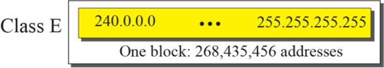
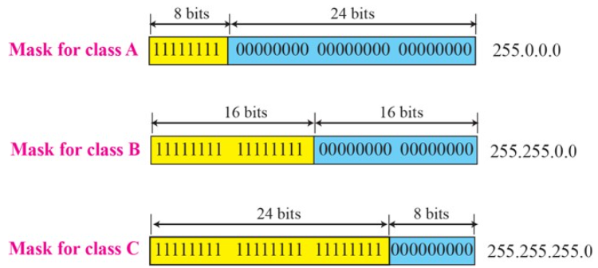

## 5.1 网际层概述

​		网际层(Internet Layer)，又称网络层(Network Layer)，其目的是**实现两个端系统之间的数据透明传送**，从而向传输层提供最基本的**端到端的数据传送服务**。具体功能包括**寻址(Addressing)**和**路由(Routing)**、连接的建立、保持和终止等。

> OSI/RM中称网络层，TCP/IP模型中称网际层。

### 5.1.1 网络层的功能

​		为了实现两个**端系统之间的数据透明传送**，让源端的数据能够以**最佳路径**透明地通过**通信子网**中的多个转接节点到达目的端，使得传输层不必关心网络的拓扑构型以及所使用的通信介质和交换技术，网络层必须具有以下功能：

* **网际通信**：把一个网络与另一个网络互相连接起来，在用户之间实现**跨网络的通信**。 
* **分组(Packet)与分组交换(Packet Switching)**：把从传输层接收到的数据报文封装成分组(Packet)再向下传送到数据链路层。
* **寻址(Addressing)**：网络中的每台主机都必须有一个**唯一的地址来确定它的位置**。在互联网上，这种地址被称为**IP(Internet Protocol)地址**。

* **路由选择(Routing)**：**通过路由选择算法为分组通过通信子网选择最适当的路径。**
* **差错检测(Error Detection)**：一般用分组中的头部校验和进行差错校验，使用确认和重传机制来进行差错恢复。 
* **网络管理**：对数据通信过程进行流量控制、拥塞控制等管理。

### 5.1.2 网络层提供的服务

​		网络层可为传输层提供**数据报(Datagram)**和**虚电路(Virtual Circuit)**两种服务，但Internet的网络层**仅为传输层提供数据报一种服务**。

> **虚电路(Virtual Circuit)和数据报(Datagram)是两种实现分组交换技术的方式**。

#### 虚电路(Virtual Circuit)

​		虚电路是分组交换的两种传输方式中的一种。在通信和网络中，虚电路是由分组交换通信所提供的**面向连接的通信服务**。

​		在两个节点或应用进程之间建立起一个**逻辑上的连接**或虚电路后，就可以在两个节点之间依次发送每一个分组，**接收端收到分组的顺序必然与发送端的发送顺序一致**，因此接收端无须负责在接收分组后重新进行排序。

##### 工作流程

主机$H_A$要和主机$H_B$进行数据交换需要经过下面的流程。

* **建立虚电路连接**
    * 主机$H_A$向主机$H_B$发一**虚呼叫**（虚电路连接请求），该虚呼叫选择一条适当的路径传送到主机$H_B$。记下**沿途所经过的路程作为虚电路**，如$H_A-K-C-E-H_B$，并给其赋一个**虚电路号VC1**。
    * 若主机$H_B$准备就绪，则发一**响应**给主机$H_A$ 。
    * 主机$H_A$收到该响应，则**虚电路VC1已建立完毕**。
* **数据交换**：主机$H_A$和主机$H_B$的数据交换**必须通过该虚电路VC1进行**。
* **释放虚电路连接**：数据交换完毕，则释放虚电路。 

工作流程可参考以下示意图。

##### 特征

* **面向连接**：通信前发送方和接收方之间**必须建立连接**（虚电路）。虚呼叫沿途经过每一结点要向该结点提出请求，任一结点拒绝请求（由于资源不足），均导致虚电路建立失败。

* **虚拟性**：**虚电路只是一种逻辑电路**，而不是真正的物理电路。报文分组在虚电路上传输不像再物理线路上那样中畅通无阻。而是要中间节点的**存储转发**。

* **链路复用**：**一条链路上允许建立多个虚电路**。

* **分组集中传输**：一旦虚电路建立完毕，本地通信的所有分组**必须经过该虚电路进行**。因此，虚电路能够**保证分组的顺序接收**。

* **高吞吐率**：**消除了帧和分组对首部的需求**，仅当建立虚电路时需要源/目的结点地址，数据分组需分配一个虚电路号而无须源/目的结点地址。

    

#### 数据报(Datagram)

​		**数据报无需建立连接**，每个报文分组携带**完整的源/目的地址**，**独立地选择路径，通过不同的路径到达目的主机** 。

##### 工作流程

工作流程如下图所示。

##### 特征

* **面向无连接**：**无需建立连接**就可传输报文分组。
* **分组独立传输**：每个报文**分组携带完整的源/目的地址**，**独立的选择路径**。不同的报文分组可通过不同的路由到达目的主机，先出发未必先到达，因此数据报服务**不能保证报文分组顺序接收**。

数据报和虚电路网络的对比如下表所示。

|                    | **数据报子网**                             | **虚电路子网**                                           |
| :----------------: | :------------------------------------------------------: | -------------------------------------------------------- |
| **分组的顺序** | 总是按发送顺序到达终点 | 到达终点的时间不一定按发送顺序|
| **延时**           | **分组传输延时**                                         | **电路建立、分组传输延时**                               |
| **路由选择**       | 每个分组**独立选择路由**                                 | 建立虚电路时选择路由，以后所有分组**都使用该路由**       |
| **状态信息**       | 子网**无需保存状态信息**                                 | **每个结点要保存一张虚电路表**                           |
| **地址**           | 每个分组包括源和目的的**完整地址**                       | 每个分组含有一个**短的虚电路号**                         |
| **结点失败的影响** | **除了在崩溃时正在该结点处理的分组都丢失外，无其他影响** | **所有经过失效结点的虚电路都要被终止**                   |
| **拥塞控制**       | **难**                                                   | 如果有足够的缓冲区分配给已经建立的虚电路，则**容易控制** |

​		在计算机网络领域，网络层应该向运输层提供怎样的服务（**面向连接**还是**面向无连接**）曾引起了长期的争论。争论焦点的实质就是：**在计算机通信中，可靠交付应当由谁来负责？是网络还是端系统？**

* 一派认为应当借助于电信网的成功经验，让**网络负责可靠交付**。电信网使用昂贵的程控交换机（其软件也非常复杂），用面向连接的通信方式，使电信网络能够向用户（实际上就是电话机）提供**可靠传输的服务**。
* 另一派认为电信网的终端（电话机）非常简单，没有智能，也没有差错处理能力。但计算机网络的端系统是有智能的计算机。**计算机有很强的差错处理能力**（这点和传统的电话机有本质上的差别）。因此，互联网在设计上就采用了和电信网完全不同的思路。		

互联网采用的设计思路是这样的：

* **不可靠服务**：**网络层向上只提供简单灵活的、无连接的、尽最大努力交付(best effort delivery)的数据报(Datagram)服务**。由于传输网络不提供端到端的可靠传输服务，这就使网络中的路由器比较简单，且价格低廉。**通信的可靠性由运输层负责（包括差错处理、流量控制等）**。**网络层不提供服务质量的承诺。**
* **面向无连接**：网络在发送分组时**无需先建立连接**。每一个分组**独立发送**，与其前后的分组无关（不进行编号）。

​		采用这种设计思路的好处是：**网络造价大大降低，运行方式灵活，能够适应多种应用**。互联网能够发展到今日的规模，充分证明了当初采用这种设计思路的正确性

> 数据报(Datagram)是互联网的设计者最初使用的名词，其实数据报（或IP数据报）就是经常使用的分组(Packet)。

-----

## 5.2 路由选择(Routing)

​		路由选择(Routing)是指：**根据某种策略，选择一条最佳的路径到达目的主机**，对路由器而言， 路由选择实质上是**选择最佳输出端口**。

> **无论是虚电路，还是数据报都要进行路由选择。**
>
> * 虚电路：需要一次路由选择。
> * 数据报：每个分组要进行路由选择。

### 5.2.1 路由选择策略

​		可将路由选择的策略分为：**静态策略**和**动态策略**两类。

#### 静态策略

​		**按某种固定的规则进行路由选择，不随网络流量和拓扑结构变化而变化**。

##### 扩散法

​		扩散法也称**洪泛法(Flooding)**，是指：**当结点收到一个分组后，把该分组向除进来的链路外的所有其他链路转发，结果至少有一个分组以最快的速度到达目的结点。**

* 问题：**扩散过程产生大量重复分组**，导致网络无法运行。
* 解决措施：每个分组设置一个**下跳数字段**，每经过一个结点，下跳数减1，**当下跳数为0时，丢弃该分组**。

##### 固定路由选择法

​		每个结点保存一张**固定的路由表**，当某一分组到达时，根据分组的目的结点，在路由表中找到其对应的输出链路，然后将分组从该链路转发出去。

路由表的结构一般包括以下几个字段：

​		路由表一般由网管中心根据**最佳路由选择算法**为每个路由产生**固定路由表**并发给该结点。固定路由表一旦生成，就不再改变，除非网管中心重新生成新的路由表。

* 优点：简单。
* 缺点：**无法适应网络流量和拓扑结构的变化**。

##### 最佳路由选择法

​		最佳路由选择法是**将网络看成连通图，每条链路以其费用(Cost)为权值，通过Dijkstra最短路径算法求出任意两个结点之间的最短距离。** 以该最短路径作为路由表的制定依据。

> **费用(Cost)**：其含义非常广泛，可以是距离、平均通信量、延迟、下跳数等。

###### Dijkstra最短路径算法

1. 确定起点$S$，将$S$放入已确定最短路径顶点集合$V$，其余顶点集合记为$U$，并计算起点$S$与集合$U$中相邻顶点的距离。
2. 选取与**起点$S$距离最短的顶点放入集合$V$中，并从集合U中移除该顶点**。
3. 重新更新**集合$V$中顶点和起点$S$的距离**。
4. 若集合V为$\O$，算法结束，否则转步骤2。

​		下图形象的展示了Dijkstra算法，其中圆圈内的值表示距离起点$S$的距离（99表示无穷大），绿色部分为集合$V$，剩余部分为集合$U$，红色箭头为最短路径。

#### 动态策略

​		动态策略根据**当前拓扑结构**和**流量的变化**来**动态改变路由**，又称为**自适应(Adaptive)路由选择策略**。可将其分为： **孤立(Isolated)**路由选择法、**集中(Centralized)**路由选择法和**分布(Distributed)**路由选择法。

##### 孤立(Isolated)路由选择法

​		每个路由器只根据它手头的**本地数据**创建的路由表进行决策。这个方法中**路由器不与邻居交换信息**。这会导致延迟，因为路由器必须通过阻塞的路径共享数据包。该类策略中常见的算法有**热土豆算法(Hot Potato Algorithm)**和**逆向自学习算法(Backward Learning Algorithm)**。

###### 热土豆算法(Hot Potato Algorithm)

* **基本思想**：当你手里拿着一个烫手的热土豆时，你一定会想办法以最快的速度脱手。当一个结点收到一个分组后，**选择一条输出队列最短的链路尽快的将其转发出去**，而不管目的节点位于何方。
* 优点：提高链路的**利用率**。
* 缺点：具有很大**盲目性**。
* 改进：同固定路由算法混合使用。
    * 确定**链路权值**：首先根据固定路由算法选择可能链路，并给这些链路赋上一定权值。
    * 确定**队列权值**：再根据链路队列长度给赋上一定权值，
    * 选择**和最小权值链路**：选择上述两个权值和最小的链路。

###### 逆向自学习算法(Backward Learning Algorithm)

* 基本思想：
    * **结点计数器**：每个分组中包含一个结点计数器，每经过一个结点，该结点计数器加1。
    * **逆向自学习**：
        * **获取链路和距离**：当一个结点R从链路L收到一个来自源结点S的分组时，若结点计数器为n，就知道经L到达S的路径的距离为n。
        * **更新链路**：若结点R以前纪录到S的最短路径大于n时，则将链路L作为到达S的最短输出链路，纪录当前最短路径长度n。
        * 经过一段时间的自学习，结点R会找到它到其它结点的最短路径及最小距离值。

* 优点：**对好消息反应灵敏**
* 缺点：对于坏消息无法了解到（如一条链路崩溃）。
* 改进：每隔一段时间T，**删除这段时间内没有刷新的记录**。

##### 分布(Distributed)路由选择法

​		**分布(Distributed)路由**选择法也称为**距离矢量路由算法(Distance Vector Routing Algorithm, D-V)**。路由器仅有与其直接相连链路的开销信息，然后通过迭代、分布式的方式与相邻结点交换信息，最后计算出最低开销路径。

​		它是网络上最早使用的动态路由算法，也称为**Bellman-Ford**或者**Ford-Fulkerson**算法。该算法最早在ARPANET中使用，后在Internet及Novell网中的IPX中使用，即RIP协议。

* 基本思想
    * 每个结点都保存一张路由表，路由表包括三个主要字段：
        * 目的地址
        * 最短距离
        * 最佳输出链路
    * 定时交换信息：**相邻结点之间定期交换路由信息**（如每隔十秒），并**根据最新路由信息，刷新路由表**，这点与固定路由选择不同。
    * 交换的路由信息由二元组$(V,D)$组成（也称距离向量），其中$V$为**目的地址**，$D$为到达目的地址的**距离**。

路由表的更新流程可以参考下图。

* 缺点：对**网络变化需经若干周期才能作出反应**。
    * 对**好消息反应迅速**。
    * 对**坏消息反应迟钝**。
* 优点：运算量和交换的信息量较小

###### 无穷计数问题

距离向量法的无穷计数问题是指：**一个结点X崩溃的消息要经过无穷次交换才能传遍全网。**如下图所示。

​		结点X的崩溃时，消息（坏消息）立马传到结点A处，结点A立即更新与结点X的距离为无穷大。但之后结点A收到来自结点B的消息使得结点A对X的距离更新为有限距离。无穷次后全网才能知晓结点X已经崩溃。

> 当一个**新结点接入网络**时，只需要**有限次的消息交换**就可传遍整个网络。

解决无穷计数问题的方法一般有两种。

* **规定足够大的数作为无穷大**，如RIP规定无穷大为16，负作用是限制了网络规模。
* **水平分割法**：**结点不向相邻结点报告从该相邻结点获取的路由信息**。
    * 若链路AX出现故障，由于B不会向A报告到X的路由，所以A把到X的距离置为无穷大。
    * 水平分割有时会失败。

##### 集中(Centralized)路由选择法

​		从1979年开始，ARPANET以及后来的Internet的内部网关协议由距离向量路由选择算法改为**链路状态(Link State, L-S)路由选择算法**。主要特征是**每个路由器具有全局状态信息**，即网络完全的拓扑、链路开销信息等。

* 基本思想：每个结点定期广播路由信息，并根据最新路由信息刷新路由表。

​		每一个路由器将自己与邻居节点之间的链路状态包广播整个网络。其他路由器收到从网络中广播来的路由信息包（链路状态包）之后，会将这个包中的信息与自己路由器上的信息进行拼装，**最终形成一个全网的拓扑视图**。如下图所示。

具体的算法流程如下：

1. **发现邻居结点**：当一个路由器启动以后，它的第一个任务就是要知道谁是它的邻居结点。

    * 通过向每个端口发送特殊的HELLO分组来**发现邻居结点**。
    * 收到HELLO分组的路由器应返回一个**应答**来说明它的**网络地址**。

2. **测量链路开销**：通过发送一个特殊的ECHO分组来实现，测量其**往返时间再除以2**。如下图所示，每个结点都知晓了与相邻结点的链路开销（距离）。

    

3. **广播L-S分组**：构建一个包含自己所拥有信息的L-S分组（链路状态包），并网络中向所有结点广播该L-S分组。例如，A的链路状态分组如下图所示。

    

    * **序号(Sequence Number)**：在IP协议中，32位，如果一个L-S分组到达，其序号比最近到达序号小，则丢弃，以**保证结点收到是最新的L-S信息**。
    * **生存期(Age)**：在扩散过程中，经过一个结点递减1，一旦生存期为0，则丢弃。

4. **计算最短路径并更新路由表**：结点获得最新L-S状态后，用Dijkstra最短路径算法计算到每个其他结点的最短路由，并刷新路由表。

​		链路状态路由选择算法不会像距离矢量路由选择算法那样发送整个路由表，链路状态路由协议只会广播更新的或者改变了的网络拓扑，这样**传播的信息量很少，同时**节省了带宽和CPU资源**。

​		链路状态路由算法具有**很好的扩展能力**，也具有**更快的收敛速度**，能够快速的适应网络变化，且由于一个路由器的链路状态只涉及与其相邻的路由器的联通状态，因而与整个互联网的规模并无直接关系，因此链路状态路由算法可以**用于大型的或者路由信息变化剧烈的互联网环境。**

> **路由收敛**：**指网络的拓扑结构发生变化后，路由表重新建立到发送再到学习直至稳定，并通告网络中所有相关路由器都得知该变化的过程。**
>
> **收敛时间**：是指从网络的拓扑结构发生变化到网络中所有路由设备中路由表重新保持一致的状态转换过程所需时间。

D-V算法和L-S算法之间的对比如下表所示。

|                  | **D-V**                    | **L-S**                            |
| :--------------: | -------------------------- | ---------------------------------- |
| **交换路由信息** | **定期**                   | **网络拓扑结构发生改变（或定期）** |
|   **交换范围**   | **相邻结点**               | **全网**                           |
|   **路由更新**   | **缓慢**                   | **迅速**                           |
|   **适用范围**   | **小规模，变化缓慢的网络** | **大规模，变化较剧烈的网络**       |

### 5.2.2 路由协议

​		互联网采用的路由选择协议主要是**自适应的、分布式路由选择协议**。

#### 自治系统(AS)

由于以下两个原因，互联网采用**分层次的路由选择协议**：

* 互联网的规模非常大。无法让所有的路由器知道所有的网络应怎样到达（路由器和网络的开销太大）。
* 网络保密性的需要。许多单位不愿意外界了解自己单位网络的布局细节和本部门所采用的路由选择协议，但同时还希望连接到互联网上。

为此，可以**把整个互联网划分为许多较小的自治系统(Autonomous System, AS)**。自治系统AS是**指在单一技术管理下的一组路由器，这些路由器使用一种自治系统内部的路由选择协议和共同的度量**。

> **域间路由选择(Interdomain Routing)**：**自治系统之间**的路由选择。
>
> **域内路由选择(Intradomain Routing)**：**自治系统内部**的路由选择。

#### 分层路由选择协议

​		在目前的互联网中，一个大的ISP就是一个自治系统。这样，互联网就把路由选择协议划分为：**内部网关协议(Interior Gateway Protocol, IGP)**和**外部网关协议(External Gateway Protocol, EGP)**两大类。

##### 内部网关协议(IGP)

​		**内部网关协议(Interior Gateway Protocol, IGP)**即**在一个自治系统内部使用的路由选择协议**，而这与在互联网中的其他自治系统选用什么路由选择协议无关。目前这类路由选择协议使用得最多，如RIP和OSPF协议。

###### RIP协议

​		**路由信息协议(Routing Information Protocol, RIP)**是内部网关协议IGP中最先得到广泛使用的协议。RIP采用**D-V算法**，用于小规模网络，是互联网的标准协议，其最大优点是简单，但已很少被使用。

* 技术特点：
    * 距离：下跳数(Hop Count)，允许对下跳数加权。
    * 交换路由信息周期：30秒
    * 无穷计算问题：RIP选择16作为无穷大。
    * 为了加快收敛速度，RIP采用**水平分割技术**。
    * RIP消息通过UDP协议传输，端口号为520。

###### OSPF协议

​		**开放最短路径优先OSPF(Open Shortest Path First)**是为克服RIP的缺点在1989年开发出来的。OSPF采用L-S算法，是目前Internet的主要内部网关协议。

* **开放(Open)**：表明OSPF协议不是受某一家厂商控制，而是**公开**发表的。
* 最短路径优先( Shortest Path First)：使用Dijkstra提出的SPF最短路径算法。

OSPF的原理很简单，但实现起来却较复杂。

* 技术特点：

    * 距离：允许网管人员**配置选择多种距离度量**，如延迟，数据率，通信费用，下跳数等。

    * OSPF支持**区域**概念。**区域(Area)**是指：为了使OSPF能够用于规模很大的网络，OSPF**将一个自治系统再划分为若干个更小的范围**。如下所示。

        

        > ​		这样就可使利用洪泛法交换链路状态信息的范围局限于每一个区域内，减少了整个网络上的通信量。

    * OSPF支持**认证服务**，防止非法向路由器发送假路由信息来愚弄路由。

    * OSPF直接用**IP数据报**传送L-S分组。

##### 外部网关协议(EGP)

​		**外部网关协议(External Gateway Protocol, EGP)**是指：当源主机和目的主机处在不同的自治系统中（这两个自治系统可能使用不同的内部网关协议），当数据报传到一个自治系统的边界时，就需要**使用一种协议将路由选择信息传递到另一个自治系统中**。目前使用最多的外部网关协议是BGP。

###### BGP协议

​		**边界网关协议(Border Gateway Protocol, BGP)**用于**在不同的自治系统AS间交换路由信息**，是Internet的外部网关协议。

​		在配置BGP时，每一个自治系统的管理员要选择至少一个路由器作为该自治系统的**BGP发言人(BGP Speaker)**，其往往就是BGP**边界路由器(Boder Router)**。

​		一般说来，两个BGP发言人都是通过一个共享网络连接在一起的。一个BGP发言人与其他AS的BGP发言人要交换路由信息，就要先**建立TCP连接**，然后在此连接上交换BGP报文以建立 BGP会话(Session)，利用BGP会话交换路由信息。如下图所示。

​		BGP只能是力求寻找一条能够到达目的网络且比较好的路由，并非要寻找一条最佳路由。BGP 采用了**路径向量(Path Vector)路由选择算法**，即改进型的D-V算法。

* 技术特点：
    * 路由表中记录到达目的地的确切路由，而不是“距离”，从而解决无穷计算问题。
    * 支持策略路由。

-----

## 5.3 IP协议

### 5.3.1 概述

​		**IP(Internet Protocol)协议是Internet体系结构的核心协议，已成为连接异构网络的工业标准。**
​		IP提供**无连接的数据报(Datagram)服务**，每个IP分组长度≤64K字节，不能保证分组可靠的、按序到达，这些留给高层协议解决。

​		IP协议又称为**Kahn-Cerf协议**，因为这个重要协议正是Robert Kahn和Vint Cerf二人共同研发的，这两位学者在2005年获得图灵奖。严格来说，这里所讲的IP其实是IP的第4个版本，记为**IPv4(IP version 4)**。

​		IP协议需要路由协议ICMP，IGMP，ARP，RARP等协议支持。其在TCP/IP协议簇中的地位如下图所示。

### 5.3.2 IPv4数据报格式

​		**IP数据报的格式能够说明IP协议都具有什么功能**。在TCP/IP的标准中，各种数据格式常常以32位（4 字节）为单位来描述。下图是IP数据报的完整格式。

​		从上图可看出，一个IP数据报由**首部(Header)**和**数据(Data)**两部分组成。首部的前一部分是**固定长度（20字节）**，是所有IP数据报必须具有的。在首部的固定部分的后面是一些**可选字段**，其长度是可变的。下面介绍首部各字段的意义。

#### 版本(Version)

​		表示IP协议版本，通常为`0100`(IPv4)，若为`0110`则表示为IPv6版本。

#### 首部长度(Header Length, HLEN)

​		表示IP数据报首部长度，最短20字节，最长60字节。

#### 区分服务(Differentiated Service, DS)

​		以前称为**服务类型(Type of Service)**，从未使用过。1998年改称区分服务。用于**指明要求网络提供的服务**，目前主要包括D、T、R等三种，分别代表**延迟(Delay)**、**吞吐量(Throughput)**和**可靠性(Reliability)**要求。即使如此，依然没有真正使用。如下图所示。

> DS字段现在只使用其中的前6位，即区分服务码点DSCP(Differentiated Services CodePoint)

#### 总长度(Total Length)

​		包括了**首部长度**和**数据长度**，最长为65535个字节（64KB）。 

​		IP层下面的每一种数据链路层协议都规定了一个数据帧中的**最大传送单元MTU(Maximum Transfer Unit)**。当一个IP数据报封装成链路层的帧时，此数据报的总长度（即首部加上数据部分）一定不能超过下面的数据链路层所规定的MTU值。如下图所示。

​		例如，最常用的以太网就规定其MTU值是1500字节。若所传送的数据报长度超过数据链路层的MTU值，就必须把过长的数据报进行**分片处理**。下表展示了常用网络的MTU值。

#### 标识(Identification)

​		数据报计数器，用于**区分数据报的唯一标识符**。在数据报传向目的地址时，如果将数据报被分为多个片段，那么**每个片段都有相同的标识符**。 

#### 标志(Flags)

​		最高位保留。具体格式如下图所示。

* **不分片(Do not Fragment, DF)**标志：
    * DF=1：则不允许分片。
    * DF=0：则允许分片。
* **更多分片(More Fragments, MF)**标志：
    * MF=0：最后一个分片。
    * MF=1：除最后一个分片以外的其余分片。

#### 片位移(Fragmentation Offset)

​		表示分片后，该片在原分组中的相对位置。片偏移以8个字节为偏移单位。如下图例子所示。

#### 生存时间(Time to Live)

​		一般记为**TTL(Time To Live)**。表示**数据报在网络中可通过的路由器数的最大值**。若超出最大值，则丢弃数据包，并返回“目标不可达”。

#### 协议(Protocol)

​		**指出此数据报使用何种协议**，以便目的主机的IP层将数据部分上交给哪个处理过程。如TCP、UDP、ICMP、IGMP、OSPF等。如下图所示。

#### 首部校验和(Header Checksum)

​		只**检验数据报首部**，不检验数据部分。按以下步骤进行校验：

* IP报头校验和的**计算**：
    * 校验和字段置0。
    * 对IP头部按照每**16bit**分割成不同单元。
    * 将所有单元相加，并将结果分为**进位单元**和**本体单元**：如果进位单元非零，则将**进位单元与本体单元相加**，并将结果再次分为进位单元与本体单元。如此循环，**直至进位单元为零**。
    * 将**本体单元的值取反**，并存入校验和字段。 
* IP报头校验和的**检验**：当接收IP包时，需要对报头进行确认，检查IP头是否有误，算法同上。
    * 本体单元的结果**取反后为零**：则认为收到的IP头**正确**。
    * 本体单元的结果**取反后非零**：则认为收到的IP头**错误**。

可以参考下图所示例子。

#### 源地址(Source IP Address)

​		发送端主机IP地址。

#### 目的地址(Destinnation IP Address)

​		接收端主机IP地址。

#### 可选字段(Option)

​		在整个首部长度不超过60个字节的情况下，主要用来**进行一些测试工作**。每个IP可选字段的长度或者只有一个字节或者长度可变，由此可分为单字节选项和多字节选项。如下图所示。

​		对于可变长度的类型采用**类型/长度/值(Type/Length/Value)**的方式来定义。如下图所示：

* Code(选项)
    * Copy(副本)：数据报可能进行分片处理，用于表示该选项是否复制到所有分片。
        * 为`1`：复制到所有分片。
        * 为`0`：仅保留在当前分片。
    * Class(选项类别)：用于表示数据报选项的类型。
        * 为`00`：表示数据报为控制类型。
        * 为`10`：表示数据报为测试和管理类型。
        * `01`和`11`：保留
    * Number(选项号)：表示选项的功能。
* 长度：该选项的长度。
* 值：选项的其余附带值。

常用的选项主要包括：

* **安全性(Security)**：告诉路由器如何对信息保密，例如，不能经过某些不友好国家的路由器。
* **松散源路由(Loose Source Routing)**：要求分组按次序通过给定的路由器，但也允许通过其他的路由器。
* **严格源路由(Strict Source Routing)**：以IP地址序列形式给出完整的源/目的路径，分组必须严格地按照此路径传输。
* **路由记录(Record Route)**：告诉沿途经过的路由器将他们的IP地址加入到该选项中，接收端能够知道该分组经过哪些路由到达。
* **时间戳(Timestamps)**：类似“路由记录”，但除记录IP地址外，还要记录时间标记。

> **填充(Padding)**是指：上述选项一个个拼接起来，中间不需要有分隔符，最后必须用全0bit的填充字段将首部补齐成为4字节的整数倍。

### 5.3.3 IPv4地址

​		整个的互联网就是一个单一的、抽象的网络。IP 地址就是给互联网上的每一台主机（或路由器）的每一个接口分配一个在**全世界范围内是唯一的32位的标识符**。

​		IP地址的结构使我们可以在互联网上很方便地进行寻址。IP地址现在由**互联网名字和数字分配机构ICANN(Internet Corporation for Assigned Names and Numbers)**进行分配 。

> ​		ICANN主要由互联网协会的成员组成的非盈利社团，创建于1998年9月18日，目的是接管包括**管理域名和IP地址的分配**等与互联网相关的任务，这些任务曾由其它组织（特别是IANA）代表美国政府来执行，但ICANN仍受美国政府及法律管理。ICANN同时也负责**L.root-servers.net这组根域名服务器的运作**（2016年管理权已正式移交）。

​		IP地址的编址方法共经过了以下三个历史阶段：

* **分类IP地址**：**最基本的编址方法**，由1981年的标准协议所确定。
* **子网划分IP地址**：基于最基本的**分类IP地址编址方法的改进**，其标准[RFC 950]在1985年成为国际标准。
* **超网IP地址**：目前应用最广泛的方法，对于**缓解IPv4地址耗尽**和**路由表过于臃肿庞大**有一定的作用。1993年提出后很快就得到推广应用。

#### 分类IP地址

​		分类的IP地址是指：将IP地址划分为若干个**固定类**。一共分为**五类**，分别称为**A类**、**B类**、**C类**、**D类**和**E类**。

​		**A类**、**B类**和**C类**地址分别由两个**固定长度的字段组成**：

* **网络号(Net-ID)**：它**标志主机（或路由器）所连接到的网络**。一个网络号在整个**互联网范围内必须是唯一的**。

* **主机号(Host-ID)**：它**标志该主机（或路由器）**。一台主机号在它前面的网络号所指明的**网络范围内必须是唯一的**。

由此可见，一个IP地址在整个互联网范围内是唯一的。这种两级的IP地址可以记为：

$IPv4 \ Address ::= \{ <NetID>, <HostID> \} $ ，其中**A类**、**B类**和**C类**地址的网络号长度分别为8位、16位和24位。如下图所示。

​		**D类**和**E类**地址不区分网络和主机。D类地址用于多播（一对多通信）；E类地址保留为以后用。

此种分类方法的五类地址如下图所示。

这五类IP地址的占比情况如下图所示。

##### 点分十进制记法(Dotted Decimal Notation)

​		点分十进制记法(Dotted Decimal Notation)是指：为了提高可读性，常常把32位的IP地址中的**每8位插入一个点**，并用其等效的**十进制数字**表示点分隔出的8位二进制数。如下图所示。

##### 分类

* A类：

    * 网络号(NetID)：`1byte`，第1位固定为`0`。
    * 主机号(Host-ID)： `3byte`。

    

* B类：

    * 网络号(NetID)：`2byte`，前2位固定为`10`。
    * 主机号(Host-ID)： `2byte`。

    

* C类：

    * 网络号(NetID)：`3byte`，前3位固定为`110`。
    * 主机号(Host-ID)： `1byte。`

    

* D类：**多播地址**，前4位固定为`1110`，地址范围`224.0.0.1—239.255.255.254`。

    

* E类：前4位是`1111`，**保留**为以后用。

    

因此，可以根据IP地址的前几位的值来判别IP地址的类型。如下图所示。

常用的三种类别的IP地址特点如下表所示。

| **网络类别** | **最大网络数** | **第一个可的网络号码** | **最后一个可用的网络号码** | **每个网络中最大的主机数** | **该类地址总数** |
| ------------ | -------------- | ---------------------- | -------------------------- | -------------------------- | ---------------- |
| **A**        | 126            | 1                      | 126                        | 2^24-2=16777214            | 2,064,770,064    |
| **B**        | 16384          | 128.1                  | 191.254                    | 2^16-2=65534               | 1,073,709,056    |
| **C**        | 2097152        | 192.0.1                | 223.225.254                | 2^8-2=254                  | 32,676,608       |
| **总计**     |                |                        |                            |                            | 3,671,155,728    |

##### 网络掩码(Network Mask)

​		互联网中的路由器在获取了目标IP地址的**类型**后，还需要**获取目标IP地址的网络地址**，用于转发IP数据包。如下图所示。

​		因此其需要一种算法来**从数据包的目标地址中提取网络地址**。使用网络掩码(Network Maks)可以较好解决此问题。在分类IP地址中，一个网络掩码或默认掩码是一个32位二进制数字，**最左边的n位全部设置为`1`，最右边32-n位全部设置为`0`**。在A、B、C三类的路由寻址中有三个**默认掩码**，如下图所示。

> ​		**斜线记法(Slash Notation)**：由于IP地址分为网络号和主机号，其中网络号为`n`，因此也可用`/n`表示IP地址的网络掩码。例如一个C类IP地址`141.14.120.77`其网络掩码`255.255.255.0`可表示为`/18`。

​		当获取到目的IP地址的类型后将所对应的类型的默认掩码**相与(AND)**即可求得目的IP地址的网络地址。如下图例所示。

#### 子网划分IP地址

​		**子网划分法(Subnetting)**是在1985年提出一种IP地址表示方式（RFC 950），已成为互联网的正式标准协议。其基本思想是：

* 将一个IP类网划分成几个较小的**子网(subnet)**。
* 多个**物理网共享同一个IP类网前缀**。

​		因此子网划分法在IP地址中又增加了一个**子网号(Subnet-ID)字段**，使两级IP地址变成**三级结构**：$IPv4 \ Address ::= \{ <NetID>, <SubnetID>, <HostID> \} $ 。这样划分后：

* 对**外**：**网络号仍然表示整个网络**。
* 对**内**：由**子网号**表示多个**不同的子网**。

如下图所示，将`141.14.0.0`IP地址所代表的网络划分为了4个子网。

##### 子网掩码(Subnet Mask)

​		**子网掩码(Subnet Mask)**，也称网络掩码，是用于**表示IP地址具体所属的子网以及子网规模**的一种掩码。**子网的规模与借用主机字段的位数有关**。借用位数越多，子网规模越小。如下图所示。

​		同分类地址中的网络掩码一样将子网掩码与目的IP地址**相与(AND)**就可得到子网地址。在分类地址中A、B、C三类的默认掩码**等同于没有划分子网的的网络掩码**，这样的掩码也称为**默认子网掩码(Defualt Subnet Mask)**。

> ​		若将一网络分为$S$个子网，则其子网掩码的bit位$n_{sub}$可由$n_{sub} = n + \lceil \log_2{S} \rceil$计算得出。子网号从$2^{(\lceil \log_2{S} \rceil)}$选出。
>
> **示例**：
>
> ​		将一个B类网络`141.14.0.0/16`划分为四个子网，则n=16，且n1=n2=n3=n4=n+log2(4)=18。这意味着子网掩码左边有18个1，即子网掩码是`255.255.192.0`
>
> ​		其中2号子网中的一个主机地址为`141.14.120.77`,则其子网地址为`255.255.192.0 AND 141.14.120.77 = 141.14.64.0`。

​		在此种IP地址的划分方法中，每个路由器中都保存一张路由表，当一个IP分组到达时，路由器通过子网掩码获取其网络号，然后根据结果采取不同的转发方法：

* **本地网络**：则启动**寻找主机**过程。
* **其他网络**：根据路由表中对应网络号的**最佳输出链路**将分组转发到下一跳路由器。
* **找不到目的网络**：将分组转发到一个**缺省路由器**中，缺省路由器具有更广泛的路由信息。

##### 特殊IP地址

IP地址中的全`0`表示“**这个(this)**”；而全`1`表示“**所有(all)**”。

###### 本网络地址(Local Network Address)

* `0.0.0.0`：代表的是**本主机地址**，任何一台主机都可以其表示自己。改地址**仅在系统启动时会使用**，启动完成后不再使用。

* **本网络特定主机地址**：**Net-ID全为0**，Host-ID表示本网络上的特定主机。

> **Host-ID全为0**：此类IP地址表示**该网络本身**，用于标识网络。如`210.45.240.0/24`表示一个C类地址。

###### 广播地址(Broadcast Address)

* **直接广播地址(Direct Broadcast Address)**：**Host-ID全为`1`**，用于**向某个网络上所有的主机广播报文**。这要求发送方必须知道信宿网络的网络号。

* **受限广播地址(Limited Broadcast Address)**：`255.255.255.255`。广播范围为主机所在的网络，所有网关都不会向外广播，此类地址**只能作为目的地址。**例如，有些主机在启动时，往往并不知道本网络的网络号，此时若想要向本网络广播，只能采用受限广播地址。

###### 回环地址(Loopback Address)

​		网络号为127(`01111111`)保留作为本地软件**环回测试(Loopback Test)**，即本主机的进程之间的通信之用。范围为`127.0.0.0—127.255.255.254`，以此类地址为目标地址的IP分组均**会被直接回送给发出这个分组的主机。**

###### 保留地址(Reserved Address)

​		保留地址也称为私有地址，是指**各独立网络可以重复使用的IP地址**，即网络边界路由器（通常就是网关）不会向目标地址为这些保留地址的主机转发IP分组。也就是说，**保留地址不会穿越出内部网络**。

* A类：`10.0.0.0` （1个网络）

    > A类地址早已用完，`10.0.0.0`本是分配给ARPANET的。由于ARPANET已停止运行，该地址便用作专用地址。

* B类：`172.16.0.0—172.31.0.0`（16个网络）

* C类：`192.168.0.0—192.168.255.0`（256个网络）

#### 超网IP地址

​		超网也称为**无分类域间路由(Classless Inter-Domain Routing, CIDR)**编址方法，是在**变长子网掩码 (Variable Length Subnet Mask, VLSM)**基础上发展出来的一种IP地址编址方法。 

​		超网的功能是**将多个连续的C类的网络地址聚合起来映射到一个物理网络上**。这样，该物理网络就可以使用这个聚合起来的C类地址的**共同地址前缀作为其网络号**。

​		在CIDR中，不再有传统的A类、B类和C类等地址以及划分子网的概念，因而可以更加有效地分配IPv4的地址空间。CIDR**使用各种长度的网络前缀(Network Prefix)来代替分类地址中的网络号和子网号**。IP地址从三级编址又回到了**两级编址**：  $IPv4 \ Address ::= \{ <Network Prefix>, <HostSuffix> \} $ ，如下图所示。

##### CIDR地址块

​		CIDR**把网络前缀都相同的连续的IP地址组成一个CIDR地址块(CIDR Block)**。只要知道CIDR地址块中的任何一个地址，就可以知道这个地址块的起始地址和最大地址，以及地址块中的地址数。 这样就有了分别包含$2^0, 2^1, 2^2, ..., 2^{32}$个地址的地址块。因此，每一个CIDR地址块中的**地址数一定是2的整数次幂**。

##### 路由聚合(Route Aggregation)

​		路由聚合(Route Aggregation)也称为**构成超网(Supernetting)**，由于一个CIDR地址块中有很多地址，所以**在路由表中就利用CIDR地址块来查找目的网络**，即相当于把原来的**多个子网聚合成为一个网络**。这使得路由表中的**一个项目可以表示原来传统分类地址的很多个路由**，从而大大缓解了路由表的臃肿现象。

​		下图中这个ISP共有64个C类网络。如果不采用CIDR技术，则在与该ISP的路由器交换路由信息的每一个路由器的路由表中，就需要有64个项目。但采用地址聚合后，只需用路由聚合后的1个项目`206.0.64.0/18`就能找到该ISP。 

##### 最长前缀匹配(Longest-Prefix Matching)

​		为了更方便地进行路由选择，CIDR使用**32位地址掩码(Address Mask)**,其中1的个数就是网络前缀的长度。虽然CIDR不使用子网了，但由于仍有一些网络还使用子网划分和子网掩码，因此 CIDR 使用的地址掩码也可继续称为子网掩码。其对比如下图所示。

​		最长前缀匹配(Longest-Prefix Matching)是指：在CIDR查找路由表时可能会得到**不止一个匹配的目标网络前缀**。 此时，应当**从匹配结果中选择具有最长网络前缀的路由**这是因为，**网络前缀越长，其地址块就越小，路由就越具体(more specific)** 。下图是最长前缀匹配的示例。

#### 虚拟专用网(VPN)

##### 专用网(Private Network)

​		由于IP地址的紧缺，一个机构能够申请到的IP地址数往往远小于本机构所拥有的主机数。并且，实**际使用中，很多主机主要还是和本机构内的其他主机进行通信**。

​		假定在一个机构内部的计算机通信也是采用TCP/IP协议，那么从原则上讲，对于这些**仅在机构内部使用的计算机就可以由本机构自行分配其 IP 地址**，即计算机使用仅在本机构有效的IP地址，这样的IP地址被称为**保留地址**或者说**私有地址**。采用这种方法可以大大节约宝贵的全球IP地址资源。

​		采用上述**专用IP地址的互连网络就被称为专用网(Private Network)**。

##### 虚拟通信专线(Virtual)

​		有时一个很大的机构的许多部门分布的范围很广，部门间经常要互相交换信息，这可以有两种方法：

* 租用电信公司的**通信线路**为本机构专用。此方法简单方便，但线路的租金太高，一般难于承受。
* **利用公用的互联网作为本机构各专用网之间的通信载体**。

​		**虚拟专用网VPN(Virtual Private Network)**就是指：**将公用互联网虚拟称为本机构各专用网之间的通信专线**的专用网络。如下图所示。

​		一个机构要构建自己的VPN就必须为它的每一个场所购买专门的硬件和软件并进行配置，使每一个场所VPN 系统都知道其他场所的地址。一般选用**IP隧道技术(IP Tunneling)**实现虚拟专用网，即**在两台计算机之间建立安全通道，通过该通道发送数据**。如下图所示。

​		假定某个机构在两个相隔较远的场所建立了专用网A和B，其网络地址分别为专用地址`10.1.0.0`和`10.2.0.0`。专用网A和B**至少要有一个路由器具有合法的全球IP地址**，如路由器R1和R2，在专用网内部网络的接口地址则是专用网的本地地址。

* 场所A的主机X要和场所B的主机Y通信，则必须经过路由器R1和R2。主机X向主机Y发送的IP数据报的源地址是`10.1.0.1`，而目的地址是`10.2.0.3`。

* 这个数据报先作为本机构的**内部数据报**从X发送到与互联网连接的路由器R1。
* 路由器R1收到内部数据报后，发现其目的网络必须通过互联网才能到达，就把整个的内部数据报进行**加密**并重新加上数据报的首部，封装成为在互联网上发送的外部数据报，其源地址是路由器R1的全球地址`125.1.2.3`，而目的地址是路由器R2的全球地址`194.4.5.6`。
* 路由器R2收到数据报后将其数据部分取出进行解密，恢复出原来的内部数据报（目的地址是`10.2.0.3`），交付主机Y，反之主机Y向主机X发送数据也一样。

上述过程下图所示。

##### VPN类型

根据常用的用途可将VPN分为下面的三类：

* **内联网VPN(Intranet VPN)**：同一个机构不同地区的内部网络所构成的虚拟专用网。

* **外联网VPN(Extranet VPN)**：一个机构的VPN中有某些外部机构（通常是合作伙伴）的网络参与。
* **远程接入VPN(Remote Access VPN)**：流动员工通过驻留在个人电脑中的VPN软件与公司的主机之间建立VPN隧道进行网络通信。

#### 网络地址转换(NAT)

​		**网络地址转换NAT(Network Address Translation)**是指：**一种在IP数据包通过路由器或防火墙时重写来源IP地址或目的IP地址的技术**。

​		在专用网内部的一些主机本来已经分配到了本地IP地址且无法再获取新的IP地址，但又想和互联网上的主机通信。使用网络地址转换NAT可以解决这一问题。

##### NAT路由器(NAT Router)

​		NAT路由器(NAT Router)是指：**专用网到互联网的装有NAT软件的路由器**，它至少有一个有效的外部全球IP地址。所有使用本地地址的主机在和外界通信时，都在NAT路由器上**将其本地地址转换成全球IP地址**。其工作原理如下图所示。

​		显然，**通过NAT路由器的通信必须由专用网内的主机发起**。若互联网上的主机要发起通信，当IP数据报到达NAT路由器时，NAT路由器就不知道应当把目的IP地址转换成专用网内的哪一个本地IP地址。这就表明，**这种专用网内部的主机不能充当服务器**，因为互联网上的客户无法请求专用网内的服务器提供服务。

##### NAT实现方式		

NAT的实现方式有三种：静态NAT(Static NAT)、动态((Pooled NAT)和端口NAT(Port NAT)。 

* **静态NAT(Static NAT)**：静态转换是指**将内部网络的私有IP地址固定转换为公有IP地址**，在这种转换中**某个私有IP地址只转换为某个公有IP地址**。借助于静态转换，可以实现外部网络对内部网络中某些特定设备（如服务器）的访问。

* **动态((Pooled NAT)**：动态转换是指**将内部网络的私有IP地址随机转换为公用IP地址**，这种转换中所有被授权访问Internet的**私有IP地址可随机转换为任何指定的合法IP地址**。动态转换可以使用多个合法外部地址集。例如，当ISP提供的合法IP地址略少于网络内部的计算机数量时，可以采用动态转换的方式。 

* **端口NAT(Port NAT)**：端口转换是指对外出数据包包括端口在内进行进行转换，这种转换中**内部网络的所有主机均可共享一个合法外部IP地址实现对Internet的访问**，从而可以最大限度地节约IP地址资源。同时，又可隐藏网络内部的所有主机，有效避免来自internet的攻击。因此，目前网络中应用最多的就是端口多路复用方式。端口转换时的转换表如下所示。

    

----

## 5.4 ICMP协议

​		为了更有效地转发IP数据报和提高交付成功的机会，在网际层使用了**网际控制报文协议ICMP(Internet Control Message Protocol)**。这使管理者可以**发送控制消息**，提供可能发生在通信环境中的各种问题反馈，从而使管理者可以对发生的问题作出诊断，并采取适当的解决措施。

* ICMP允许主机或路由器**报告差错情况**和提供有关**异常情况的报告**。

* ICMP不是高层协议，而是**IP层协议**。

    

* **ICMP报文作为IP层数据报的数据**，加上数据报的首部，组成IP数据报发送出去。   

> ICMP是少数几个可以**直接从应用层操作**的协议，不经过传输层。

### 5.4.1 ICMP作用与功能

#### 作用

​		IP协议提供了以无连接为特征的“尽力而为”的数据通信服务，并不能解决数据报丢失、重复、延迟或乱序等问题。ICMP的目的就是希望**对IP包无法传输时提供报告**，这些差错报告帮助发送方了解网络中发生了什么问题，以确定应用程序后续操作。

#### 功能

ICMP的主要功能包括：

* 通告网络错误
* 通告网络拥塞 
* 通告超时
* 协助解决故障 

### 5.4.2 ICMP报文

#### 报文的封装

​		ICMP是一个网际层协议，但却需要利用IP协议进行封装，因此ICMP是一种需要**两次封装**的网际层协议。首先由网络层的**IP协议**对ICMP协议报文进行封装，其次再由**数据链路层协议**对相应的IP报文进行封装。经过两次封装后的ICMP报文才能被传输。如下图所示。

​		ICMP报文是由IP协议封装，因此其也和IP协议一样是一个**不可靠的协议**，既不能保证报文的到达，也不能保证报文按序到达。

#### 报文格式

ICMP的报文格式如下图所示。

* **类型(Type)**：ICMP的类型，标识生成的错误报文。
* **代码(Code)**：**进一步划分ICMP的类型**，该字段用来查找产生错误的原因。例如，ICMP的目标不可达类型可以把这个位设为1至15等来表示不同的意思。 
* **校验和(Checksum)**：用于**报文错误检查**，从ICMP头和以该字段替换为0的数据计算得出。 
* **报头其余部分(Rest of Header)**：4字节字段，长度可变，根据ICMP类型和代码而有所不同。

#### 报文种类

​		ICMP报文的种类有两种：ICMP**差错报告(Error-reporting)**报文和 ICMP**询问(Query**)报文，报文类型**由类型字段和代码字段共同决定**。如下表所示。

> **信息请求与回答(Information Request and Reply)**报文、**地址掩码请求与回答(Address Mask Request and Reply)**报文、路由器请求与通告(Router Solicitation and Advertisement)报文以及**源点抑制(Source Quench)**报文已不再使用。

##### 差错报告(Error-reporting)报文

* **终点不可达(Destination Unreachable)**：当路由器或主机**不能交付数据报时**就向源点发送终点不可达报文。
* **时间超过(Time Exceeded)**：
    * 当路由器收到**生存时间为零的数据报时，除丢弃该数据报外，还要向源点发送时间超过报文**。
    * 当终点在**预先规定的时间内不能收到一个数据报的全部数据报片时**，就把已收到的数据报片都丢弃，并向源点发送时间超过报文。

* **参数问题(Parameter Problems)**：当路由器或目的主机收到的**数据报的首部中有的字段的值不正确时**，就丢弃该数据报，并向源点发送参数问题报文。

* **路由重定向(Redirection)**：路由器把改变路由报文发送给主机，让主机知道**下次应将数据报发送给另外的路由器**（可通过更好的路由）。

##### 询问(Query)报文

* **回送请求和回答(Echo Request and Reply)**：主机或路由器**向一个特定的目的主机发出的询问**。收到此报文的主机必须给源主机或路由器发送ICMP回送回答报文。这种询问报文用来**测试目的站是否可达以及了解其有关状态**。

* **时间戳请求和回答(Timestamp Reauest and Reply)**：请求某台主机或路由器回答当前的日期和时间。在ICMP时间戳回答报文中有一个32位的字段，其中写入的整数代表从1900年1月1日起到当前时刻一共有多少秒。时间戳请求与回答可**用于时钟同步和时间测量**。

两种报文归总表如下所示。

### 5.4.3 ICMP应用举例

#### PING

​		**PING(Packet InterNet Groper)用来测试两个主机之间的连通性**。PING使用了ICMP回送请求与回送回答报文。PING是应用层直接使用网络层ICMP的例子，它没有**通过运输层的TCP或UDP**。 

#### Tracert

​		Tracert是Windows平台上的一个实用程序，可以实现从源主机到目的主机之间数据报文所经过的路由追踪(Trace Router)。

​		Tracert完全基于ICMP协议实现路由追踪，基本原理是：

* 从TTL=1开始，Tracert不断从源IP向目标IP发出类型为8代码为0的ICMP查询报文，并逐次增加TTL值。
* 根据不同TTL值时各路由器返回的TTL=0（类型为11代码为0）的差错报文，即可知道经过了哪些路由器。

> 在Unix或Linux中，类似的程序是Tracerouter

-----

## 5.5 ARP协议

​		在实际应用中，我们经常会遇到这样的问题：**已经知道了一个机器（主机或路由器）的IP地址，需要找出其相应的硬件地址**。**地址解析协议ARP(Address Resolution Protocol)**就是用来解决这样的问题的。

### 5.5.1 MAC地址

​		无论OSI还是TCP/IP，都奉行的是**对等层通信原则**。在这一原则下，**低层只是向上层提供支持**，即将上层的协议报文作为载荷封装在本层相关协议的数据单元中。**低层无法获得也不能理解被封装的高层协议报文的内容**，即低层协议看不见高层数据。当IP报文被数据链路层协议封装后，包括**IP地址在内的IP协议细节均无法被数据链路层协议获得。**

​		为了能够在数据链路层的协议中描述源/目的节点，需要在数据链路层设计相应的节点标识符，即**数据链路层地址**。在以太网中，该地址称为**MAC(Media Access Control)地址**。由于数据链路层向下紧邻物理层，受到物理层许多因素的影响，因此也被称为**物理地址**或**硬件地址**或**机器地址**。对应的，**IP地址也常常被称为逻辑地址**。

> 以太网由DEC，INTEL和XEROX联合提出，并在1980年被IEEE802工作组标准化。因此，MAC地址也由IEEE负责管理。

​		MAC地址由**48位二进制数**表示。为了便于记忆，用12个16进制数代表，**每2个16进制数之间用冒号分割**，比如：`08:00:20:0A:8C:6D`就是一个合适的MAC地址。

* IEEE负责向从事以太网产品生产的厂商分配前24位。
* 厂商负责编写后24位，并确保所有MAC地址的唯一性。

​		**地址解析协议(Address Resolution Protocol, ARP)**是IP协议最重要的配套协议之一，其目的是**将IP地址转化成MAC（物理或硬件）地址**。

> RARP协议(Reverse ARP) ：与ARP正好相反，主机知道MAC地址，但不知道IP地址，通过该协议**广播询问分组获取IP地址**。

### 5.5.2 ARP协议工作原理

* PC1查找本地ARP表，若表中有PC5的IP地址，则按照对应的MAC地址，将要发送的IP包封装成以太帧，并向PC5发送。
* 若ARP表中没有PC5的数据项，则**以广播方式发出ARP请求包，在本网段内寻找与PC5的MAC地址**。

* PC5收到PC1的ARP请求报文后，向PC1**发出单播的ARP响应包**，并**将PC1的IP地址和MAC地址填入自己的ARP表中**。
* PC1在收到响应报文后，将PC5的MAC地址填写到自己的ARP表中，按照获得的MAC地址将IP包封装到以太帧，并向PC5发送。

上述过程如下图所示。

> ​		每一台主机都设有一个**ARP高速缓存(ARP Cache)**，里面有本局域网上的各主机和路由器的**IP地址到硬件地址的映射表**，这些映射都是该主机目前知道的一些地址。
>
> ​		**ARP缓存表采用老化机制**，在一段时间内如果表中的某一行没有使用，就会被删除，这样可减少缓存表的长度，加快查询速度。

### 5.5.3 ARP报文格式

ARP报文格式如下图所示，这是以Ethernet(Type: 0x0806)为例的**数据链路层帧格式**。

* **硬件类型(Hardware Type)**：发送方硬件接口类型，例如，`1`为以太网。
* **协议类型(Protocol Type)**：发送方请求解析的协议地址类型，例如，`0x0800`为IP协议地址。

* **硬件地址长度(Hardware Length)**：发送方硬件地址长度。

* **协议地址长度(Protocol Length)**：请求解析的协议地址长度。

* **操作(Operation)**：表示本报文类型，`1`为ARP请求，`2`为ARP响应，`3`为RARP请求，`4`为RARP响应。

* **发送方硬件地址(Sender Hardware Address)**：发送方硬件地址，长度根据硬件地址长度而有所不同。例如，以太网地址为48bit。
* **发送方协议地址(Sender Protocol Address)**：发送方协议地址，长度根据协议地址长度而有所不同。例如，IP地址为32bit。
* **接收方硬件地址(Target Hardware Address)**：接收方硬件地址，长度根据硬件地址长度而有所不同。例如，以太网地址为48bit。
* **接收方协议地址(Target Protocol Address)**：接收方协议地址，长度根据协议地址长度而有所不同。例如，IP地址为32bit。

### 5.5.4 ARP类型

​		根据报文中地址项的填写内容，可将ARP分为：**标准（也称有偿）ARP**和无偿（Gratuitous，也称免费）ARP两种类型：

#### 标准ARP

ARP请求报文的各相关地址项的格式为：

* 源IP：为发出ARP请求的主机的IP地址。
* 源MAC：为发出ARP请求的主机的MAC地址。
* 目标IP：为希望获得其MAC地址的主机的IP地址。
* 目标MAC：为全`0`。

#### 无偿(Gratuitous)ARP

​		无偿ARP也称为免费ARP，是一种**特殊的ARP请求报文**，即**请求自己的IP地址的MAC地址**。当一个ARP请求报文满足以下条件时：

* 源IP：为发出此ARP报文的主机的IP地址。
* 源MAC：为发出这个ARP报文的主机MAC地址。
* 目标IP：为发出此ARP报文的主机的IP地址。
* 目标MAC：广播地址。

​		无偿ARP常用于：当ARP功能被开启或者是端口初始配置完成，主机发送ARP查询（广播）自己的IP地址。其作用是：

* **IP地址唯一查询**：**主机向网络发送无偿ARP来查询自己的IP地址确认地址唯一可用**。即确定网络中是否有其他主机使用了IP地址，如果有应答则产生错误消息。
* **更新ARP缓存**：**网络中的其他主机收到该广播则在ARP缓存中更新条目**，收到该广播的主机无论是否存在与IP地址相关的条目都会强制更新，如果存在旧条目则会将MAC更新为广播包中的MAC。

#### 代理ARP(Proxy ARP)

​		代理ARP(Proxy ARP)是ARP的一种变种，是指：**代表一组主机进行操作的ARP**，即ARP请求从**源网络的主机**发往同一网段却不在同一物理网络上的另一台主机，目的主机所在网络中具有代理ARP功能的设备(通常为router)**代理该网段中所有主机回应该ARP请求**。

​		每当运行代理ARP的路由器接收到一个ARP请求以寻找其中一个主机的IP地址的ARP请求时，路由器就会发送一个ARP回复，宣布自己的硬件（物理）地址。在代理路由器接收到实际的IP包后，它将该包发送到适当的主机或路由器。如下图所示。

### 5.5.5 ARP典型应用情况

发送一个数据报文时，有以下四种情况：

* **发送方是主机**要把IP数据报文发送到**同一个网络**的另外一台主机。这时发送方主机发送ARP请求分组，找到**接收方主机的硬件地址**。然后将IP数据报文**直接交给目标主机**。
* **发送方是主机**要把IP数据报文发送到**另外一个网络**中的一台主机。这时发送方主机发送ARP请求分组，找到本网络中的一个**路由器的硬件地址**。然后将IP数据报文**交给该路由器**，其余工作由该路由器完成。
* **发送方是路由器**要把接收到的IP数据报文发送到**另外一个网络**中的一台主机。这时路由器发送ARP请求分组，找到连接在目标网络上的一个路由器的硬件地址，然后将IP数据报文**交给该路由器**，其余工作由该路由器完成。
* **发送方是路由器**要把接收到的IP数据报文发送到**本网络中**的一台主机。这时路由器发送ARP请求分组，找到本网络中**接收方主机的硬件地址**。然后将IP数据报文**直接交给目标主机**。

除了上述第四种情况外，前三种都是**在同一个网络内的数据报文传输**。其示意图如下图所示。

