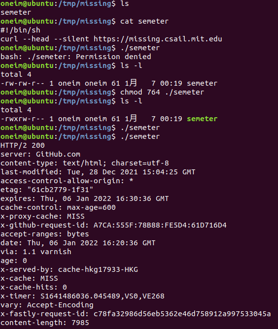

## What is the shell?

To take full advantage of the tools your computer provides, we have to got old-school and drop down to **a textual interface: The Shell**. 

**They allow you to run programs, give them input, and inspect their output in a semi-structured way.**

------


## Using the Shell

**The shell is a programming environment**, just like Python or Ruby, and so it has variables, conditionals, loops, and functions. When you run commands in your shell, you are really **writing a small bit of code that your shell interprets.**

If the shell is asked to execute a command that doesn't match one its programming keywords, **it consults an *environment variable* called `$PATH` that lists which directories the shell should search for programs when it is given a command.**

```bash
missing:~$ echo $PATH
/usr/local/sbin:/usr/local/bin:/usr/sbin:/usr/bin:/sbin:/bin
missing:~$ which echo
/bin/echo
missing:~$ /bin/echo $PATH
/usr/local/sbin:/usr/local/bin:/usr/sbin:/usr/bin:/sbin:/bin
```

We can find out which file is executed for a given program name using the `which` program. We can also bypass `$PATH` entirely by **giving the *path* to the file we want to execute.**

--------------


## Navigating in the shell

To see what lives in a given directory, we use the `ls` command:

```bash
missing:~$ ls
missing:~$ cd ..
missing:/home$ ls
missing
missing:/home$ cd ..
missing:/$ ls
bin
boot
dev
etc
home
...
```

Usually, running a program with the `-h` or `--help` flag will print some help text that tells you what flags and options are available. For example, `ls --help` tells us:

```bash
  -l                         use a long listing format
```

```bash
missing:~$ ls -l /home
drwxr-xr-x 1 missing  users  4096 Jun 15  2019 missing
```

This gives us a bunch more information about each file or directory present.

First, the `d` at the beginning of the line tells us that `missing` is a directory. Then follow three groups of three characters (`rwx`). These indicate what permissions the owner of the file (`missing`), the owning group (`users`), and everyone else respectively have on the relevant item. A `-` indicates that the given principal does not have the given permission. Above, only the owner is allowed to modify (`w`) the `missing` directory (i.e., add/remove files in it). 


* **To enter a directory, a user must have "search" (represented by "execute": `x`) permissions on that directory (and its parents).** 

* **To list its contents, a user must have read (`r`) permissions on that directory**. For files, the permissions are as you would expect.

* **Notice that nearly all the files in `/bin` have the `x` permission set for the last group, "everyone else", so that anyone can execute those programs.**


Some other handy programs to know about at this point are :

* **`mv` (to rename/move a file)**
* **`cp` (to copy a file)**
* **`mkdir` (to make a new directory)**


If you ever want *more* information about a program's arguments, inputs, outputs, or how it works in general, give the **`man` program** a try. It takes as an argument the name of a program, and shows you its *manual page*. Press `q` to exit.

```bash
missing:~$ man ls
```

------------


## Connecting programs

In the shell, programs have two primary "streams" associated with them:

* **Input stream**
* **Output stream**

**When the program tries to read input, it reads from the input stream, and when it prints something, it prints to its output stream.** Normally, a program's input and output are both your terminal. That is, your keyboard as input and your screen as output. However, **we can also rewire those streams!**

The simplest form of redirection is `< file` and `> file`. These let you rewire the input and output streams of a program to a file respectively:

```bash
missing:~$ echo hello > hello.txt
missing:~$ cat hello.txt
hello
missing:~$ cat < hello.txt
hello
missing:~$ cat < hello.txt > hello2.txt
missing:~$ cat hello2.txt
hello
```

Demonstrated in the example above, **`cat` is a program that con`cat`enates files.** When given file names as arguments, it prints the contents of each of the files in sequence to its output stream. But when `cat` is not given any arguments, it prints contents from its input stream to its output stream (like in the third example above).You can also **use `>>` to append to a file.**

Where this kind of input/output redirection really shines is in the use of *pipes*. **The `|` operator lets you "chain" programs such that the output of one is the input of another**:

```bash
missing:~$ ls -l / | tail -n1
drwxr-xr-x 1 root  root  4096 Jun 20  2019 var
missing:~$ curl --head --silent google.com | grep --ignore-case content-length | cut --delimiter=' ' -f2
219
```

-----------------


## A versatile and powerful tool

**On most Unix-like systems, one user is special: the "root" user.** You may have seen it in the file listings above. **The root user is above (almost) all access restrictions, and can create, read, update, and delete any file in the system.** 

 You will not usually log into your system as the root user though, since it’s too easy to accidentally break something. Instead, **you will be using the `sudo` command. As its name implies, it lets you "do" something "as su" (short for "super user", or "root").**

One thing you need to be root in order to do is writing to the `sysfs` file system mounted under `/sys`. **`sysfs` exposes a number of kernel parameters as files, so that you can easily reconfigure the kernel on the fly without specialized tools.**


## Exercises

* Write the following into that file, one line at a time:

```shell
#!/bin/sh
curl --head --silent https://missing.csail.mit.edu
```

The first line might be tricky to get working. It’s helpful to know that **`#` starts a comment in Bash**, and **`!` has a special meaning even within double-quoted (`"`) strings. Bash treats single-quoted strings (`'`) differently**: they will do the trick in this case. 


* Run the command by explicitly starting the `sh` interpreter, and giving it the file `semester` as the first argument, i.e. `sh semester`. Why does this work, while `./semester` didn’t?


* Use `chmod` to make it possible to run the command `./semester` rather than having to type `sh semester`. How does your shell know that the file is supposed to be interpreted using `sh`? See this page on the [shebang](https://en.wikipedia.org/wiki/Shebang_(Unix)) line for more information.



> In computing, a shebang is the character sequence consisting of the characters number sign and exclamation mark (#!) at the beginning of a script.
>
> **The `#!` shebang is used to tell the kernel which interpreter should be used to run the commands present in the file.**


* Use `|` and `>` to write the “last modified” date output by `semester` into a file called `last-modified.txt` in your home directory.


