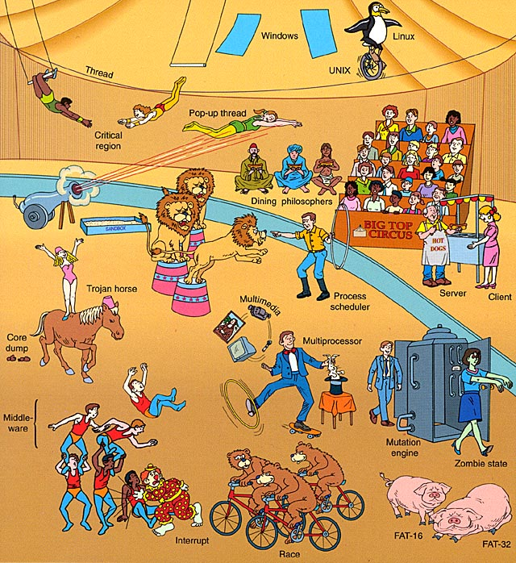

> **操作系统**是整个计算机系统的**内核与基石**。

---

## 1.1 什么是操作系统

​		**操作系统(Operating System, OS)**是配置在计算机硬件上的第一层软件，是对硬件系统的首次扩充。

### 1.1.1 定义

​		操作系统是一组**管理**和**控制**计算机**软件和硬件资源**，合理组织计算机系统工作流程，以及方便用户使用的**软件集合**。

#### 核心

* **计算机系统的管理者和控制者**：管理和控制计算机软硬件资源，合理组织计算机系统工作流程。
* **其他软件的运行平台和服务接口**：系统服务，用户使用接口。

下图展示了操作系统在整个计算机系统中的层次和地位。

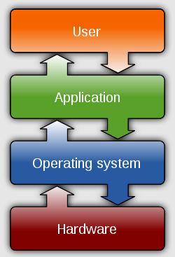

---

## 1.2 OS的目标和作用

### 1.2.1 目标

​		在计算机系统上配置操作系统其主要目标是：**方便性**、**有效性**、**可扩充性**和**开放性**。

#### 方便性

​		配置OS使得**用户**使用计算机系统更加**方便容易**。

#### 有效性

​		配置OS使得计算机更加**高效**。这有两层含义：

* 提高系统资源的**利用率**。
* 提高系统的**吞吐量**。

#### 可扩充性

​		为适应计算机**硬件**、**体系结构**以及计算机**应用**的发展，OS必须具有良好的可扩展性。

#### 开放性

​		随着计算机网络的发展，计算机系统的应用环境越来越开放。因此，OS必须能够**兼容(Compatibility)**不同应用环境的计算机软件和硬件。

### 1.2.2 作用

#### 接口

​		**OS作为用户和计算机硬件系统之间的接口**，将硬件和用户**隔离**。下图展示了其接口性质。

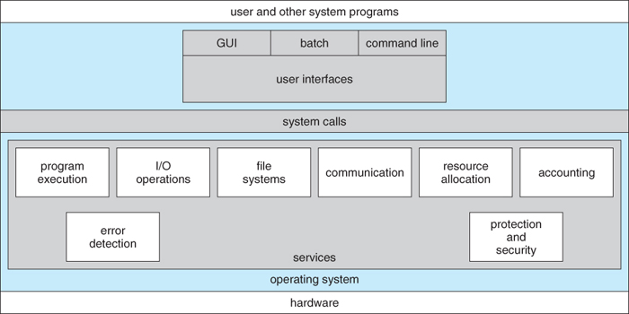

#### 管理者

​		**OS作为计算机系统资源的管理者。**计算机系统中有各种各样的资源，归纳起来可分为四类：**处理机**、**存储器**、**I/O设备**和**文件（数据和程序）**。OS的主要功能就是对这四类资源进行有效的管理。

* 处理机管理：负责**处理机**的分配和控制。
* 存储器管理：负责**内存**的分配和回收。
* I/O设备管理：负责**I/O设备**的分配（回收）和操纵。
* 文件管理：负责对**文件**的存取、共享和保护。

#### 扩充机器

​		OS实现了对计算机资源的**抽象**，隐藏了计算机底层硬件的实现功能的细节，**向用户提供了一个对硬件操作的抽象模型。**通过一层层的抽象形成使得操作系统的功能越来越强大。这就像一个洋葱，一层层将计算机硬件裸机包裹起来，下图形象的展现了其层次结构。

---

## 1.3 OS的发展历程

​		**OS的发展伴随着计算机硬件和体系结构的发展**，特别是CPU计算能力的发展使得计算机应用越来越广泛，促进了人们对OS发展的需求，下图的所展示的摩尔定律很好的说明了这一点。

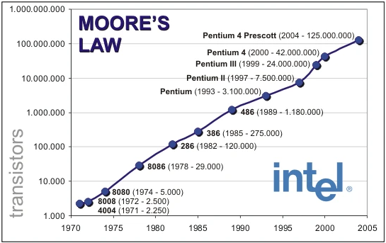

### 1.3.1 无操作系统时代

​		20世纪40年代末，现代计算机系统（冯·诺依曼结构）出现，此时还未形成软件的概念。这时还处在无操作系统时代。

* 工作方式：计算机专注于单个用户及程序。一切由程序员**人工操作**：
    * Programming
    * Debugging
    * Loading
* 优点
    * **交互性(Interactive)**好
* 缺点
    * 人工操作很**慢**，机器大多数处于空闲状态。
    * 程序必须包含操作外设的代码（**设备相关性**）
    
    

### 1.3.2 批处理操作系统(Batch Processing OS)

​		批处理系统(Batch Processing System)即在计算机上加载一个**专门的监控软件**，在其控制下，计算机能够**自动地成批地处理**一个或多个用户的一批作业。

下图展示了批处理系统大致的结构和工作流程。

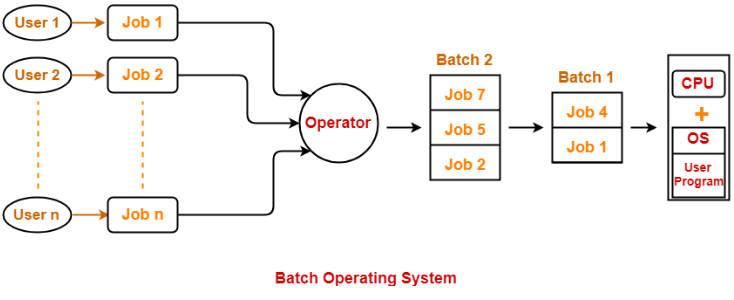

* 优点
    * 系统吞吐量大
    * 资源利用率高
    * 平均周转时间短

* 缺点
    * 无交互能力

#### 单道批处理系统(Simple Batch Processing System)

* 工作方式
    * 用户/程序员提交一套描述需要完成任务的卡片（作业控制说明书）。
    * 不同用户提交的多个任务由监控程序排队，可完成批量输入和SPOOLing输出。
    * **一次仅调入一个作业到内存中运行**。

* 优点
    * **计算机能自动连续的运转**
* 缺点
    * 没有交互
    * I/O——CPU矛盾
* 特点
    * **自动性**
    * 顺序性
    * 单道性

​		

​		批处理系统提高了系统的资源利用率和系统吞吐量，部分解决了人机矛盾和I/O——CPU问题。具有代表性的系统是1960年代IBM公司的FMS(Fortran Monitor System)。然而，单道批处理系统对系统资源的利用率并不高，且存在交互性差和I/O——CPU问题。下图说明了这一缺点。

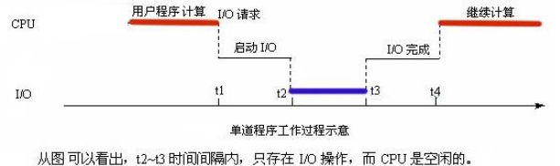

#### 多道批处理系统(Multiprogrammed Batch Processing System)

​		为了进一步提高对计算机资源的利用率和系统吞吐量，在20世纪60年代中期引入了**多道程序设计技术——流水线技术**，由此形成了多道批处理系统。代表性系统有1960年代的**IBM OS/360**。

* 工作方式
    * 用户/程序员提交一套描述需要完成任务的卡片(作业控制说明书）。
    * 由不同用户提交的多个任务由常驻的监控程序排队.。
    * 可使用磁带完成批量输入和SPOOLing输出.。
    * 由**不同用户提交的多个作业同时常驻主存运行**。
* 优点
    * 计算机系统**始终保持忙碌状态**。
* 缺点
    * 没有交互
    * 个别作业的长周转时间

* 特点
    * 多道性
    * 无序性
    * 调度性

下图展示了多道批处理系统工作过程。

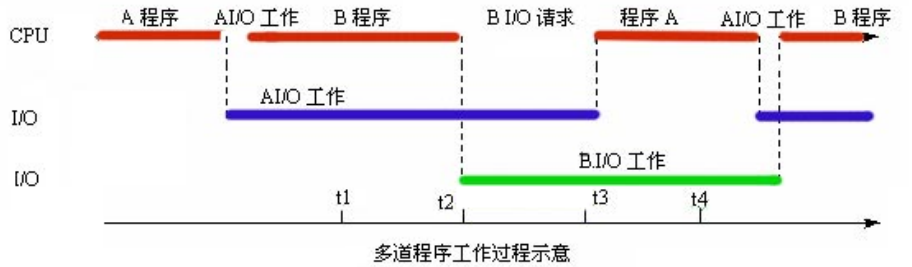

### 1.3.3 分时操作系统(Time Sharing OS)

​		如果说推动多道批处理系统形成和发展的主要动力是提高资源利用率和系统吞吐量，那么，推动分时系统形成和发展的主要动力，则是为了满足用户对**人/机交互**的需求，而形成了一种新型OS，代表性的系统有**CTSS (Compatible Time Sharing System), 1962, MIT, IBM 7094**和**Multics (多路存取计算机系统), 1964, GE-645**。

​		分时系统是指一台计算机能连接多个用户终端，用户可通过各自的终端使用和控制计算机，即**一台计算机连接多个终端的计算机系统**。

​		分时系统需要解决的关键问题有：及时接收和及时处理问题。一般通过分时处理技术来解决。

* 作业直接进入内存。
* **时间片轮转**运行方式：把处理机的响应时间分成大小相等（或不相等）的**时间片(Time Slice)**，所有**终端用户依次轮流获得一个时间片**，可以运行程序，当时间片用完，则暂停运行，等待下一次运行。

分时操作系统具有以下的一些特点

* **多路性**：众多联机用户可以“同时”使用同一台计算机。
* **独立性**：各终端用户感觉到自己独占了计算机。

* **及时性**：用户的请求能在很短时间内得到响应。

* **交互性**：用户与计算机之间可进行“会话” 。

### 1.3.4 实时操作系统(Real Time OS)

​		60年代初，计算机开始应用到**生产过程控制、工业控制、防空系统、信息处理**等，在这些应用中不但要解决计算问题，还要求在**规定的时间内完成计算**，即**实时处理**。在实时处理中的一个核心的问题就是**响应时间问题**，代表性系统有**WinCE**、**嵌入式Linux**、 **ucOSII**、**VxWorks**。

> **实时计算(Real-Time Computing)**可以定义为这样一类计算：系统的正确性，不仅由计算的**逻辑结果**来确定，而且还取决于**产生结果的时间**。

​		实时系统是指系统能**及时响应外部事件的请求**，在**规定的时间内完成对该事件的处理**，并**控制所有实时任务协调一致地运行**。

#### 实时任务类型

​		按实时任务的周期性可以将其分为**周期性实时任务**和**非周期性实时任务**。

* **周期性实时任务**：外部设备**周期性**地发出激励信号给计算机，要求它按指定**周期循环执行**，以便周期性地控制某外部设备。
* **非周期性实时任务**：每个实时任务必须联系着一个**截止时间(Deadline)**，或称为最后期限，可分为两种。
    * 开始截止时间：指某任务在**某时间以前必须开始执行**。
    * 完成截止时间：指某任务在**某时间以前必须完成**。

​		按实时任务对实时性的要求严格程度将其分为**硬实时任务(Hard Real-time Task, HRT)**和软**实时任务(Soft Real-time Task, SRT)**。

* **硬实时任务**：是指**系统必须满足任务对截止时间的要求**，否则可能出现难以预测的后果。用于工业和武器控制的实时系统，通常它所执行的是硬实时任务。
* **软实时任务**：对**截止时间的要求并不严格**，若偶尔错过了任务的截止时间，对系统产生的影响也不会太大。如用于信息查询系统和多媒体系统中的实时系统，通常是软实时任务。

实时任务具有以下的一些特点。

* **实时性**：计算机对于用户请求能足够快地进行处理，并做出反映。要求毫秒、微秒级。

* **高可靠性**和**安全性**：效率则放在第二位，且整体性强。

* **交互性较差**：不要求很强的“会话”能力。

### 1.3.5 OS家族

​		目前主流的OS家族有两个，一个是基于Unix系统的**类Unix系统家族**，另一个就是微软(Microsoft)的**Windows系统家族**，这两个家族操作系统的演化史几乎囊括了整个操作系统的发展进化历史。

#### Unix OS

​		Unix操作系统，是一个强大的多用户、多任务操作系统，支持多种处理器架构，按照操作系统的分类，属于**分时操作系统**。

​		最早由**肯尼斯·蓝·汤普逊(Kenneth Lane Thompson)**、**丹尼斯·麦卡利斯泰尔·里奇(Dennis MacAlistair Ritchie)**和**马尔科姆·道格拉斯·麦克罗伊(Malcolm Douglas McIlroy)**于1969年在AT&T的**贝尔实验室**开发。

​		目前它的商标权由国际开放标准组织所拥有，只有符合单一Unix规范的Unix系统才能使用Unix这个名称，否则只能称为**类Unix(Unix-like)**。例如Linux这样著名的系统都属于类Unix系统。

​		Unix因为其**安全可靠**，**高效强大**的特点在**服务器领域**得到了广泛的应用。直到GNU/Linux流行开始前，Unix也是科学计算、大型机、超级计算机等所用操作系统的主流。现在其仍然被应用于一些对**稳定性要求极高的数据中心**之上。

#### Microsoft Windows OS

​			Microsoft Windows 操作系统是微软公司以**图形用户界面(Graphical User Interface,  GUI)**为主推出的一系列专有商业软件操作系统。

​		它于1985年问世，起初为运行于**MS-DOS**之下的桌面环境，其后续版本逐渐发展成为主要为**个人电脑(Personal Computer, PC)**和服务器用户设计的操作系统，并最终获得了**世界个人电脑操作系统的垄断地位**。

#### 类Unix家族

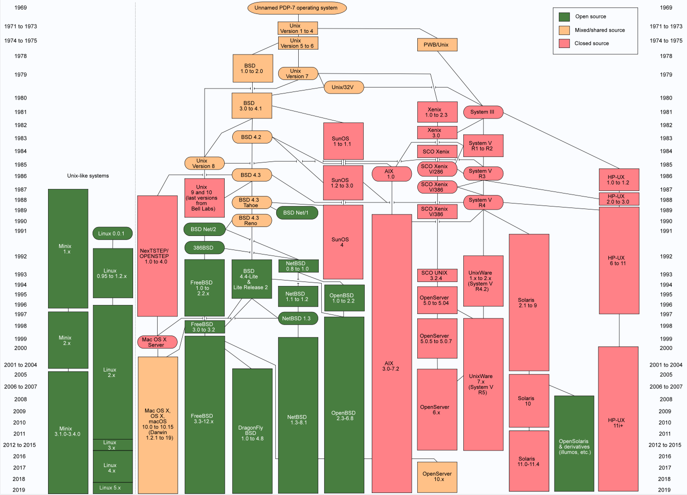

> [Unix history-simple - Unix-like - Wikipedia](https://en.wikipedia.org/wiki/Unix-like#/media/File:Unix_history-simple.svg)

#### Microsoft Windows家族

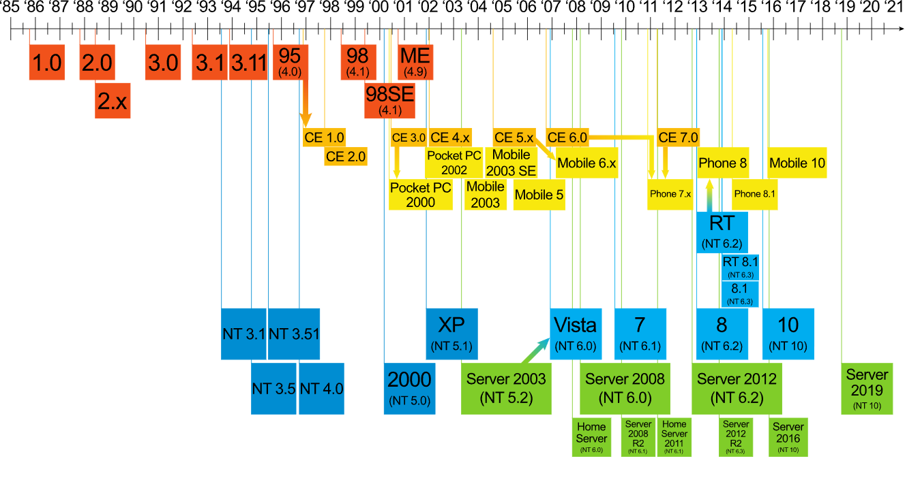

> [Suite des versions de Windows - File:Suite des versions de Windows.svg - Wikimedia Commons](https://commons.wikimedia.org/wiki/File:Suite_des_versions_de_Windows.svg#/media/File:Suite_des_versions_de_Windows.svg)

---

## 1.4 OS的基本特征

​		1.3节所述的操作系统各自具有不同的特征，除此之外，操作系统一般都共同具有**并发(Concurrency)**、**共享(Sharing)**、**虚拟(Virtual)**和**异步(Asynchronism)**四个基本特征。

### 并发(Concurrency)

​		并发是指两个或多个事件在同一**时间段内**发生，而另一个概念**并行(Parallelism)**则是指两个或多个事件在**同一时刻**发生。两者之间的区别如下图所示。

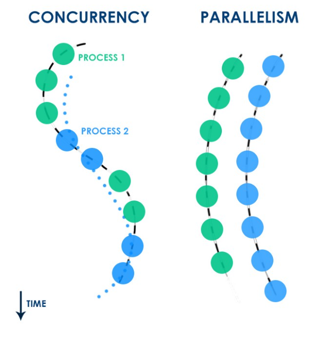

​		倘若在计算机系统中有多个处理机，这些可以并发执行的进程便可被分配到多个处理机上，实现**可并发进程的并行执行**。即利用每个处理机来处理多个可并发执行的进程。这样，多个进程便可同时执行。具体形式如下图所示。

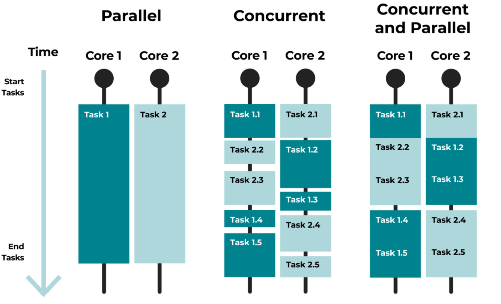

> 进程(Process)：指计算机系统中能**独立运行**并作为**资源分配的基本单位**。

### 共享(Sharing)

​		共享指多个计算任务（或多道程序）**对系统资源共同使用**。

​		为实现对计算机系统的资源的共享，其管理就要复杂得多。因为系统中的资源远少于多道程序需求的总和，会形成它们**对共享资源的争夺**，所以系统必须对资源共享进行妥善管理。由于资源属性的不同，进程对资源复用的方式也不同，目前主要实现资源共享的方式有如下两种。

* **互斥共享方式**：该类资源在规定的时间段内，只允许一个进程对其访问。
* **同时访问方式**：该类资源在规定的时间段内，允许多个进程对其访问（宏观时间上的“同时”）。

​		**并发和共享是多用户(多任务)OS的两个最基本的特征**。它们又是**互为存在的条件**。一方面**资源共享是以进程的并发执行为条件**的，若系统不允许并发执行也就不存在资源共享问题；另一方面，若系统不能对资源共享实施有效管理，以协调好诸进程对共享资源的访问，也必然会影响到诸进程间并发执行的调度，甚至根本无法并发执行。

### 虚拟(Virtual)

​		虚拟是指通过某种技术把**一个物理实体变为若干个逻辑上的对应物**。物理实体是实际存在的，“虚拟”物是虚的，用户感觉到的东西。

​		虚拟技术最早应用于通信系统中，操作系统中虚拟技术一般分为**时分复用**技术和**空分复用**技术两种。例如，利用时分复用技术实现了虚拟处理机技术和虚拟设备技术；利用空分复用技术实现了虚拟内存管理，提高了存储空间的利用效率。

### 异步(Asynchronism)

​		在多道程序环境下，允许多个进程并发执行，但只有进程在获得所需的资源后方能执行。由于资源等因素的限制，使得进程的执行通常都不是“一气呵成”的，而是“停停走走”不可预知的。

​		比如，有的程序侧重于计算而较少需要IO；而有的程序其计算少而I/O 多。这样，很可能是先进入内存的作业后完成，而后进入内存的作业先完成。

​		因此，进程是**以人们不可预知的速度向前推进的**，这称之为进程的**异步性**。

## 1.5 OS的主要功能

​		引入OS的主要目的是，为多道程序的运行提供良好的运行环境，以保证多道程序能有条不紊地、高效地运行，并能最大程度地提高系统中各种资源的利用率，方便用户的使用。

​	为此，在传统的OS中应具有**处理机管理(Processor Management)**、**存储器管理(Memory Management)**、**设备管理(Device Management)**和**文件管理(File Management)**等基本功能。此外，为了方便用户使用OS，还需向用户提供方便的**用户接口(User Interface)**。

### 处理机管理

* 进程控制
* 进程同步
* 进程通信
* 进程调度

### 存储器管理

* 内存分配
* 内存保护
* 地址映射
* 内存扩充

### 设备管理

* 缓存管理
* 设备分配
* 设备处理

### 文件管理

* 文件存储空间管理
* 目录管理
* 文件I/O管理与保护

### 用户接口

* 命令接口
* 图形接口
* 程序接口

---

## 1.6 OS结构

### 1.6.1 OS软件规模的演变

​		操作系统的进化史就如同恐龙的进化史一样，从最初的简单细胞生物进化到了几百米长的庞然大物。

* 1963, CTSS：32000个36位字
* 1960's, IBM OS/360：100万条机器指令
* 1975, Multics：2000万条机器指令
* 1990’s, Windows NT 4.0：1600万条代码
* 2000, Windows 2000：比Windows NT 4.0增长2倍
* 2020，Linux 5.8：2200万行代码

​		下面是Windows自Window 3.1系统到2002年Windows XP系统为例的系统代码行数演变图。

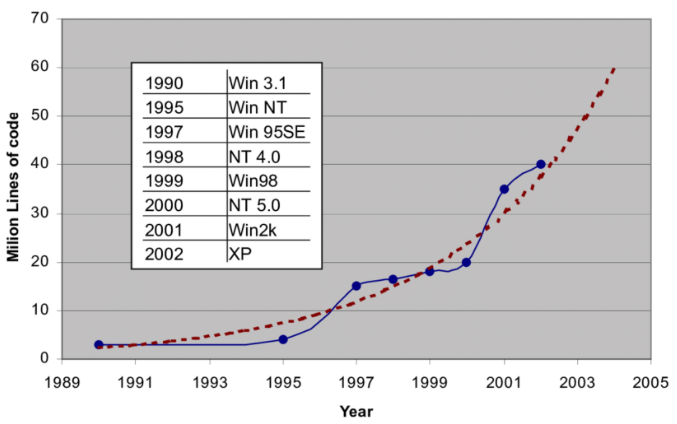

### 1.6.2 无结构OS

​		无结构OS是早期的操作系统结构，那时的操作系统内部无明显的结构特征，**设计者只关心功能的实现和高的执行效率，缺乏首位一致的设计思想。**

* 优缺点
    * 操作系统庞大杂乱，缺乏清晰的程序结构。
    * 程序、调试、维护复杂，保证程序正确困难。

### 1.6.2 模块化OS

​		模块化OS是指**使用结构化程序设计思想**，划分系统模块，模块间直接按功能要求互相调用。

* 优点

    * 提高OS设计的正确性、可理解性和可维护性。

    * 增强OS的可移植性, 加速OS的开发过程。

* 缺点

    * 结构划分和接口设计困难

    * 模块之间调用关系复杂，牵一发而动全身

### 1.6.2 分层式OS

​		分层式OS在**模块化结构基础上，将模块分为若干层**。

* **层内**模块之间可以互相随意调用。

* **层间**模块的调用遵循**单向调用原则**，高层模块可以调用低层模块，反之不可以。

操作系统不同层次之间的**划分原则**有：

* 程序嵌套

* 运行频率

* 公用模块

* 用户接口

优缺点：

* 提高OS设计的正确性、可理解性和可维护性。

* 增强OS的可移植性。

* OS开发调试效率提高，可以逐层开发和调试。

* 降低模块之间耦合度。

### 1.6.2 微内核OS

​		微内核(Micro-Kernel)是**指精心设计的、能实现现代OS核心功能的小型内核**，比一般的OS更小更精炼，运行在**核心态**且开机后常驻内存，不会因为内存紧张而被换出内存。

> 操作系统的**内核(Kernel)是指**最靠近硬件的低层OS部分，**内核通常常驻主存**。

#### 微内核技术

​		微内核技术基于**客户机-服务器**工作模式，提供各类操作系统服务。将OS分为两个部分：

* **服务器进程**：提供各类服务的进程。

* **内核**：只提供客户-服务器**通信机制**和与**硬件紧密相关**的较基本的功能。

​		微内核架构的一大特点是**不同服务器进程之间的通信必须经过微内核**，这就带来了一定的系统开销。下面是**微内核**和**宏内核**两种系统内核结构之间对比。

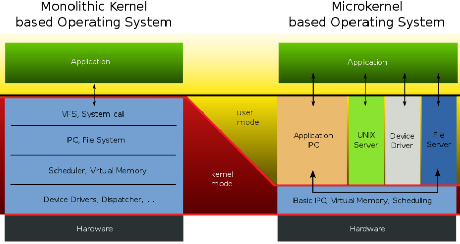

* 优点
    * 提高OS的**灵活性**和**可扩充性**。
    * OS内核更小、加稳定，**可靠性高**。
    * 可运行于**分布式系统**。

* 缺点
    * 操作系统运行**效率较低**。

-----

## 1.7 OS内核(Kernel)

​		OS**内核(Kernel)**是指将一些:

* **硬件紧密相关**的模块(如中断处理程序等)
* **常用设备的驱动程序**
* **运行频率较高**(如时钟管理、进程调度)
* **模块所公用**的一些基本操作

集中起来形成的**紧靠硬件的OS层次**。内核一般**常驻内存**，运行在**系统态**。

内核在操作系统中的层次地位如下图所示。

### 1.7.1 用户态和系统态

​		为了防止OS本身及其关键数据（如PCB）被破坏，通常也将处理机的执行状态分成**系统态(System Mode)**和**用户态**两种。

#### 系统态(System Mode)

​		系统态又称为**管态**，也称为**内核态**。它具有**较高特权**，能**执行一切指令**，**访问所有寄存器和存储区**，传统的OS都在系统态运行。

#### 用户态(User Mode)

​		用户态又称为**目态**。它是具有**较低特权**的执行状态，仅能**执行规定的指令**，**访问指定的寄存器和存储区**。

​		一般情况下，应用程序只能在用户态运行，不能去执行OS指令及访问OS区域，这样可以**防止应用程序对OS的破坏**。

### 1.7.2 内核的功能

​		总体而言，不同类型和规模的OS，它们的内核所包含的功能间存在着一定的差异，但大多数OS内核都包含了：**支持功能**和**资源管理功能**。

#### 支持功能

​		该功能是提供给OS其它众多模块所需要的一些**基本功能**，以便**支撑这些模块工作**。其中三种最基本的支撑功能是：**中断处理**、**时钟管理**和**原语操作**。

##### 中断处理

​		**中断处理是内核最基本的功能，是整个操作系统赖以活动的基础**。OS中许多重要的活动，如各种类型的系统调用、键盘命令的输入、进程调度、设备驱动等，无不依赖于中断。

##### 时钟管理

​		时钟管理是内核的一项基本功能，在OS中的许多活动都需要得到它的支撑，如在**时间片轮转调度**中，每当时间片用完时，便由时钟管理产生一个中断信号，促使调度程序重新进行调度。同样，在实时系统中的**截止时间控制**、批处理系统中的**最长运行时间控制**等，也无不依赖于时钟管理功能。

##### 原语操作

​		**原语(Primitive)**是由若干条指令组成的，用于完成一定功能的一个**过程**，原语操作是**原子操作(Atomic Operation)**，即**原语在执行过程中不允许被中断**。原子操作在系统态下执行，常驻内存。在内核中可能有许多原语，如用于对链表进行操作的原语、用于实现进程同步的原语等。

> 原子操作(Atomic Operation)是指一个操作中的所有动作**要么全做，要么全不做**。换言之，它是**一个不可分割的基本单位**。

#### 资源管理功能

##### 进程管理

​		在进程管理中，由于：

* 各个功能模块的**运行频率较高**，如进程的调度与分派、进程的创建与撤消等。
* 它们为**多种功能模块所需要**，如用于实现进程同步的原语、常用的进程通信原语等。

通常都将它们放在内核中，以提高OS的性能。

##### 存储器管理

​		**存储器管理软件的运行频率也比较高**，如用于实现将用户空间的逻辑地址变换为内存空间的物理地址的地址转换机构、内存分配与回收的功能模块以及实现内存保护和对换功能的模块等。通常也将它们放在内核中，以**保证存储器管理具有较高的运行速度**。

##### 设备管理

​		由于**设备管理与硬件设备紧密相关**，因此其中很大部分也都设置在内核中。如各类设备的**驱动程序**、用于缓和CPU与I/O速度不匹配矛盾的**缓冲管理**、用于实现**设备分配**和**设备独立性功能**的模块等。
